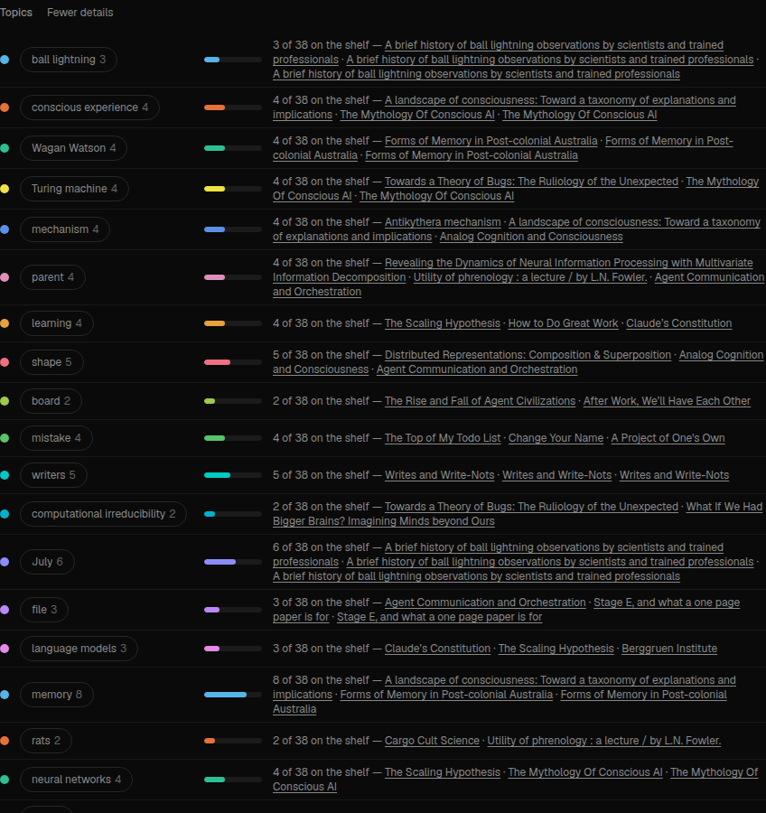
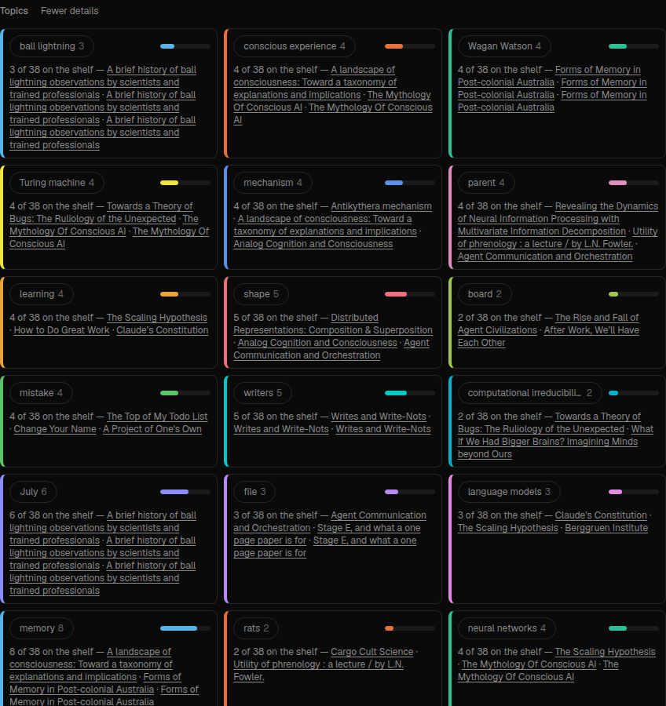
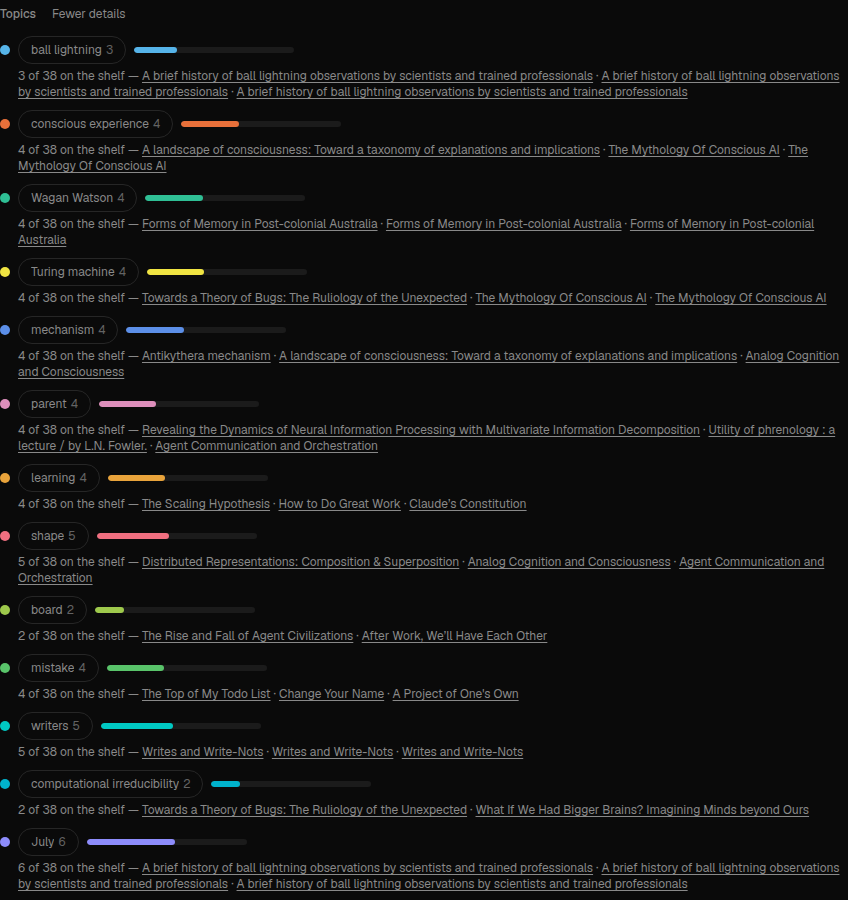
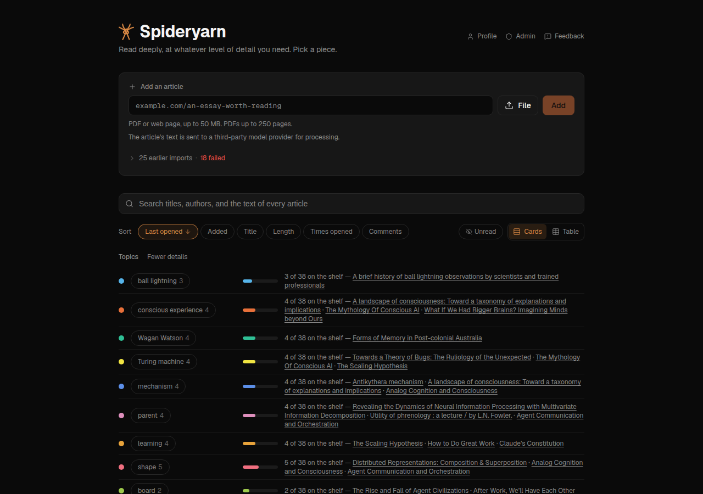

# Shelf topics, round two: diversity, coverage in the first few, and a detail view

**Status:** both stages built, reviewed and on `dev` by 14:48 BST, 2026-09-28 — in time for the
15:50 deploy. Planned 14:10 BST. Follows
[260928a-shelf-facet-terms.md](260928a-shelf-facet-terms.md), which built the Topics row; read its
§ Design first. Greg's production deploy fires ~15:50 BST today and takes whatever is on `dev`, so
Stage 1 aims to be green and pushed by 15:30 and Stage 2 may wait for the next deploy.

## What Greg asked for

> For the faceted-terms-filtering on the homepage:
> - how can we ensure more diversity amongst the terms, e.g. right now it lists "AI systems" and
>   "AIs". Perhaps by looking at the correlation between terms of the articles that they capture?
> - how can we ensure that pretty much all articles have terms that would capture them in the top
>   few?
> - the "All N topics" should show all the terms, without changing the nature of their display
> - then there should be a different way to show "More detail" or similar, that turns them into
>   per-row-with-extra-detail rather than pills-on-the-same-row. and take a screenshot of this -
>   right now it's ugly (just shows them directly beneath), and not that functional (no
>   links/tooltips). can we do better? e.g. use colour per term
> - I know I said to look for multi-word phrases. use your judgment about whether that's helping or
>   not
>
> — Greg, 2026-09-28

## Why it happens today (read from the code, 2026-09-28)

1. **"AIs" is not folded into "AI".** `foldKey` returns any lowercased word of three letters or fewer
   unchanged, so `AIs` → `ais`, a different key from `ai`. The same is true of `LLMs`, `GPUs`, `NGOs`.
2. **The redundancy check measures the wrong overlap.** It skips a candidate when the Jaccard of the
   two topics' article sets exceeds 0.7 (0.3 if they share a word). Jaccard is small when a small
   set sits *inside* a big one — *AI systems* (3 articles) entirely inside *AI* (11) is Jaccard 0.27,
   under both thresholds. What Greg means by "correlation between terms of the articles they capture"
   is containment: the **overlap coefficient**, |A ∩ B| / min(|A|, |B|), which is 1.0 there.
3. **The first few chips are not chosen for coverage.** The greedy pick's gain is
   `quality × sqrt(Σ 1/(1 + times covered))` — quality dominates, and the square root flattens the
   reward for reaching an uncovered article. Then the row **re-sorts by count**, so the first chips a
   reader sees are the biggest topics, which overlap each other most (*AI 11, memory 8, neurons 7…*
   on the local shelf share many of the same consciousness/neuroscience articles).

## Design

### Stage 1 — the selection (server; no model)

- **Fold short acronym plurals — at choose time, not in the extractor** (Sol R1, R6). `foldKey`
  already maps `LLMs → llm`; what escapes is a key of three letters or fewer (`AIs → ais`, `UIs`)
  and the kept *-us*/*-os* endings (`GPUs → gpus`, `NGOs → ngos` — measured, contrary to R1). So
  `chooseTerms` merges a key of at most four characters ending in `s` into its singular when the
  singular is also a key on the shelf: counts added, label from the singular's forms. `bus` and
  `gas` survive because no shelf has `bu` or `ga`. **No `EXTRACTOR_VERSION` bump**, so no reader's
  cached phrases are invalidated by the deploy.
- **Containment, not only Jaccard.** A candidate is redundant if its overlap coefficient with a
  chosen topic is ≥ 0.8 **and** they share a word stem, or ≥ 0.9 regardless (a near-subset that
  adds almost nothing). Jaccard > 0.7 stays. Soft penalty too: the gain is multiplied by
  `1 − max overlap coefficient with anything chosen`, so a mostly-contained topic can still be
  picked late, but never ahead of one that reaches new articles.
- **Coverage first.** Gain = `(Σ over its works of 0.2^(times already covered)) × quality^0.5`: an
  uncovered work is worth 1, a once-covered 0.2, twice 0.04 — near-pure maximum coverage, with
  quality (square-rooted, so it only breaks near-ties) keeping junk out. The greedy order is the
  **rank**, and the server returns topics in rank order.
- **The row shows topics in rank order**, not by count, so "the top few" are the few that cover the
  shelf. Counts still update live; order does not jump when you select.
- **Multi-word phrases:** measure with the phrase bonus at 1.0 (today), 0.5 and 0 and keep whichever
  gives better coverage@8 without lowering the share of multi-word topics a reader would call useful
  (judged from the lists, which go in this plan). Say which and why.
- **Metrics**, added to `shelfTermMetrics` and the report: coverage of the first 5, 8 and 12 topics
  **in the order the row shows them**; max and mean pairwise Jaccard *and* overlap coefficient among
  the first 12; the list.

Measured before and after on the local shelf with `npm run shelf-terms:report` (read-only) — the
numbers go in § Measurements.

### Stage 2 — the display (client)

- **"All N topics" expands the same row** of pills to every topic — no change of style.
- **"More detail"**, a separate toggle, turns the topics into **one row per topic**: a colour swatch
  per topic, the label, the count with a small proportional bar, and the top three article titles as
  **links** to the articles; the pill in the row is the same toggle as above, and each row carries the
  chip's tooltip. Colour per topic from a fixed categorical palette keyed on rank (stable across
  reloads), the same colour on the pill's dot so the two views agree.
- **Mock two or three shapes** (e.g. a compact table; a list of cards; rows with a bar) behind a
  throwaway flag, screenshot each at desktop and phone widths in a Sonnet subagent, pick one with
  the screenshots as evidence, put them in this plan, and delete the others.
- State: `?topicsView=detail` in the URL, per url-state.md.

### The detail view: three shapes, and the pick

Mocked behind a temporary `?topicsMock=` and screenshotted by a Sonnet subagent (Playwright, the
local 38-article shelf, 1280 and 390 wide, 2026-09-28 14:36 BST): colours real, bars proportional,
titles real links, no horizontal scroll at 390px, no console errors, for all three.

| Shape | Desktop |
|---|---|
| **A — compact rows, bars in one column (chosen)** |  |
| B — cards in a grid |  |
| C — two-line rows |  |

**A, because the bars line up**: every bar starts at the same x, so counts compare down one column
at a glance — which is the point of a per-row view with extra detail. It is the most compact and the
nearest to the "per-row" table Greg described. C (the subagent's pick, and the builder's default)
starts each bar where its label ends, so the eye cannot compare lengths; B is the most colourful
and spends the most height, with titles squeezed into narrow cards. On a phone all three collapse to
nearly the same thing ([A at 390px](260928d-shots/detail-a-phone.png)).

All three screenshots showed the same flaw: **physical copies of one article repeat its title**
(*A brief history of ball lightning…* ×3). The rows and the tooltip now list distinct titles; the
counts stay physical. The pill row, collapsed and expanded in place:
[collapsed](260928d-shots/pills-collapsed-desktop.png), [all 30](260928d-shots/pills-expanded-desktop.png).

## Stages and gates

1. **Selection** — extract/choose changes, metrics, tests red first (acronym plural; subset
   containment skip; coverage-first order puts an uncovered-article topic ahead of a bigger
   overlapping one; rank order preserved by the route), report numbers before/after. UI change
   limited to "sort by rank, not count" so the numbers match what a reader sees. Sol code review.
   **Target: pushed by 15:30.**
2. **Display** — All-N as pills, More-detail rows with colour, links, tooltips; mocks and screenshots;
   component tests; browser check. Sol code review. Pushed when green, which may be after the deploy.

## Measurements

Local shelf, owner `f4d08b58…`, 2026-09-28: 37 eligible articles, 32 works, 740 candidates.
`npm run shelf-terms:report` (read-only), K = 30. Coverage is of physical articles, **in the order
the row draws** — by count before, by rank after. Overlap = |A∩B| / min(|A|, |B|).

| | total cov | @5 | @8 | @12 | Jaccard mean / max (first 12) | overlap mean / max (first 12) | topics |
|---|---|---|---|---|---|---|---|
| Before (old greedy, row by count) | 0.89 | 0.70 | 0.70 | 0.70 | 0.13 / 0.60 | 0.27 / **1.00** | 30 |
| After (product e=1, p=1, row by rank) | **1.00** | 0.43 | 0.70 | **0.95** | **0.02 / 0.33** | **0.05 / 0.50** | 30 |
| Unweighted max-coverage baseline | 1.00 (ceiling) | 0.92 | 1.00 | 1.00 | — | — | — |

- **Before, first 12 (by count):** AI 11, memory 8, neurons 7, scientists 6, window 5, conscious
  experience 4, information 4, mechanism 4, neural networks 4, Turing machine 4, Wagan Watson 4,
  agents 3. (*AI systems* 3 and *AI* 11 both chosen; overlap 1.0.)
- **After, first 12 (rank):** ball lightning 3, conscious experience 4, Wagan Watson 4, Turing
  machine 4, mechanism 4, parent 4, learning 4, shape 5, board 2, mistake 4, writers 5,
  computational irreducibility 2. No key/key+s pair; no stem-sharing subset.

**The ranking rule, measured — Sol R3's lexicographic order was built and rejected on this data.**
Pure lexicographic (new works first, quality only as a tie-break) reaches the ceiling fastest
(@5 0.92, @8 1.00) because it *is* the unweighted baseline: its first chips are *process 16, research
11, mistake 4, writers 5, mind 10, white 8, file 3…* — the shelf's most frequent vague words. Gating
it to the 60 or 90 best by quality first (`qualityPool`) restores good labels but total coverage
falls to 0.57–0.65, below the old 0.89, because quality (idf-driven) favours small rare phrases.
So the default is the product `(Σ 0.2^covered) × quality^e` with **e = 1**:

| ranking (p = phrase bonus) | @5 | @8 | @12 | first 12 reads |
|---|---|---|---|---|
| lex, all candidates | 0.92 | 1.00 | 1.00 | process, research, mistake, writers, white… — junk |
| lex, 60 best by quality | 0.43 | 0.54 | 0.57 (total 0.57) | good phrases, a third of the shelf uncovered |
| e = 0.5, p 1 | 0.89 | 1.00 | 1.00 | theory, process, AI, mistake, organization, white… — junk |
| **e = 1, p 1 (default)** | 0.43 | 0.70 | 0.95 | ball lightning, conscious experience, Wagan Watson, Turing machine, mechanism, then parent, learning, shape, board, mistake |
| e = 2, p 1 | 0.38 | 0.62 | 0.78 | ball lightning, computational irreducibility, conscious experience, Wagan Watson, neural networks, AI, neural activity, message, mental… — best-reading, least coverage |

Under the product a high-quality subset can be taken before its superset (Sol R3's worry: *AI
systems* before *AI*). `admit` handles it: a later pick that shares a stem with a chosen topic and
contains ≥ 0.8 of it **replaces it in its place** (test: *zeta, ai system, ai* → *zeta, ai*). The
directional containment skip (Sol R2: a pick adding ≤ 1 new work, ≥ 0.8 inside a chosen topic with a
shared stem, or ≥ 0.9 regardless) and Jaccard > 0.7 stay. The old shared-word Jaccard > 0.3 rule
is kept: switching it off changes nothing on this shelf (identical numbers and list), and it still
decides two existing tests the new rules do not subsume (*conscious AI* / *AI system*, 2 of 3 inside
— containment 0.67).

**Phrases: keep the bonus at 1.** At e = 1, p = 0.5 and p = 0 raise @8 to 0.86 but the list turns to
single words, several vague (after *ball lightning*: *neurons, AI, Wagan Watson, parent, cycle,
children, water, mistake, file, solve*); at p = 1 the
top four are multi-word topics a reader would call useful. The rule's criterion — coverage@8 without
more vague single words — favours p = 1.

**Gate (Sol R5): coverage@8 0.70 trails the unweighted baseline's 1.00.** The baseline's list is
junk (*process, research, writers, mistake, advantage, file, address, abstraction…*), and the
articles the tail chases are the local shelf's test fixtures (*todo*, *read*, *stage-e-one-page* ×2,
*stage-e-scratch*, *writes*, *test-serialise-unlocked*) — *mistake*, *file*, *writers* exist to reach
them. So on this shelf the gap is the price of readable labels, not a poor selector; a real shelf
(production, which the box cannot read) is the measurement that would settle it. Coverage@8 equals
the old count-order row's and @12 is 0.95 against 0.70.

**Tried: short works earn no coverage (`minCoverageWords: 500`), rejected; the option stays at 0.**
Only 4 of 37 articles are under 500 words, so the vague words do not come from them: *stage-e-scratch*,
*writes* and *test-serialise-unlocked* are over 500. Rank order, phrase bonus 1:

| | all @5/8/12 | ≥ 500 words @5/8/12 | overlap max | first 12 |
|---|---|---|---|---|
| e 1, min 0 (default) | 0.43 / 0.70 / 0.95 | 0.48 / 0.79 / 1.00 | 0.50 | …mechanism, parent, learning, shape, board, mistake, writers… |
| e 1, min 500 | 0.43 / 0.70 / 0.89 | 0.48 / 0.79 / 1.00 | 1.00 | same first 9 (…parent, learning, shape, board), then AI, window, startups |
| e 1.5, min 0 or 500 | 0.41 / 0.54 / 0.73 | 0.45 / 0.61 / 0.82 | 0.50 | ball lightning, computational irreducibility, conscious experience, Wagan Watson, language models, neural activity, message, neural networks, mental, cycle, kids, worker |
| e 2, min 0 or 500 | 0.38 / 0.62 / 0.78 | 0.42 / 0.70 / 0.88 | 1.00 | …neural networks, AI, neural activity, message, mental, artificial consciousness, cycle, kids |

At e = 1.5 the rule changes nothing; at e = 1 it only swaps the last three. e = 1.5 reaches
@12 0.82 over ≥ 500-word articles and reads better, but still has vague single words (*message,
mental, cycle, worker*). So neither meets "no vague single words and @12 ≥ 0.80", and the default
stays e = 1. The call left open: e = 1.5 trades @8 (0.70 → 0.54) for fewer vague words.

## Assumptions pending Greg

1. The row keeps the server's rank order rather than sorting by count.
2. Colour is decoration keyed to rank, not meaning; a topic's colour can change when the shelf
   changes enough to re-rank it.
3. Still no model call: nothing here needs one.

## Reviews

*(recorded as they land)*
- **GPT Sol, plan** —
  [260928d-shelf-topics-diversity-coverage-and-detail-view-plan-review-sol.md](260928d-shelf-topics-diversity-coverage-and-detail-view-plan-review-sol.md)
  (prompt: [260928d-shelf-topics-diversity-coverage-and-detail-view-plan-review-prompt.md](260928d-shelf-topics-diversity-coverage-and-detail-view-plan-review-prompt.md)).
  *Revise Stage 1's selection rule and client ordering.* Taken: R1 (the acronym case is short
  plurals only — and handled at choose time, **not** by an `EXTRACTOR_VERSION` bump, which would
  have refilled every reader's cache on deploy day; R6's cold-load worry therefore does not arise),
  R2 (directional containment), R4 (server order in the DOM, chosen chips kept in place), R5 (the
  ceiling and an unweighted baseline are reported), R7 (Stage 2's state machine). **R3 built,
  measured and not adopted as the default:** its lexicographic order *is* the unweighted baseline on
  this shelf and leads with *process, research, mistake, writers*; the default stays the product
  `(Σ 0.2^covered) × quality`, with `admit` handling the subset-before-superset case R3 raised.
  **R5's gate is not met as written** (coverage@8 0.70 against the baseline's 1.00); the baseline's
  list is junk that exists to reach the local shelf's test pages, so the gap is read as the price of
  readable labels — a production shelf is the measurement that would settle it.
- **Decision, orchestrator (2026-09-28 14:25):** ship e = 1. It does what Greg asked — max overlap
  among the first 12 falls from 1.0 to 0.5 and coverage@12 rises from 0.70 to 0.95 — but the first
  12 still include vague single words (*parent, shape, board, mistake*). A 500-word floor on the
  coverage reward did not fix that (the pages being chased are longer), and e = 1.5 / 2 trade
  coverage for different vague words. The real fix is a shipped English word-frequency list as a
  fixed background, replacing the hand-written generic list — the next step, not done today.
- **GPT Sol, stage 1 code** —
  [260928d-shelf-topics-diversity-coverage-and-detail-view-stage1-review-sol.md](260928d-shelf-topics-diversity-coverage-and-detail-view-stage1-review-sol.md)
  (prompt: [260928d-shelf-topics-diversity-coverage-and-detail-view-stage1-review-prompt.md](260928d-shelf-topics-diversity-coverage-and-detail-view-stage1-review-prompt.md)),
  reviewing 37cb66bd, time-boxed. It fixed S1-1 (the short-plural merge also merged real words —
  *bus*/*bu*, *its*/*it*, *ups*/*up* — now only when the surface forms are an acronym and its
  plural, *AI*/*AIs*) and S1-2 (the shared-word Jaccard rule could reject a larger containing topic
  before `admit` saw it, so a 4-article *AI system* kept out an 11-article *AI*). Rerun here: the
  shelf-terms suites 78/78, typecheck clean (bar the screenshot agent's scratch scripts), the report's
  numbers and first-12 list unchanged on the local shelf.
- **GPT Sol, stage 2 code** —
  [260928d-shelf-topics-diversity-coverage-and-detail-view-stage2-review-sol.md](260928d-shelf-topics-diversity-coverage-and-detail-view-stage2-review-sol.md)
  (prompt: [260928d-shelf-topics-diversity-coverage-and-detail-view-stage2-review-prompt.md](260928d-shelf-topics-diversity-coverage-and-detail-view-stage2-review-prompt.md)),
  reviewing 9af75f80, time-boxed. **No findings, no changes**, after a short run (about two
  minutes) — which is weaker evidence than a review that found something, so the final shape was
  also checked in a real browser (below).

## The final browser check

Sonnet subagent, Playwright, 2026-09-28 ~15:00 BST, the local 38-article shelf, 1280 and 390 wide:
all six checks passed — 12 pills in rank order and "All 30 topics" expanding the same row; More
detail with every bar at the same x (measured, 442px), distinct titles as `/read/` links (the *ball
lightning* row now one link, not three), focus kept on the toggle, Back returning to pills; a chip
in a row narrowing the shelf to a matching "3 of 38"; the tooltip; no horizontal scroll at 390px;
`/api/library/terms` 200. One console error — *Cannot update a component (App) while rendering a
different component (SignedIn)* — reproduces on an untouched load of `/` and is not this work's.

## What is left, and why

- **Vague single words in the first dozen** (*parent, shape, board, mistake* on the local shelf).
  The fix is a shipped English word-frequency list as a fixed background, replacing the hand-written
  generic list — the next step, and the one that would most improve what Greg sees.
- **Near-copies of one article still count as separate works** (*ball lightning*, *Wagan Watson*),
  which rewards topics that name one piece. Fuzzy grouping is the v2 named in plan 260928a.
- **Coverage@8 trails the unweighted baseline** (0.70 vs 1.00) on this shelf; a production run of
  `npm run shelf-terms:report` would say whether that holds on a real one.
