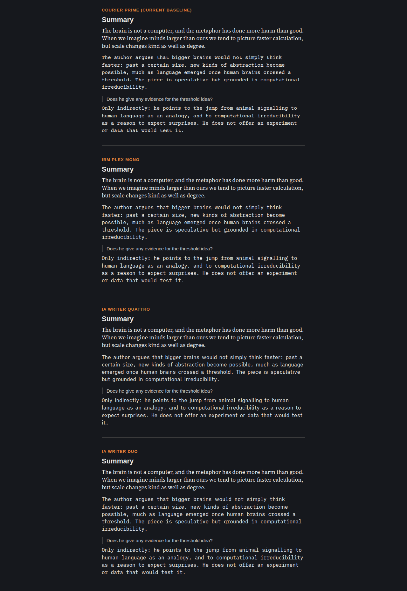
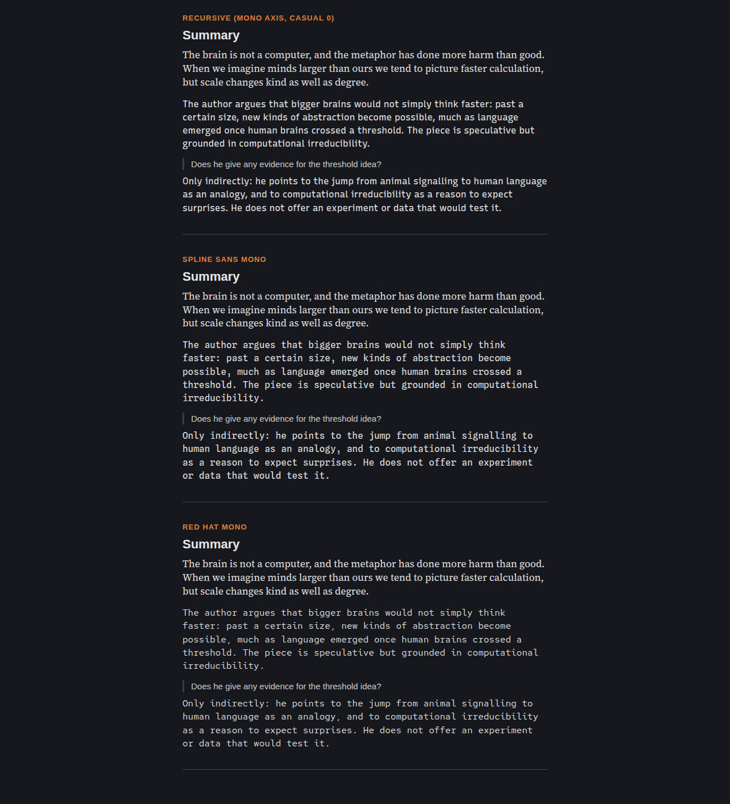
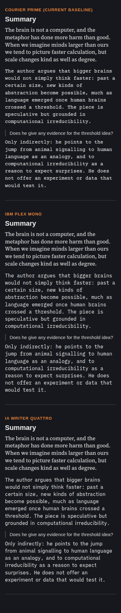
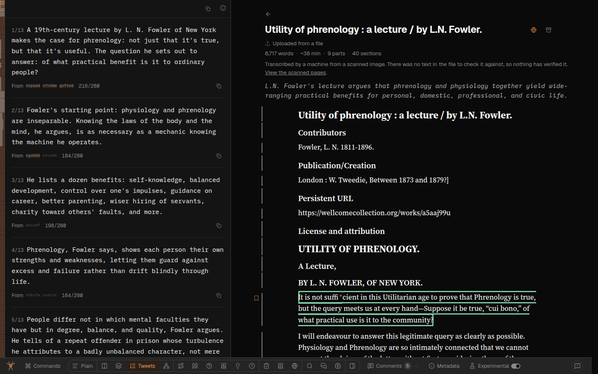
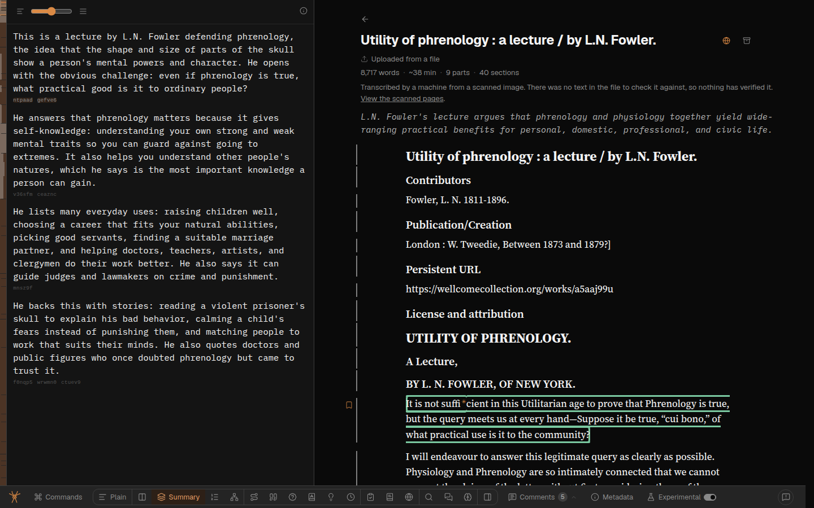
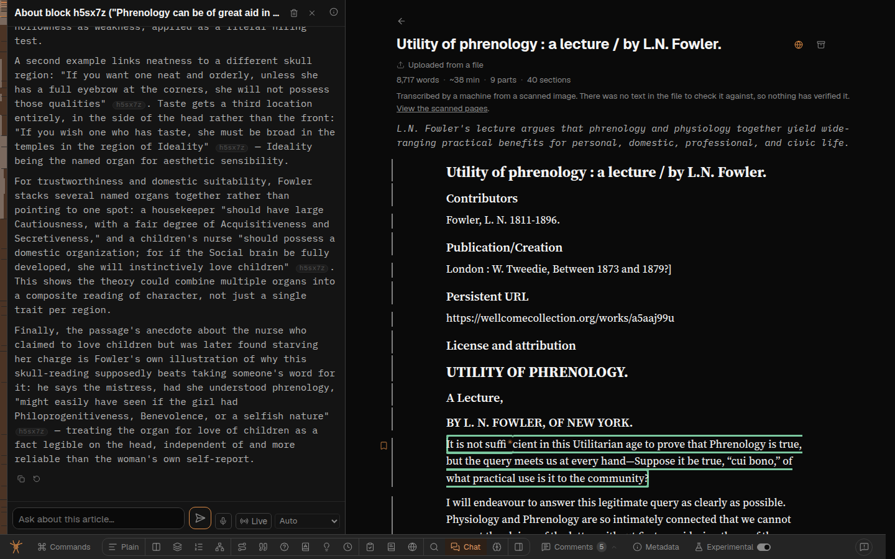
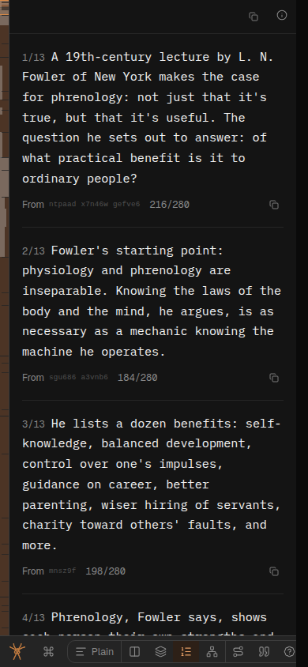
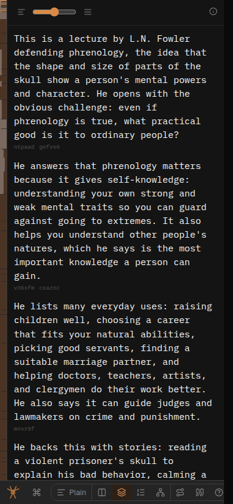
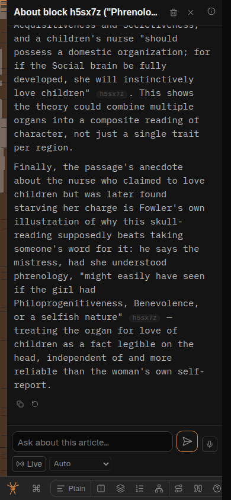

# A nicer AI typeface, and the voices trawl (v1.1 of the per-voice faces)

Reports, all Greg's own, suggestions, admin-verified: SPIDERYARN-READING2-7N (`spya-rwys0e`),
SPIDERYARN-READING2-81 (`spya-a52jsr`), SPIDERYARN-READING2-8G (`spya-j6b69x`). Overseer queue
`qi-ehnxt7ez`. Follows [261001d-typeface-per-voice.md](261001d-typeface-per-voice.md), the v1.

> We switched to using a monospace font for the AI-generated text. Great!
>
> But Courier is really ugly. Do some web research on a more attractive font that would still
> indicate that it's somehow machine/AI-generated - Courier is good in that respect because it looks
> typewriter-y, but it's just a bit too unattractive.
>
> — Greg, 2026-10-01 (7N)

> I like the different fonts for AI-generated vs author-generated vs user-generated.
>
> Let's do another trawl and make sure we're following this carefully throughout, and add/update
> fonts.md (with appropriate signposting from design docs and AGENTS.md and new-mode.md etc) so that
> we stick to this going forwards.
>
> — Greg, 2026-10-01 (81)

> Make sure we're using the AI monospaced font for all AI-generated text (including e.g. Tweet
> threads, etc etc)
>
> — Greg, 2026-10-02 (8G)

## Prior work

The v1 (261001d) is on `dev` behind the Experimental switch. Nothing on `dev`, in `docs/plans/` or
`docs/user-feedback/` touches 7N, 81 or 8G. `gjd-remote ls` shows a sleeping `fb8g-ai-typeface-everywhere`
session with no worktree and no commits; the Overseer relayed 8G to this session instead.

## 1. The face: IBM Plex Mono replaces Courier Prime

Research: [261002a-a-nicer-typeface-for-ai-written-text.md](../research/261002a-a-nicer-typeface-for-ai-written-text.md) (seven candidates,
metrics measured from the woff2 files, sources). Specimens, the same three voices with each
candidate, dark, light and phone:

(light: [1](261002b-specimen-light.png), [2](261002b-specimen-light-2.png))

**IBM Plex Mono.** Still a true monospace, so it still reads as machine-made — and its slab serifs on
`i l r` and Selectric-derived italic keep a little of the typewriter Greg liked. What makes Courier
ugly is a small x-height (0.45 em) and hairline strokes; Plex's x-height is 0.52 em with a real
stroke, so it holds up at body size and light-on-dark. It looks nothing like Geist, Source Serif or
Arial, so the four voices stay distinct. OFL, `@fontsource/ibm-plex-mono`, ~15 KB per style.

**Passed over: iA Writer Quattro**, which reads best as paragraphs — but it is a quasi-proportional
"duospace" and barely looks monospaced, and the monospace look is the signal Greg liked. It is the
named alternative: the swap is the `--font-ai` token and one import. Spline Sans Mono reads as a code
listing; Red Hat Mono is faint in dark mode; Recursive needs a variation axis set to be mono at all.

**Weights:** Plex Mono is static. We import 400, 400 italic, 700 and 700 italic (Markdown emphasis in a reply). `--reading-weight: 450` then
resolves to 400 (CSS font matching goes down to 400 before up past 500), the same as Courier Prime
today. Importing 500 would make dark-mode AI text visibly heavier than the serif beside it.

## 2. The trawl

Full inventory, with file:line and the provenance of each string:
[261002b-voices-trawl.md](261002b-voices-trawl.md). Summary of what we take:

**AI text not in the AI face — take all of it**, about 15 surfaces: Tweets' posts (the one Greg
named: they are in the *reading* face today, under `tw:font-prose`), Marginalia (its question, idea
name and statement, arc), Sketch's card, title bar and scene tooltips, Illustrated's plate titles,
vignette rows, style and prompt, Quotes' "why this one", Skim's next-stop cue, sense lines, timeline
labels and chip names, Structure's paragraph rows and the spine/Structure child lists — voiced by
the **block the node starts at**, not by whether it has a navLabel: a heading leaf's navLabel is
copied from the author's heading (`src/labels.ts`), so a heading block is the author's and anything
else is the model's (Sol, P1), the hover card's web answer, "what the paper does", legacy
gloss, Glossary's legacy detail **and term names** (the model writes the canonical name, and
`.ideas-name` is already AI), chat's pointed-passage reason, Diagram's card gist, the Dock's preview
of an answered comment, the chat thread list's last message (role-classed), Debate's title when the
AI read it, and **code inside an AI answer** — Greg's "all AI-generated text"; code keeps its box, so
it still reads as code.

**Author text not in the serif:** Debate's by-claim heading, Citations' first-cited words, the
search hit card's passage, Timeline's date phrase (wrapped, so our sentence around it stays UI),
and Diagram's evidence quote. Referee's hidden-instruction scan stays UI: hidden, untrusted text is
not obviously the author's voice (Sol, P2).

**Reader text not in Arial:** the written-for-you popover, the purpose prompt, dictation's live
guess, chat thread titles (list, header, dialog), the reader half of the thread list's last
message, search's "Found by {criterion}", the Feedback dialog's body, and the command bar's input.

**Wrong today, fixed:** the chat stance tag ("socratic") is Courier → UI; Debate's fixed "Key
sources" thread name and its fixed relation word (`disputes`/`qualifies`/`unclear`) → UI, matching
the v1 rule that a fixed verdict phrase stays UI; Criteria's `You: leans … · −50` is our template →
UI; Candidates' "said to be at" hedge → UI with only the affiliation AI; "Whole paragraph" in a
comment quote → UI; placeholders in reader inputs → UI.

**Left as they are, deliberately:**
- **Sketch's SVG labels** stay Geist. Every label is wrapped and measured in TypeScript assuming
  Geist's width (`CHAR_W = 0.53`, `src/sketch-scene.ts`); a monospace is ~13% wider and would spill
  out of its shapes. The card, the bar and the tooltips around the picture are voiced. Fixing the
  picture means a per-voice `CHAR_W` through `paintScene`, which the offline harness also calls —
  deferred.
- **Illustrated's captions** are painted into the image; CSS cannot reach them.
- Section titles, citation titles and bylines, Debate's bylines, tool-strip templates, the shelf
  gist (it silently falls back to the author's excerpt, so it needs a `gistSource` flag first), the
  third-party "fifth voice" — all as the v1 decided, listed in the trawl § 6.
- **Pages outside the reading view** — Metadata, the shelf, the public shelf, /profile, /add. The
  attribute is set by `Reader` only, and Metadata replaces `Reader` rather than sitting inside it;
  most of their text is also `tw:font-prose`, which beats `voices.css` by layer. Bringing them in
  is part of promoting the faces out of the switch, which is Greg's call (below).

## 3. Keeping it that way

The one-time trawl rots the moment a new mode arrives. Two things:

1. **A test that every mode has been decided.** `tests/voices-css.test.ts` gains
   `VOICES_BY_MODE: Record<Mode, …>` — for each mode, the AI-voice classes it renders, or an explicit
   `{ noModelText: "<why>" }`. Being a `Record<Mode, …>`, a new mode is a **type error** until somebody
   decides its voices; the test then checks each named class is in `voices.css`'s AI list. It cannot
   prove a new element in an existing mode is covered — nothing short of provenance-tagging every
   string could — but it puts the question in front of whoever adds a mode, at the moment they add it.
   Simpler option passed over: a sentence in `mode.md` alone — a sentence is not a check.
2. **A doc, `docs/project/fonts.md`**, Greg's name for it: the four voices, their faces and tokens,
   the rule (*prose a model generated goes in `--font-ai`; text a model only copied or transcribed —
   the author's heading, a citation's title — keeps the voice of whoever wrote it; a fixed sentence we
   wrote stays UI even when it reports a model's verdict*), how to voice a new element (a class in `voices.css`, a wrapper
   span when a `tw:font-*` utility or a mixed element is in the way), and what is deliberately out.
   `typography.md § A face per voice` moves there (one home), leaving a pointer. Owned by
   `design-css-overview.md`; signposted from `CLAUDE.md`/`AGENTS.md` (a pointer line, no new rule) and
   from `mode.md`'s checklist (there is no `new-mode.md`; `mode.md` is the "adding a mode" checklist
   Greg means).

## Stages

1. **Face** — swap the package and the token; `/design`'s Faces table; screenshot.
2. **Trawl** — component wrappers and `voices.css` entries as above; the `VOICES_BY_MODE` test,
   red-first (remove `tweets` from it and see the typecheck fail); test entries for new templated
   compounds; GPT Sol code review (fixes in-stage).
3. **Docs** — `fonts.md`, the move from `typography.md`, signposts.
4. **Look** — Playwright, laptop and 390px, Experimental on: Tweets, Marginalia, Skim, Sketch,
   chat (incl. stance tag), Summary, a hover card; computed `font-family` checks.
5. **Land** — gates, push, the note, `feedback-endings.ts`, queue item done.

## For Greg

- **Promote the faces out of the Experimental switch?** You've said you like it twice. Promotion
  deletes one attribute guard for the reading view; Metadata and the shelf need their own audit,
  wrappers under their `tw:font-prose` utilities, and a `gistSource` flag for the shelf gist. Not done
  here, because it changes every paying reader's page and you have not said "ship it to everyone".
- Plex Mono not right? iA Writer Quattro is the runner-up, a two-line swap.

## Progress

- 2026-10-02 — research, specimens and trawl done (subagents); plan written.
- 2026-10-02 — **GPT Sol, plan review** ([answer](261002b-sol-plan-review.md)): *approve with
  changes*. All four taken: heading leaves voiced by their block, not by navLabel; 700 italic
  imported; the rule distinguishes generated from copied/transcribed text, and `.ref-scan-text` stays
  UI; promotion described as its own audit. Sol confirmed the trawl's spot-checks, the 450→400
  matching, and that `Record<Mode,…>` reds under `npm run typecheck`.
- 2026-10-02 — **built** (Opus subagent): the trawl's additions and fixes, `VOICES_BY_MODE`, and
  `startsAtHeading` on the tree, so a heading leaf's label is the author's. Red-first: removing
  `tweets` from the record is a TS2741 at typecheck; removing `.tweets-text` from `voices.css` reds the
  test; forcing `navLabelVoice` to `"ai"` reds all four nav-label tests. Docs:
  [fonts.md](../project/fonts.md), and the research moved to
  [docs/research](../research/261002a-a-nicer-typeface-for-ai-written-text.md).
- 2026-10-02 — **GPT Sol, code review/fix** ([answer](261002b-sol-code-review.md)): four fixed.
  Candidates' hedge had inherited the AI face through `.cnd-name`; the stance-tag and "Whole
  paragraph" UI rules had escaped the switch's guard; the nav-label test now exercises Spine's own
  `childLabel`; two over-claims in the docs. Nothing wider was left for me.
- 2026-10-02 — **browser pass** (Sonnet, Playwright, at `0d35f120d`, `fowler-phrenology`, laptop and
  390px): Plex Mono 400/700 loaded and computed on Summary, the masthead gist, chat replies, Tweets'
  posts, glossary entries and names, Structure gists, Marginalia and Skim. Source Serif on the prose
  and its headings, Arial on the reader's message and the chat input, Geist on the chrome and Tweets'
  counter (Geist Mono). No horizontal overflow at either width. With the switch off, five modes went
  back to Geist. The check was inconclusive for Tweets, Marginalia and Skim, because a peer flipped
  the shared dev account's switch back on mid-run. The hook is unchanged by this work, and its tests
  pass.

## Screenshots (switch on)

