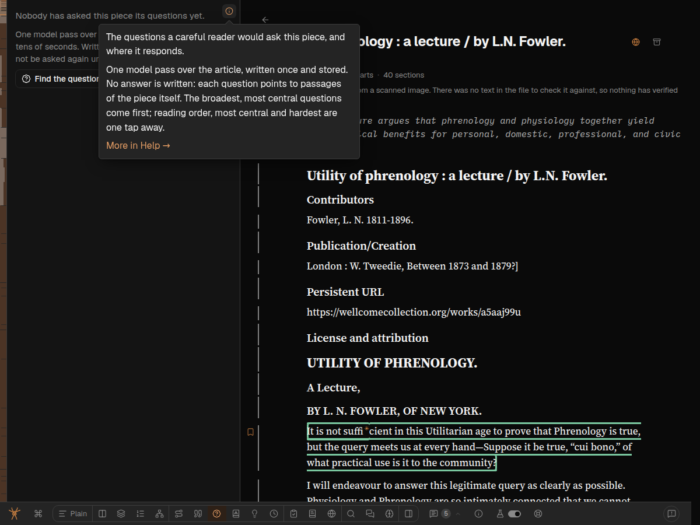
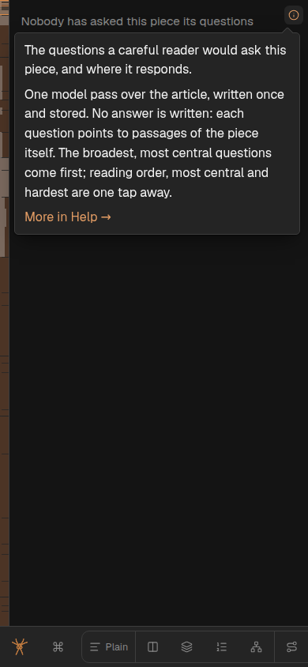
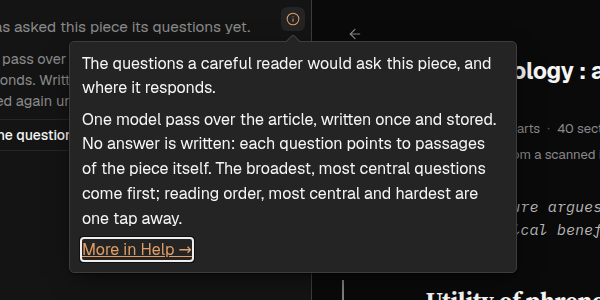
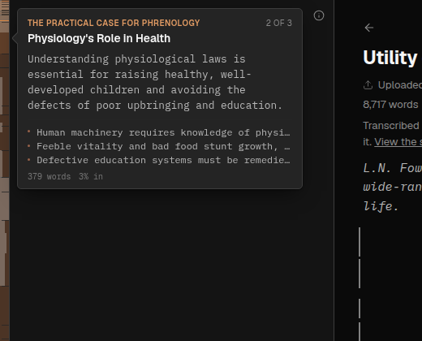
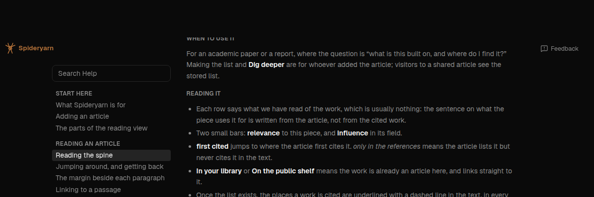

# An opt-in hoverable card on `Tooltip`, proved by "More in Help →" in every band's (i)

Decides [open-questions.md § Q10](../project/open-questions.md#q10) — *Should a tooltip be
hoverable?* Greg, 2026-10-02:

> Q-hover-cards-clickable (c) would be ideal if we can make it work, but test & check in browser
> carefully. If this ends up being really complicated, we'll reconsider.

(c) is **per-use**: `Tooltip` takes a prop that lets the pointer into the card, and only the cards
that hold something to click take it. The spine, which is most of the tooltips in the app, keeps
exactly what it has.

## Why now

Three pieces of work want a link or a button inside a card:

1. **"More in Help →" at the end of every band's (i) card** — the Help page plan
   ([261002b](261002b-help-page.md) § More (i) icons, R5) deferred exactly this to Q10.
2. **A "Dig deeper" (and "Hide") button in the in-text Glossary card** — report `spya-p09u4s`,
   handled by session fbyqfzkm. That card is `ProseHoverCard`, which is *already* interactive through
   its own machinery (`useHoverCard.ts`), so it does not need this prop; listed so nobody assumes it
   does.
3. Possibly an action in the share tooltip (session fbd886ah, queued).

This plan builds the prop and takes it into use in **one** place, (1).

## What there is today

- `Tooltip.tsx`: `useHover(context, { handleClose: null, … })` — the card closes the moment the
  pointer leaves the trigger. The comment there records that a `safePolygon()` corridor lived here
  once, for the context pills, and went with them.
- `tooltip.css`: `.tooltip-anchor { pointer-events: none }`, `.tooltip-anchor.interactive {
  pointer-events: auto }`. The `.interactive` rule is today used only by `useHoverCard.ts` (the prose
  card) — the one existing piece of machinery to reuse. `useHoverCard` itself is a delegated
  listener with its own timers, built for injected-HTML triggers; it is not a fit for `Tooltip`,
  whose triggers are React elements and whose hover is Floating UI's `useHover`. So "reuse" here
  means the CSS class and the house precedent, and Floating UI's own `safePolygon`, which is what
  `useHover` was designed to take.
- `BandAbout.tsx`: a **controlled** `Tooltip` (`open`/`onOpenChange`), so `useHover` is `mouseOnly`
  and a tap toggles it through the button's `onClick`. `ModeSurface` renders it in every band's
  corner, with `<AboutMode mode={mode}/>` plus the band's own `about`.
- Keyboard: `useFocus` opens on focus and closes on blur. The card is portalled to the end of
  `<body>`, so Tab from the trigger goes to the next control in the band, never into the card.

## The design

### `interactive` on `Tooltip`, off by default

```
<Tooltip interactive content={…}>{trigger}</Tooltip>
```

When `interactive` is true, and only then:

1. **The anchor gets `.interactive`** — `className="tooltip-anchor interactive"` — so the card takes
   pointer events.
2. **`useHover` gets `handleClose: safePolygon()`** instead of `null`. The pointer leaving the
   trigger towards the card travels through a triangle from the pointer to the card's near edge, and
   the card stays open while it is inside it (and while it is over the card). Leaving in any other
   direction closes as now. Defaults (`buffer: 0.5`, `requireIntent: true`, `blockPointerEvents:
   false`): `blockPointerEvents` stays false because it sets `pointer-events: none` on `<body>` while
   in the corridor, which would fight the band's own hover states and is the fiddly part people
   complain about.
3. **`FloatingFocusManager` with `modal={false}`, `initialFocus={-1}`, `returnFocus={false}`** wraps
   the floating element. Non-modal focus management inserts focus guards so that **Tab from the
   trigger moves into the card** (to its link) and Tab out of the card's end moves on to whatever
   followed the trigger; `closeOnFocusOut` (default) closes the card when focus leaves both.
   `initialFocus={-1}` is so that *opening* the card — by hover above all — never moves focus;
   `returnFocus={false}` likewise, so closing a hovered card does not yank focus to the trigger.
   `useFocus`'s blur handler already treats focus moving into the floating element, or onto a focus
   guard, as "stay open" (read in `@floating-ui/react` 0.27.20's `useFocus.onBlur`).
4. **Escape** — `useDismiss` already closes on Escape, wherever focus is in the document. Unchanged.
5. **Role.** `useRole(context, { role: "tooltip" })` stays. ARIA's tooltip role is not meant to
   contain focusable content, and `"dialog"` would replace `aria-describedby` with
   `aria-controls`/`aria-expanded`, so the card stops being the trigger's description. The trade-off
   goes to the plan review; the default is to keep `tooltip` (the card is still, first, a
   description, and the link is its last line), unless Sol thinks otherwise.

Without the prop, nothing changes: same class, `handleClose: null`, no focus manager. A test
holds that (below).

### Touch

`BandAbout` is controlled, so a tap on the (i) toggles the card via `onClick`, and `useDismiss`'s
outside-press closes it. With `.interactive`, a tap inside the card is no longer a tap *through* it
to whatever is beneath, and is not an outside press either, so tapping "More in Help →" follows the
link. Nothing else to do; checked on phone width with touch emulation.

### "More in Help →" in every band's (i)

`BandAbout` takes an optional `help?: string` (an href built by `helpHref`, never by hand). When
present the card is `interactive` and ends with a line `More in Help →` as a `Link` to it. When
absent, the card is not interactive — so a card with nothing to click keeps the old, simpler
behaviour.

`ModeSurface` passes `help={helpHref(modeAnchor(mode))}` whenever it has a `mode`. A band with an
`about` but no `mode` gets no link (none of them has a Help section of its own).

A real link in the same tab — Back returns to the article with its address, mode and place, as the
Dock's Help link does (Dock.tsx § `helpHrefFor`).

### The simpler option passed over

**Put the link beside the (i), not in its card** — a second icon in the band's corner. 261002b's
R5 rejected that already (the corner holds the (i) and each mode pads its top row by
`--band-about-room`; a second icon doubles that everywhere). And Greg chose (c).

## Tests (red first)

`tests/tooltip-interactive.test.tsx` (jsdom):

1. **Default card is not interactive**: hover a plain `Tooltip` trigger, the anchor has no
   `interactive` class, and moving the pointer from the trigger onto the card closes it.
2. **Interactive card stays open when the pointer moves into it**: `mouseleave` on the trigger with
   `relatedTarget`/coordinates heading into the card, then `mouseenter` on the card — still open.
   (jsdom has no layout, so `safePolygon`'s geometry cannot be exercised there; what jsdom *can* see
   is that entering the floating element keeps it open, which `useHover` does with any
   `handleClose`. The geometry is the browser pass's job.)
3. **Keyboard reaches the link**: focus the trigger, card opens; Tab moves focus to the card's link,
   and the card is still open.
4. **Escape closes it** with focus on the link.

`tests/band-about.test.tsx` gains: the (i) card for a band with a mode ends with a link to
`/help#mode-<mode>`; a card with no `help` has no link and no `interactive`.

## The browser pass (Sonnet subagent)

Per browser-control.md, then browser-testing.md (Playwright on the box). Screenshots into
`docs/plans/261002e-shot-*.png`. Checked:

- Mouse travel from the (i) into its card: straight down, diagonally across the gap from both
  sides, and a fast swipe — the card stays; moving *away* closes it within ~100ms.
- Click "More in Help →": lands on `/help#mode-<mode>`, section scrolled into view; Back returns.
- **The spine's rail**: scrub down it, cards open and close as before, none sticks open, none can be
  entered; `.tooltip-anchor` on a spine card has no `interactive`.
- A Dock mode button's card: unchanged (not interactive).
- Keyboard: Tab to (i) → card opens → Tab → link focused → Enter navigates; Escape closes; Tab past
  the link leaves and closes the card.
- Phone width (390px) with touch emulation: tap (i) → card; tap link → Help; tap elsewhere → card
  closes.

## Stages

1. **Prop + tests + BandAbout link** — one commit. Code review by GPT Sol.
2. **Browser pass**, fixes from it, screenshots into this plan.
3. **Record the decision**: tooltips.md § The pointer cannot enter a card rewritten as the decided
   rule with Greg's quote; Q10 deleted from open-questions.md; Tooltip.tsx's `handleClose` comment
   updated. Push to dev; tell the Overseer the prop is there.

## If it turns out hard

Stop and write Greg a plain summary if any of: safePolygon fights the band's layering (the band is
`position: fixed` and the card portals over it), the spine regresses, or the corridor is flaky in
the browser. The fallback is the one 261002b chose: the link beside the card rather than in it.

## Plan review (GPT Sol, 2026-10-02) and what changed

[261002e-interactive-tooltip-prop-plan-review-sol.md](261002e-interactive-tooltip-prop-plan-review-sol.md).
Verdict: keep the opt-in design; fix focus loss and the role first. All six taken:

- **F1 (P1) Escape dropped focus on `<body>`** — `returnFocus={false}` meant the focused link
  unmounted with nothing to go back to. Fixed in `Tooltip`'s `changeOpen`: an `escape-key` close
  with focus inside the card focuses the trigger first. Only for Escape — an outside press is a
  click that puts focus where it lands, and Tab out has already moved it.
- **F2 (P1) hover-leave closed a card the keyboard was inside** — `safePolygon` knows nothing about
  focus. `changeOpen` ignores `hover` / `safe-polygon` closes while focus is inside the card.
- **F3 (P1) role** — an interactive card is a **named non-modal `dialog`**, not a `tooltip`. So
  `interactive` is `{ label: string }` rather than a boolean: an interactive card without a name
  does not compile. The trigger gets `aria-haspopup="dialog"` / `aria-controls` from `useRole`
  and loses the card as its `aria-describedby`; BandAbout's trigger already has `aria-expanded`.
- **F4 (P2) touch** — BandAbout's own `onClick` toggle bypasses Floating UI's record of a click
  opening. Not changed to `useClick` up front (it would change how the (i) answers a mouse click
  too, which nobody asked for); **the browser pass decides**, with touch emulation and event order.
- **F5 (P2) tests** — the first draft's `mouseenter` on the card kept *every* card open
  (`useHover` clears its timer on it), so it could not go red. The tests now use the focus
  guards for Tab, document `mousemove` for travel, and assert focus after Escape and after hover
  leaves. Mutation-checked by construction: without `safePolygon` the travel test goes red (the
  default-path test is that case), without the focus manager there are no guards.
- **F6 (P3)** — added a controlled, grouped, non-interactive case (the spine's shape): still a
  `tooltip`, still the trigger's description, no pointer, no guards.

## Code review (GPT Sol, 2026-10-02) — fixed by the reviewer

[261002e-interactive-tooltip-prop-code-review-sol.md](261002e-interactive-tooltip-prop-code-review-sol.md),
exit 0, verdict *pass after fixes*. It changed `Tooltip.tsx` and the two test files; I read the diff
and re-ran the gates (typecheck, lint, the nine tooltip/band/spine/help/doc-links suites, 214 tests).

- **F7 (P1)**: a card could stick open after focus left it directly (focus on the link, pointer
  away, then focus moved by something other than Tab). Floating UI 0.27.20's portal workaround
  treats every blur as "inside the React tree" when there is no `FloatingTree`, so dismissal was
  swallowed. Fixed: `FocusReach` supplies a `FloatingTree` (no DOM) unless one already encloses it.
- **F8 (P1)**: the `placed` ref written during render could hold a detached trigger if the trigger
  was replaced in the same commit as an Escape. Fixed: read Floating UI's live `refs` instead;
  `focus({ preventScroll: true })`.
- **F9 (P2)**: the "hover does not take focus" test asserted before queued focus work ran, so it
  passed with `initialFocus={0}`. Fixed, and it added mouse-toggle, simulated-touch and
  focus-transition cases. It reports six behaviour mutations now fail an assertion.

## Browser pass (Sonnet subagent, Playwright on the box, 2026-10-02)

Article `/read/fowler-phrenology?mode=faq`, real `page.mouse` moves, on 982025104 (Sol's edits
landed mid-run; see A).

| | Check | Result |
|---|---|---|
| A | Pointer from (i) into the card: down, down-left, down-right, fast | Pass on the final runs (card 10px below the (i); all five moves twice). **One early down-left failure** that did not recur in 8 fresh loads — re-run on the committed final tree, below. |
| B | Pointer away from the card | Closes in 80–180ms |
| C | *More in Help →* | `/help#mode-faq`, section in view; Back returns to the article |
| D | Spine scrub, 40 positions | One card each time, always `role=tooltip`, never `interactive`, `pointer-events: none`; `elementFromPoint` inside a spine card hits the band beneath; nothing sticks |
| E | Dock cards | `role=tooltip`, not interactive |
| F | Keyboard | Tab → link (card open); Shift+Tab → (i); Tab past the link → next control, card closed; Escape from the link → closed, focus on (i); hover moves no focus |
| G | Focus in the card, pointer wanders off | Stays open, focus kept |
| H | Mouse click on a hover-opened (i) | Closes it (hover opens, click toggles) — the behaviour before this change too; left alone |
| I | 390px, touch emulation | Tap (i) opens; tap link navigates; tap outside closes; tap twice toggles |






