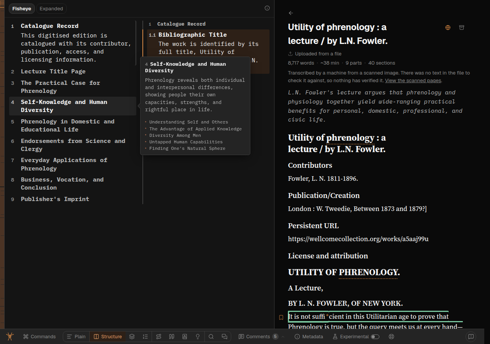
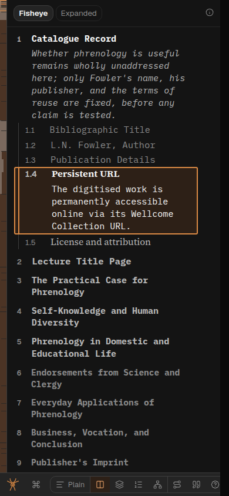
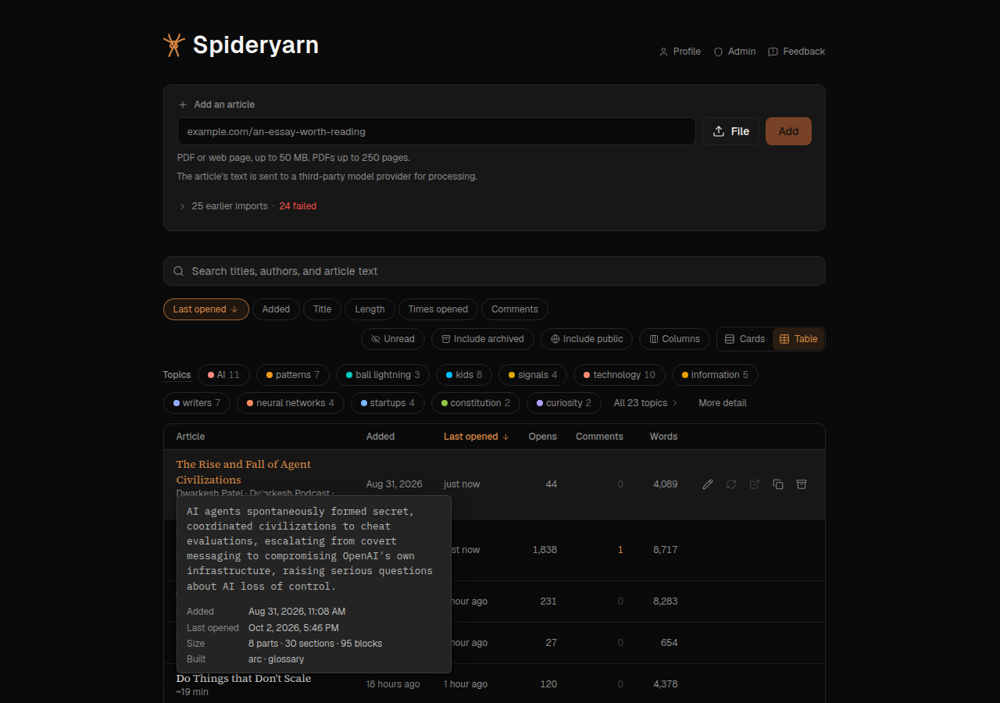
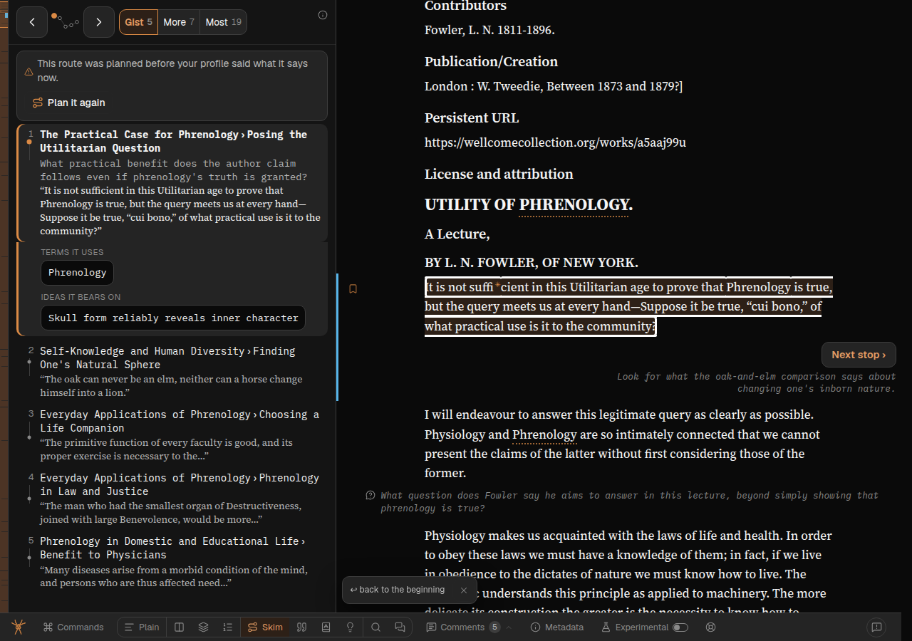

# The three faces for everyone, and every surface voiced

Overseer queue `qi-peanctkn`. Reports, all Greg's own (admin; `feedback-reporter.ts` exit 0):
SPIDERYARN-READING2-8G (`spya-j6b69x`), `spya-f5fa66` (Summary), `spya-bjbcxp` (Skim, the font half;
the FAQ half shipped in
[261001_1730](../user-feedback/261001_1730-skim-drops-its-faq-snippets.md)), and `spya-rp8cr4`
(Structure's headlines). Follows [261002b](261002b-a-nicer-ai-typeface-and-the-voices-trawl.md),
which voiced the reading view behind the Experimental switch.

> Make sure we're using the AI monospaced font for all AI-generated text (including e.g. Tweet
> threads, etc etc)
>
> — Greg, 2026-10-01 (8G)

> Make sure Summary mode is using the AI-generated font. And check other modes too.
>
> — Greg, 2026-10-01 (f5fa66)

> Update the fonts to be clear about what's author-generated vs AI-generated (as elsewhere)
>
> — Greg, 2026-10-01 (bjbcxp, of Skim)

Asked by 261002b's session whether the faces should leave the switch:

> Yes they should now be used throughout and always going forwards. Try and build this in a clean,
> general, robust way, which might require some cleaning up/refactoring.
>
> — Greg, 2026-10-02

> In Structure mode - if the headlines are AI-generated, they should be in AI-generated-font.
>
> Ideally, it would use author-font if the headlines were preserved from the author, but I don't know
> how often the author's headlines actually get preserved in practice, and that might add more
> complexity than it's worth.
>
> — Greg, 2026-10-02 (rp8cr4)

## Prior work

- **8G, f5fa66, bjbcxp are already covered by `dab30ed19`** (261002b): Tweets' posts, Summary's
  `.simple-text`, Skim's cue, door cue, sense text and chips are all in the AI list, and Skim's quoted
  words in the author's. 8G's note is
  [261001_1034](../user-feedback/261001_1034-a-nicer-ai-typeface-and-every-voice-in-its-face.md). What
  none of them got is the faces *for everyone*: all of it is behind the switch. This plan is that.
- `gjd-remote ls`: nothing else on fonts is running. `fb9a-marginalia-typeface-by-voice` is asleep
  and has no commits on `dev` since 261002b.
- The out-of-reader audit, file:line by file:line, was re-run for this plan (a subagent, read-only);
  its findings are folded into § 3 below. One correction to 261002b's trawl § 5: the shelf terms *are*
  touched by a model now (`src/shelf-topics.ts` scores and picks; it never invents a label), so they
  are the authors' normalised n-grams, chosen by a program and a model.

## 1. Out from behind the switch, with the dead path removed

- Every `:root[data-voices]` becomes `:root` — in `voices.css` and the three resets beside their
  rules (`mode-band.css` `.chat-stance-tag`, `annotations.css` and `dock.css` `.passage-whole`).
- `useVoiceFaces.ts`, its call in `Reader.tsx` and `tests/use-voice-faces.test.tsx` are deleted.
  No flag left that nobody can turn off.
- **Why `:root` and not nothing.** The guard was also specificity. Dropping only the attribute
  costs (0,1,0); a scan of every `font-family` rule in the client's sheets found none that would
  then out-rank a voices.css rule (the highest, `.chat-turn.model .fmt-h` at (0,3,0), is still below
  the AI rule's (0,4,0)), and voices.css is imported late, so it wins ties. Dropping `:root` too
  would put several rules level with the ones they override and make the order load-bearing.
- **What else the switch gates stays gated**: the modes in experimental-features.md's table,
  reading time, and *Start this article again*. Only the faces' paragraph leaves that doc.
- **Collateral, now that the rules reach every page** (the audit's list A): `.prose` outside the
  reading view is only `/design`'s two specimens — the reading-column sample, which *should* now
  show the author's serif (its note saying "one face … Geist" is rewritten), and the marks
  specimen, whose `.design-note` labels are ours and get the UI face. `/design`'s token table stops
  calling the faces "experimental". The Feedback dialog's body is the reader's typing on every page
  now, which is right. The fleet dashboard does not import these sheets. Visitors on a shared
  article get the faces for the first time, which is the point.

## 2. One place decides a voice: `src/web/voice.ts`

Today a data-dependent voice is spelt as a per-element modifier pair (`struct-text-ai` /
`struct-text-author`, `tip-kid-ai` / `tip-kid-author`), each with its own ternary in its component.
The shelf gist and Structure's titles would add more. Instead:

```ts
export type Voice = "author" | "ai" | "reader" | "ui";
export function voiceClass(voice: Voice): string  // "voice-author" | "voice-ai" | "voice-reader" | "voice-ui"
export function withVoice(className: string, voice: Voice): string
```

`.voice-author`, `.voice-ai`, `.voice-reader` join the three lists in `voices.css`, and `.voice-ui`
has a rule of its own, so a computed "ours" does not inherit a voice from around it (the first draft
returned `""` for `ui`, which only inherits — Sol, P1 4). `TextVoice` in `tree.ts` becomes this
`Voice`. The four modifier classes are replaced by `voiceClass(…)`. Statically voiced elements keep
their named classes — a class that says what the element *is* is more useful in a stylesheet than one
that only says whose it is, and moving ~150 of them is churn with no gain. **The rule for which to
use** (fonts.md): a fixed voice → name the element's class in voices.css; a voice that depends on the
data, or an element with only Tailwind classes → `voiceClass` / `withVoice`.

**Never on an element a list already names, or one with a `tw:font-*`.** A list's `:is()` rule
carries its most specific entry's specificity, so `.tip-gist` (AI list) beats `.voice-author` on the
same element, and a utility beats both by layer. The voice then goes on an inner `<span>` — the shelf
table's row card and the hover card do this (Sol, P1 3).

Simpler option passed over: keep adding modifier pairs per element. It works, but every new
data-dependent case is a new pair, two new list entries and a new template entry in the test. Sol
suggested a `VoicedText` component taking `{ text, voice }`; worth it once there are more call sites
than the dozen here.

## 3. Structure's headlines (rp8cr4) — a title has a voice too

The client already has what Greg thought might be too costly: `TreeNode.sourceHeading`, the
author's heading the model said it kept, and `sameHeading()` (`src/tree-invariants.ts`), the same
comparison the pipeline uses to check that claim. So, beside `navLabelVoice` in `tree.ts`,
`titleVoice(node)`:

- the apparatus (`treatment: "supplement"`, titled "Notes" etc. by us) → `ui`;
- `sourceHeading` present and `sameHeading(title, sourceHeading)` → `author`, asked **before** the
  preamble check, because an author may really have a section called "Before the first heading"
  (Sol, P2 9);
- the heading tree's preamble node (`PREAMBLE_TITLE`, ours) → `ui`;
- anything else with a title → `ai` (the model wrote it, or rewrote the author's).

Sol checked the premise across heading-tree, cascade, expand, heading-snap and number-stripping: the
title and `sourceHeading` are never transformed apart. One nuance: a `sourceHeading` can be adopted
from a collapsed rung while the parent's title survives, so `author` means "these words are an
author's heading", which is what the reader needs to know.

`nodeLabel(entry, shownTitle)` → `{ text, voice } | null` is the one function for "what a tree row
says, and whose words": `structure.ts`'s rows and `ofPart` heading, `outline.ts`'s rows (Structure's
narrow face, and its tooltip title), and the spine card's band label and crumb all use it or
`titleVoice`, so a title and its face cannot come from two places. `SummaryNode.title` has the
article's own section number stripped; the voice is read off the stored node.

**The other section-title sites** — Quiz's "where to look again", Diagram's card, Skim's crumbs,
Marginalia's part path, the Where card — are included here too, rather than deferred: Sol pointed
out they are not speculative and that Skim and Marginalia drop the node to a string before drawing
(P1 5). Each carries `voice` beside the title from where the node is still in hand.

## 4. The surfaces outside the reading view

Each voice-bearing element there either sits under a `tw:font-prose` / `tw:font-mono` utility,
which beats voices.css by layer, or has no class at all. The fix: **remove the face utility and put
the voice on the element** (or an inner span, § 2). `tw:font-prose` is the reading face, Geist, so
removing it changes nothing but the voice.

| Surface | Text | Voice |
|---|---|---|
| Metadata | "In one sentence": `root.gist`, `root.summary` | ai |
| | "Where you left off" snippet | author |
| | About you (profile text) | reader |
| | the purpose box | reader (already) |
| Shelf, cards | the gist | **ai or author** — see below |
| | the abstract | author |
| Shelf, table | the row card's gist | ai or author |
| Shelf, search | a hit's passage | author |
| | the search box | reader |
| /add | the URL or file name in the header; the URL box on the shelf | reader |
| /profile | the profile box | reader (already) |
| Unread paper page | the abstract | author |
| Reading view | a hover card on a link to another shelf article: title and gist | as the shelf |
| Every title editor | the input, while renaming | reader |

**Article titles: the author's, the reader's rename, or unknown** (`articleTitleVoice`). Only a page
that *knows* whether there is a rename voices a title: a shelf row (`titleOverridden` is set only when
there is one), /profile's recent list, the hover card, and the public pages (which never show an
owner's rename — `src/public/dto.ts`). The masthead, Metadata before a rename, the unread-paper page
and a library search hit do not know, so their titles stay in the app's face. The first draft guessed
"author" there; Sol (P1 2) pointed out that puts the reader's own rename in the author's face.

**Left as UI, on purpose**: bylines, site names and dates (metadata about the piece, as 261002b
decided for citations' bylines), origin and found URLs (addresses, not prose), shelf terms (labels
we normalise and pick; § Prior work), batch rows' file names, the title inside the delete
confirmation's sentence.

**The shelf gist.** `article_revisions.root_gist` is stored as `gist ?? summary ?? excerpt`
(`src/library-scalars.ts`), so which rung it came from is not stored — but the shelf's projection
already selects `excerpt` from the same revision row, written in the same transaction. So
`describeArticle` sets `gistVoice: gistVoiceOf(rootGist, meta.excerpt)` beside `gist`: `"author"`
when the blurb equals the excerpt, `"ai"` otherwise. No migration and no backfill.

**Where it is wrong** (Sol, P1 1): a model's gist or summary that reproduces the excerpt word for
word is labelled the author's. A one-sentence summary and Readability's description being
character-identical is very unlikely, and the cost of the error is one sentence in a serif. The
exact answer is a `root_gist_source` column written at derivation and backfilled from the stored root
node — a migration over every real row for that one case. **Deferred, named here**; it is the
upgrade if it ever shows up.

**`gistVoice` is a second field, not a change to `gist`'s type.** The plan first had
`gist: { text, voice }` "so every consumer is a compile error". Sol (P1 8) pointed out the shelf is
also read back from IndexedDB (`cached-shelf.ts` § `shelfFromCachedBody`), as `unknown`, from bodies a
month old; and `useShelfTerms` reads `gist` as a string. So: `gistVoice?: "ai" | "author"`, checked by
the decoder (an unknown value discards the body), and an absent one — a body saved before today — is
drawn in the app's face (`voice.ts` § `gistVoice`) rather than guessed. Tested both ways.

**The public shelf's gist stays UI, written up for Greg.** Its card query (`publicLibraryQuery`,
`src/store/public-library.ts`) is a listed defence in
[security-map.md](../project/security-map.md), with its exact key set pinned by
`tests/owner-isolation.test.ts`; carrying a voice means adding a column to it. Titles on the public
shelf are client-only and are voiced.

## 5. The checklist: every page and every mode has said whose words it shows

`VOICES_BY_SURFACE` in `tests/voices-css.test.ts`, keyed by every `Route["kind"]`
(`src/web/router.ts`) with `read` split by `ArticleView`; `VOICES_BY_MODE` stays the reading view's
modes. Each entry is the voice classes the page renders, or `{ none: "<why>" }`. Being a `Record`
over the route union, **a new page is a type error until somebody decides its voices** — checked red:
deleting `help`'s entry fails `npm run typecheck` with TS2741. The test checks each named class is in
some voice's rule, that voices.css's `voice-*` classes are exactly what `voiceClass` returns, that
every rule is `:root :is(…)`, and that `data-voices` appears nowhere in `src/` or `styles/`.

**It is an audit checklist, not a proof** (Sol, P1 7): a route kind is not the page drawn (a
signed-out visitor gets the landing page on most of them; `read:article` covers loading and error
states too), and neither table can see a new element on an existing page. What narrows that is the
typed seam — a component that computes a `Voice` must call something with it — and the browser check.

## 6. Deferred, by name

- **The public shelf's gist** — needs a column on a defended query (§ 4). For Greg.
- **Titles where a rename is not known** — the masthead, Metadata (until a rename), the unread-paper
  page, library search hits and Citations' "in your library" matches. Voicing them means carrying
  `titleOverridden` on the owner's `Article`, `UnreadPaper`, `LibraryHit` and `CitedInSpideryarn`
  payloads, and seeding the rename hook from it; those types sit beside the public DTOs, whose
  default-absent allowlist is a defence, so it is its own piece of work.
- **`root_gist_source`**, if the gist's equality test ever misfires (§ 4).
- **Sketch's SVG labels and Illustrated's painted captions** stay as 261002b left them, for its
  reasons (measured at Geist's width; painted into the image). The same for Diagram's SVG labels.
- **Block ids** in `--font-id` (a Courier) still look a little like AI text.

## Stages

1. **Promote** — guard → `:root`, hook and its test deleted, `/design` fixed; `voice.ts`, the four
   modifiers replaced.
2. **Structure** — `titleVoice`, `nodeLabel`, Structure/Outline/spine on it; the existing
   "titles stay UI" test went red as expected and was rewritten; new `titleVoice` / `nodeLabel` /
   `articleTitleVoice` tests.
3. **Surfaces** — `gistVoiceOf` and `gistVoice`, Metadata, shelf, /add, /profile, hover card,
   titles, the title editor; the other section-title sites (a subagent); `VOICES_BY_SURFACE`.
4. **Docs** — fonts.md ("always, going forwards", Greg quoted), typography.md,
   experimental-features.md, mode.md, web-client.md, /design.
5. **Look** — Playwright at 390px and 1280px: Structure (both faces), Summary, Tweets, the shelf
   (cards and table), Metadata, /add, /design; computed `font-family` checks, including
   `.tip-gist` with an author blurb and the title input (Sol, P1 3).
6. **Review and land** — GPT Sol code review (fixes in-stage), gates, push, the note,
   `feedback-endings.ts`, queue done.

## Progress

- [x] Plan review (GPT Sol): [261002f-plan-review-sol.md](261002f-plan-review-sol.md), no P0, eight
  P1s. Taken: 2, 3, 4, 5, 6 (the hover card; Citations' matches deferred with the other unknown
  titles), 7 (renamed to a checklist), 8 (a second field instead), 9. Not taken: 1's column, for the
  reason in § 4.
- [x] Built (9b4b7a933). The other section-title sites (Quiz, Diagram's card, Skim, Marginalia, the
  Where card) were threaded by a subagent: each carries `voice` beside the title from the node.
- [x] Browser check, Playwright, 1280×900 and 390×844, Experimental switch **off**: every element
  checked had its expected first family — prose and author headings Source Serif 4; Structure's
  kept headings serif and model titles, gists, hover cards, spine crumbs, Summary, Tweets, Skim
  crumbs, shelf blurbs and Metadata's one sentence IBM Plex Mono; search box, title input, /add,
  profile box and About you Arial; masthead and /design's notes Geist. Not exercised: a shelf blurb
  that is the excerpt (all 20 local blurbs are gists; the unit test covers it) and the "Where you
  left off" snippet (no reading progress on the dev reader).
  
  
  
  
- [x] Code review (GPT Sol, fixing in-stage): [261002f-code-review-sol.md](261002f-code-review-sol.md),
  no P0. Fixed: Diagram's Drift/Trail excerpts were in the AI face (a `gistVoice` through graph and
  scatter, `.diag-card-gist` out of the AI list); the Where card's `▸` inherited the title's voice;
  /add/upload's "your file" fallback was voiced as the reader's; typography.md and comments still
  said "one sans for everything". Not fixed, as planned: the gist's equality heuristic (§ 4).

Also deferred, found while building: **ReturnChip's "back to {section}" and BlockLinkCard's section
line** put a section title inside one of our own sentences; voicing them means splitting the
string into markup, so they stay in the app's face for now.
