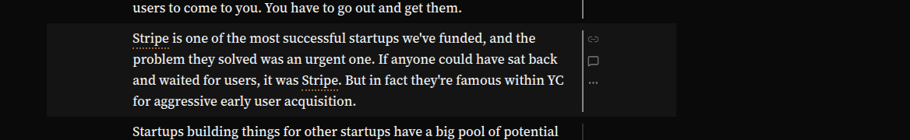
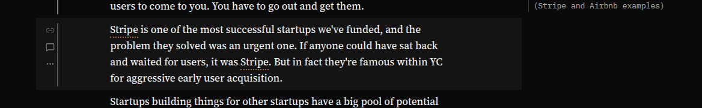
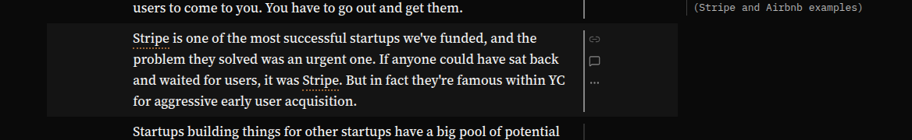
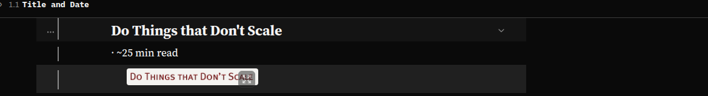
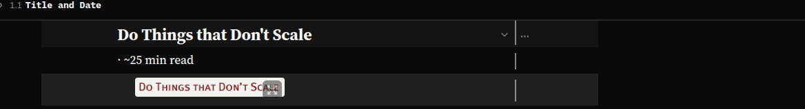
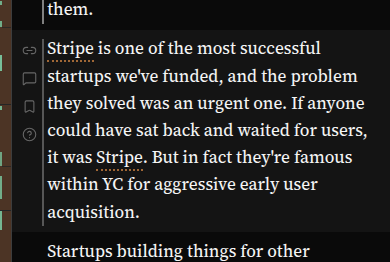
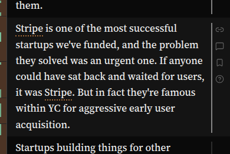

# The block's gutter icons move to the right of the block

**Status:** built 2026-10-03, on `dev`. Report `spya-kd5dk5`, Overseer queue item `qi-crm2g6dr`.
The Sol plan review (`261003c-block-gutter-icons-right-plan-review-sol.md`) found no P0 and asked
for tests that pin each rule's side and for checks at 12px and 20px roots; both are in. The
screenshots found one more thing, § A gap that was already there.

> For the icons currently to the left of the block (e.g. Permalink, Comment, Question, etc)
> - Let's try moving them to the right-hand-side of the block
> - Add a slightly bigger vertical gap between each of them
>
> — Greg, 2026-09-29

## What is already done

**The gap.** Plan [261002e](261002e-mode-corner-icons-and-gutter-icon-polish.md) gave the icons
4px more air (13px between glyphs instead of 9) for `spya-jc0vm6`, which asked the same thing on
2026-10-02. This plan does not widen it again. It moves the column.

## What is in the way

The queue item warned that **Marginalia** now has the right-hand column. The reason it does not
conflict: a Marginalia note sits *outside* the reading cell (`left: 100%` of `td.text`, then
`--marg-gap`), and the gutter sits *inside* the cell's padding. On the right, the order becomes:

```
| prose ...................... | ⟂ icons |   note in the margin ...
                               ^ cell's right pad (the gutter's column)
                                         ^ cell's edge, then --marg-gap
```

This fits [interface-vision.md](../project/interface-vision.md): the right column is for what is
anchored to the text, and a bookmark or a question on a block is exactly that.

**The heading's fold chevron** (`.fold-toggle`) is at the right-hand end of a heading's line. It is
placed `--text-pad-r` plus the centring slack in from the cell's right edge, which puts it at the
prose's right edge, *inside* the measure. When the right pad becomes the gutter, the chevron stays
at the end of the heading line and the heading's icons sit one gutter-inset to its right. They are
neighbours, not overlapping. The screenshots check this.

## The design

**Swap which side of the cell holds the gutter.** Every rule that places something against the
prose already reads two tokens, `--text-pad-l` and `--text-pad-r`, and most were written for "any
pair" on purpose (narrow-window.css § the title over the column says so at length). So:

1. `shell.css`: `--text-pad-r` becomes the gutter's column,
   `calc(var(--blk-gutter-w) + var(--blk-gutter-x) * 2)`, and `--text-pad-l` becomes the plain
   breathing space, `1.4rem`. The total is unchanged, so `proseAloneMaxPx`, `fitMargin` and the
   lone-column cap in `layout.ts` are unchanged (their comments get the sides swapped).
2. `narrow-window.css`: the phone's trailing pad `--text-pad-r: 0.9rem` becomes
   `--text-pad-l: 0.9rem`. The phone's masthead and controls bar already align to `--text-pad-l`,
   so the title still starts on the same pixel as the first line of prose.
3. `gutter.css` § the gutter: `left: calc(--blk-gutter-x + max(0, slack / 2))` becomes the same
   expression as `right:`. The expression is symmetric in the two pads, so nothing else in it
   changes.
4. `gutter.css` § the reading-time line: it hangs in the gap between the column and the prose,
   which is now on the column's left: `left: 100%` → `right: 100%`, and the 2px line is drawn at
   the strip's right edge (next to the column, as now).
5. `footnotes.css`: a footnote's prose is left-aligned, not centred, so its gutter is
   `right: calc(--blk-gutter-x + max(0, 100% - padL - padR - measure))` rather than
   `left: --blk-gutter-x`, to stay beside the note's own right edge rather than out at the cell's.
6. Comments and docs that say "left of the prose" for the gutter: gutter.css, prose.css,
   shell.css, narrow-window.css, layout.ts, BlockGutter.tsx, and the docs that describe it
   (touch.md § the gutter, comments.md, reading-time.md, and others a grep finds). Each one is
   read, not search-and-replaced.
7. The tests that assert these numbers (`tests/prose-centred-in-its-cell.test.ts`,
   `tests/text-alone-centring.test.ts`, `tests/gutter-target-size.test.ts`, the layout tests)
   follow the swap. A test that asserted "the gutter's `left`" now asserts its `right`.

**What does not move:** the spine's marks (left edge of the window), the open "…" panel (it grows
downward, one slot wide), the tooltip cards (the delegated card places itself against the control).
The screenshots check the last two.

## Checked by

Before-and-after screenshots at 1440, 820 and 390 (touch) wide: plain reading, a band mode,
Marginalia open, and a heading with its fold chevron, with box measurements: the gutter's left edge
must be ≥ the prose's right edge plus `--blk-gutter-x`, at most a couple of pixels off; it must not
overlap `.fold-toggle` or the first `.marg-note`; and on the phone it must stay inside the window.

## What the screenshots show

Playwright on the box, article `ds-spya-me0d4g`. Measured after both fixes: the icons start 5.6px
(one `--blk-gutter-x`) past the prose's right edge at 1440, 820 and 390, and 4.2 / 7.0px at 12 / 20px
roots; the fold chevron and a heading's icons are the same inset apart at every root; with
Marginalia open the icons are 25.6px (820) to 114px (1440) clear of a note's words; the open "…"
panel and the tooltip stay inside the cell and the window.

| | before | after |
|---|---|---|
| paragraph, 1440 |  |  |
| Marginalia open, 1440 |  |  |
| heading and its fold chevron, 1440 |  |  |
| phone, a tapped paragraph |  |  |

On a phone the text gains about 21px on the left (35.2 → 14.4) and gives the same back on the right.

## A gap that was already there

The first "after" screenshots put the icons **88px** right of the text at 1440. The "before" set had
the same 88px on the *left*: the gutter sat 11.7px from the cell's edge and the text 123.7px. The
gutter (and the fold chevron) place themselves at the edge of a 65ch measure, and `ch` is the zero
of the font it is used on. Since 2026-10-02 the prose is set in the author's face for every reader
(styles/voices.css), so `.prose` measures 65 serif zeroes while these two went on measuring 65 Geist
ones. On the left it showed less, because the text's first letters line up; beside ragged line ends
on the right it is obvious.

The fix is one line in each rule: `font-family: var(--font-author)`, the face voices.css gives
`.prose`. `tests/prose-centred-in-its-cell.test.ts` reads that face from voices.css rather than
naming it, so a later change to the prose's face goes red here too. The two mastheads use `ch` the
same way and were not touched. They set the UI face on purpose (their children inherit it), and a
title a few pixels off is a separate, smaller thing; it is deferred.

## The simpler option passed over, and the one deferred

- **A switch** (an experimental toggle, or a reader setting, keeping both sides) was passed over.
  Greg said "let's try", and a beta on `dev` is how we try. Two layouts would double every rule
  above and their tests. Going back is reverting one commit, or swapping the two tokens back.
- **Not moving the gutter while Marginalia is open** was passed over, because the drawing above
  shows they do not collide. If the screenshots show they crowd each other, that is the first thing
  to revisit.
