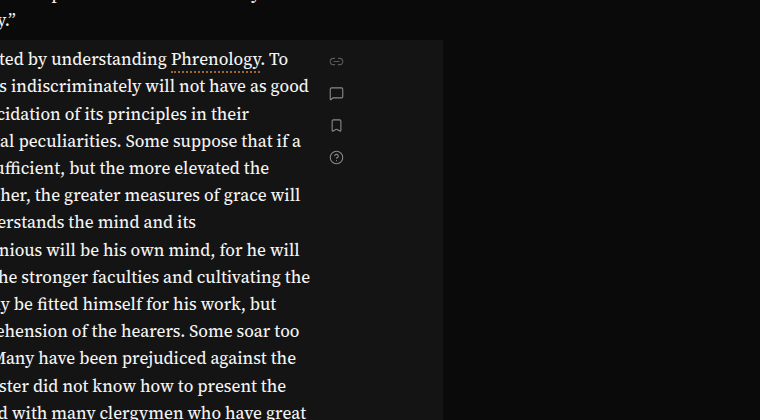
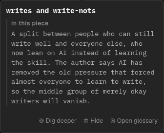
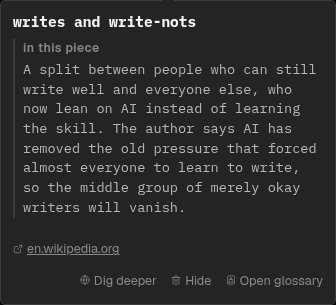
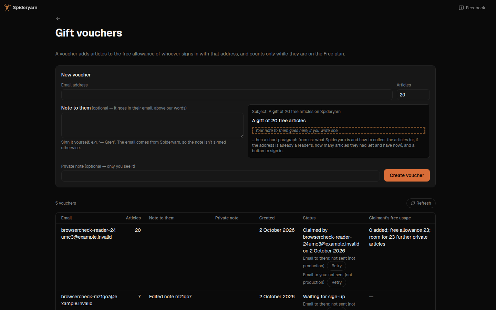

# 261003h: four small UI fixes from Greg's reports of 2026-10-03

Up: [plans.md](../project/plans.md)

Four reports from Greg (admin), relayed by the Overseer. Each is a small change to what a reader
(or, for the last, the admin) sees. One commit per fix, one feedback note per report.

## The four reports, in his words

`spya-kwgem6`, on the Entropy article in Summary mode:

> Please, can we slightly increase the vertical gap between the icons in the gutter next to a block,
> you know, the permalink and the comment and the question. I feel like I've asked this at least once
> before. It's just a little bit hard to touch them with a finger on an iPad.

`spya-za77hj`, in Remember:

> When I click on a glossary item, it shows a tooltip with dig deeper, hide, and in the glossary.
> They should all be on the same row to minimize vertical space, perhaps. Or at least take a
> screenshot and see how you can arrange them so that they don't look odd like they do now. Perhaps
> in the glossary could be renamed to go to glossary or open glossary, and maybe anywhere else that
> has in the X should be renamed go to or open X.

`spya-gmtt4b`, in Remember's tutorial, with a conversation open:

> When a keyboard pops up on iOS, it often has a sort of an enter key, but no done button. In cases
> where I'd expect there to be a done button or something more, or some kind of command button, I'm
> not sure about this, but I think I remember that in iOS programming, there's a way to specify that
> for the keyboard. And so what I end up doing is pressing the carriage return button, and then
> sometimes I can actually press the sort of keyboard hide button because the keyboard doesn't
> disappear. Does this make sense? If you can understand what I mean and you think there's a clear
> fix, then great, and make sure you look for where we should apply it throughout and maybe find
> appropriate docs to signpost and update to this guidance. Or if you don't understand, then ask me
> or we can discuss.

`spya-prv9yu`, on `/admin/vouchers`:

> Make the "Create voucher" button more visible
>
> And emphasise the public over the private message

## Prior work

- The gutter gap has been asked for twice (`spya-jc0vm6`, `spya-kd5dk5`) and widened once, on
  2026-10-02: a 4px `row-gap`, 13px of air between glyphs
  ([261002e](261002e-mode-corner-icons-and-gutter-icon-polish.md)). That change **is deployed**
  (`220d1723a` is an ancestor of `origin/main`), so this report was written looking at it. He wants
  more than 13px.
- The Enter key's label was decided box by box on 2026-09-04
  ([touch.md § What the Enter key promises](../project/touch.md#what-the-enter-key-promises)),
  with `tests/what-the-enter-key-promises.test.tsx` listing every box. That work labelled the key.
  It did not say what happens to the keyboard after the key acts, and that is this report.
- The card's second row and the voucher form's note layout both date from 2026-10-02 (see § After GPT Sol's plan review); no session has touched either since.

## Fix 1: the gutter gap (`gutter.css`)

`row-gap: max(0.25rem, 4px)` becomes `max(0.5rem, 8px)`: 17px of air between two 15px glyphs, and a
32px pitch between targets instead of 28px. For everyone, not only for a finger: one set of numbers,
and Greg's two earlier reports were from a desktop.

The cost is in the container queries that count how many slots fit (n × slot + (n − 1) × gap). They
move from 52 / 80 / 108px to **56 / 88 / 120px** (3.5 / 5.5 / 7.5rem). So a paragraph with only
just room for its next icon folds that icon behind the "…".

**The risk to measure before committing**: a two-line paragraph must still show two slots. If the
room a two-line paragraph gives is under 56px at a 16px root, the gap is 6px instead (54 / 84 /
114), and the plan says so. The browser check measures the room on one-, two-, three- and four-line
paragraphs.

*Passed over*: a wider gap only under `(any-pointer: coarse)`. It doubles every container query
(a media query cannot be read inside the query's condition), and this file's recorded failure mode
is a rule restated at a second specificity.

*Passed over*: a taller slot (bigger target). That costs every one-line paragraph height, which
is the thing the 2026-09-05 work removed.

Tests: `tests/gutter-target-size.test.ts` pins the gap and the three thresholds as exact strings;
change them red-first.

## Fix 2: the term card's foot (`ProseHoverCard.tsx`, `prose-hover-card.css`)

Today the card ends in two rows: a foot (`host link` … `in the glossary`) and, for the owner, a
second row (`Dig deeper`, `Hide`). One row instead:

```
before                                after
─────────────────────────────         ─────────────────────────────
↗ wikipedia.org   ▤ in the glossary   ◍ Dig deeper  🗑 Hide   ▤ Open glossary
◍ Dig deeper  🗑 Hide                 
```

- The two owner buttons move into the foot, left; *Open glossary* stays pushed right.
- The external link (only some entries have one) stays in the foot, first. The foot gets
  `flex-wrap: wrap`, so a card with a link and a long *Dig deeper again* wraps to a second line
  rather than overflowing 18rem. A visitor's card (no owner buttons) is unchanged but for the label.
- The label: **Open glossary**. Sentence case because it now shares a row with *Dig deeper* and
  *Hide*.
- "Anywhere else that has in the X": the only other one in the client is the quote card's
  *open in Quotes*, which becomes **open Quotes** (that card's other labels are lower case:
  *go there*, *go to the note*). Skim's *In the glossary ›* already became an icon (icons.md).
- Help (`help-modes.tsx`) and the docs that name the button follow.

Tests: `tests/hover-card-touch.test.tsx` and any test that finds the button by its text. A new
assertion that the owner's buttons are inside `.prose-card-foot` (red first).

## Fix 3: after Enter sends, the soft keyboard goes away

What I understand the report to say: in a chat-style box (he was in Remember's tutorial
conversation) the key says *send*, he presses it, the message goes, and **the keyboard stays up**
over the answer he now wants to read, so he has to find the hide-keyboard key. The key label is
already right. What is missing is the blur.

The rule, added to touch.md § What the Enter key promises: **when a box's Enter (or its send
button) has done its thing and there is nothing more to type, the keyboard goes away.** Only when a
soft keyboard is actually up, so a desktop reader and an iPad with a hardware keyboard keep focus
in the box.

- One helper, `putKeyboardAway(el)`, beside `useVisualViewport.ts`: blurs `el` when
  `window.innerHeight − visualViewport.height − visualViewport.offsetTop` is over a threshold
  (the same sum `useVisualViewport` already uses for `--kb-inset`). No `visualViewport`, or no
  inset: does nothing.
- Called where a send or a search completes and the reader's next act is reading:
  chat's composer and its edit box, Candidates' box, the comment dialog's follow-up, the glossary's
  look-up box, the search panel's box, Help's search, the page-contents search, and the add-URL box.
  The sweep of `PROMISES` decides the list; each box that keeps its keyboard says why (the tag
  editor: "the box stays for the next").
- **Not** the multi-line boxes where Enter is a newline (Feedback, a comment, a quiz answer). iOS
  gives those no Done key in a web page, and touch.md already records that a floating accessory bar
  is not to be built. That is the open question for Greg, in the debrief, not built here.

Tests: the helper (inset over and under the threshold, no `visualViewport`), and the chat composer
pressed with a keyboard up (red first).

*Passed over*: `(any-pointer: coarse)` as the test. An iPad with a keyboard case is coarse and has
no soft keyboard; blurring there would make every message cost a tap back into the box.

## Fix 4: the voucher form (`AdminVouchersPage.tsx`)

```
before                                         after
Email | Articles | Private note | [Create]     Email | Articles
Note to them (textarea)  | email sketch        Note to them (textarea) | email sketch
                                               Private note (quiet)       [ Create voucher ]
```

- *Create voucher* becomes the filled primary button (`Button`, default variant), last in the form,
  where a form's submit is looked for.
- *Note to them* moves up, directly under the address, with its label in the foreground colour.
  *Private note* moves below it, labelled as before, in the muted colour.
- The table's two columns swap to match: *Note to them*, then *Private note*.

Tests: `tests/admin-vouchers-page.test.tsx`; the order of the two notes in the form and the table.

## Done looks like

Four commits on `dev`, `npm test` and `npm run typecheck` green, a GPT Sol code review, a browser
check at desktop, iPad and phone widths, four notes in `docs/user-feedback/`.

## After GPT Sol's plan review

The review is [here](261003h-four-small-ui-fixes-gutter-gap-glossary-card-row-keyboard-dismiss-voucher-form-plan-review-sol.md):
build with changes. What it changed:

- **F1 (gutter capacity), accepted; the 6px fallback is dropped.** A two-line paragraph of prose
  has 51.2px of room at a 16px root, which was already under the old 52px threshold. So a
  prose-driven two-line row showed one slot before and shows one now. Each further line adds 27.2px:
  three lines 78.4 (two slots under both 80 and 88), four 105.6 (three under both), five 132.8 (four
  under both 108 and 120). The 8px gap costs an ordinary paragraph nothing. A row made taller by
  another column can land between an old and a new threshold and lose one icon to the "…".
- **F2 (the negated one-slot query), already done**: all four conditions moved together.
- **F3 (the card's wrapping), accepted.** The three buttons are one group that does not break. A
  link that leaves no room puts the group on the next line whole. The card is 21rem at most, not
  18rem as this plan said.
- **F4 (keyboard detection), partly accepted.** The check multiplies by the viewport's scale, so a
  pinch-zoom is not a keyboard, and it is described as conservative: Android Chrome (which resizes
  the layout viewport) and an iPad's floating keyboard are not seen, and the box keeps focus there
  as it does today. *Overruled*: tracking shrinkage against an unfocused baseline. It would see
  Android, at the cost of state that has to survive rotation and zoom; the report is from iOS, and
  failing towards "does nothing" is safe. In the debrief as a follow-up, not built.
- **F5 (the replacement composer), accepted.** The first message from the conversation list raised
  the focus nonce, so the new composer took focus and reopened the keyboard. It is not raised while
  a soft keyboard is up.
- **F6 (existing blurs), no change needed**: words search, the shelf's search and the Dock's quick
  search keep the blur they had. Help, page-contents and the add box move focus or leave the page.
- **F7**, corrected here: the card's second row was added on 2026-10-02 (`a0de6acd6`) and the
  voucher form's note layout the same day (`950e1a33b`).

The boxes that now call `putKeyboardAway`: chat's composer, Candidates, the comment follow-up, the
glossary's look-up, the search panel's box. Chat's edit-a-question box unmounts on send, which
already drops the keyboard.

## What landed, and GPT Sol's code review

The four fixes are four commits. The browser check (Playwright, 1440, 820 and 390 wide) passed the
three visual ones: 72 gutters, 32px between icon centres, 8px between targets, none below its row,
and the same number of icons under the old and new thresholds on every row.






The [code review](261003h-four-small-ui-fixes-gutter-gap-glossary-card-row-keyboard-dismiss-voucher-form-code-review-sol.md)
found four things and fixed all four, each with a test that was red first. One round; I read the
diff and took all of it:

- Search's **find** button sent the search and kept the keyboard; only Enter let go. The blur
  moved into the shared `ask()`.
- The glossary look-up blurred on a term it had refused, which still needed correcting.
- Chat blurred a second draft typed while the first send waited on a live handoff.
- The card's tests passed with its CSS deleted; there is now a guard on the stylesheet.

It wrote the class up as
[261003b](../postmortems/261003b-a-submit-side-effect-attached-to-an-event-bypasses-acceptance-and-sibling-paths.md):
a side effect hung on an event rather than on the accepted action.

**Not checked: a real iPad.** The keyboard fix is tested in jsdom against the numbers iOS reports.
Nothing here has seen a physical soft keyboard.

**Deferred, and why**: seeing Android Chrome's keyboard (needs a remembered baseline height); a Done
button for the multi-line boxes (a question for Greg, in the debrief).
