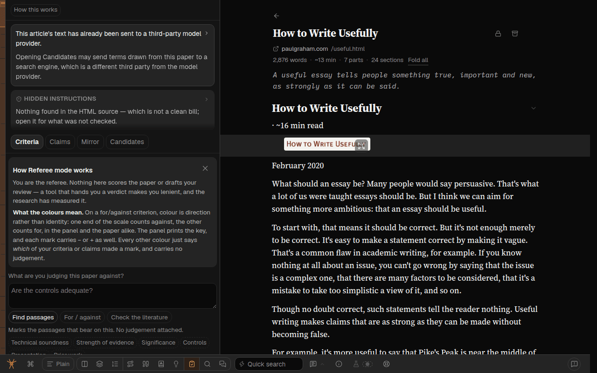
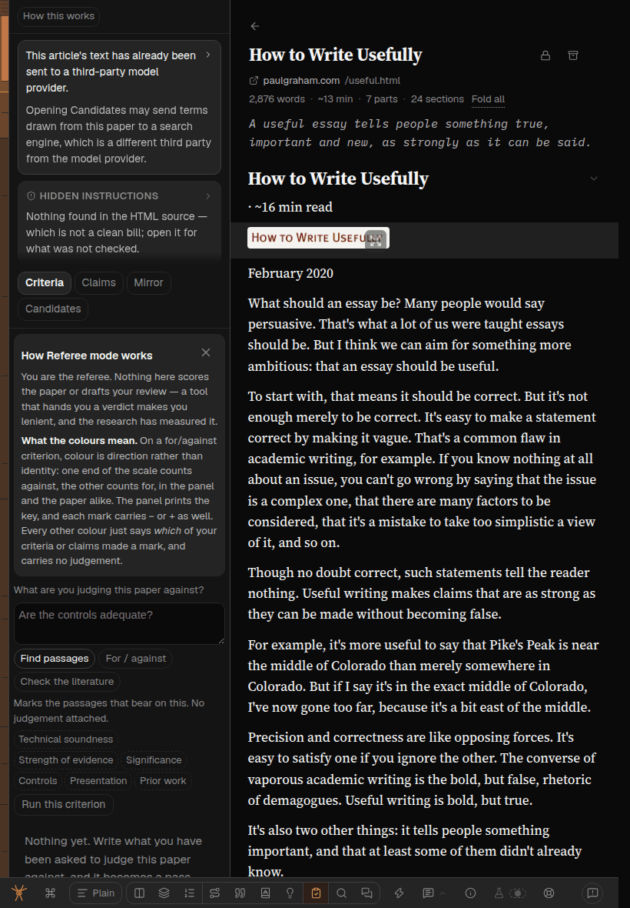
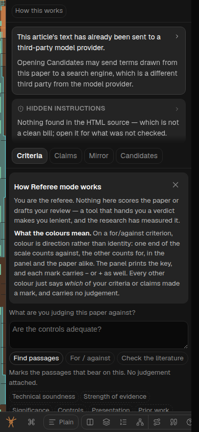
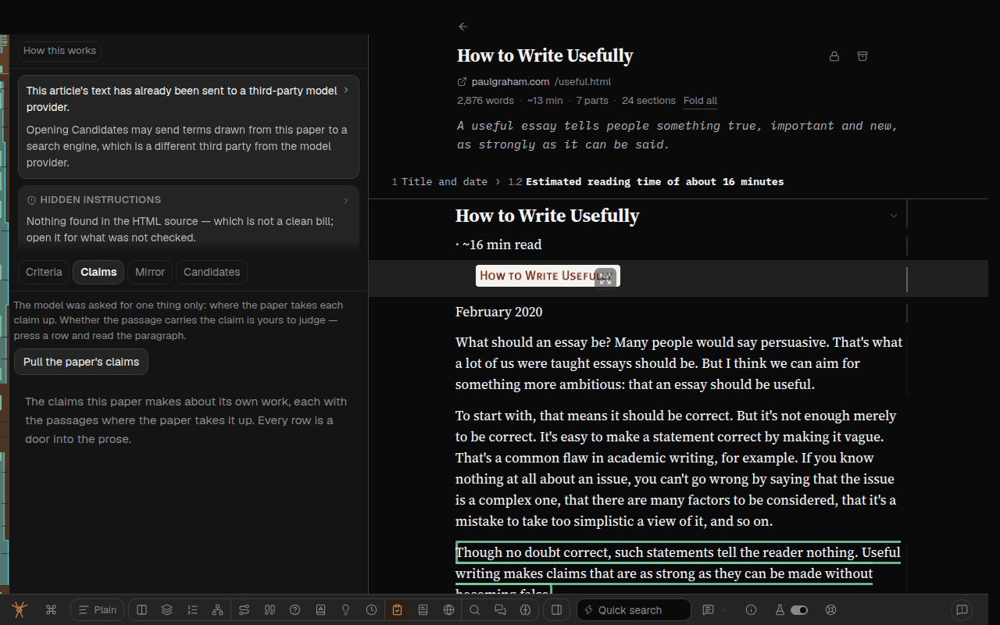

# Referee mode puts the actions first, and the notices behind one button

Feedback report `spya-vbeyse`, Greg, 2026-10-03, on the Entropy article in Referee mode:

> The referee mode is, the UI is very confusing. I wonder, is there a way to clean it up, take
> screenshots and just, you know, guide me a bit more? It seems to bury the actual actions and
> useful stuff underneath a whole bunch of warnings. I mean, maybe those warnings are necessary,
> but perhaps we could hide them inside the information tooltip or something, or create a warning
> tooltip, and in general see how you can improve that whole mode UI.

The mode is described in [referee-mode.md](../project/referee-mode.md). This plan changes the web
client only. Another session (sweep-c6a) is changing Referee's store and its two route handlers, so
nothing here touches `src/store/`, the routes, a prompt or the database.

**Status: built, one stage.** Reviews: [the plan, by GPT Sol](261003k-referee-mode-actions-first-plan-review-sol.md)
(*build after changes*; what each finding changed is in § What the plan review changed), and the
code review named in § Reviews.

## What was on screen, top to bottom

Before the first thing a referee can act on (the criterion box), the band showed:

1. a header row with one button, *How this works*;
2. a box with the sentence *"This article's text has already been sent to a third-party model
   provider."* (press to expand two more paragraphs);
3. in the same box, always visible, *"Opening Candidates may send terms drawn from this paper to a
   search engine, which is a different third party from the model provider."*;
4. a second box, *Hidden instructions*, with a one or two line result of the source scan;
5. the four sub-mode chips: Criteria, Claims, Mirror, Candidates;
6. on a first visit, the *How Referee mode works* card: two paragraphs, one of them about what
   colours mean on a kind of criterion the referee has not written yet;
7. then the panel.

Each of items 2 to 4 and 6 was added for a reason that is written down, and each was reviewed. Taken
one at a time they are defensible. Together they are what Greg met: a screen of notices with the
actions underneath. § Before has the measurements.

## What changed

```
before                                   after
┌──────────────────────────────┐         ┌──────────────────────────────┐
│ [How this works]             │         │ [Criteria][Claims][Mirror]   │
│ ┌ text already sent…      ▸ ┐│         │ [Candidates]  ⚠ Notices  (i) │
│ │ Opening Candidates may…   ││         ├──────────────────────────────┤
│ └───────────────────────────┘│         │ Write what you have been     │
│ ┌ HIDDEN INSTRUCTIONS     ▸ ┐│         │ asked to judge this paper…   │
│ │ Nothing found in the…     ││         │ What are you judging this    │
│ └───────────────────────────┘│         │ paper against?               │
│ [Criteria][Claims][Mirror]…  │         │ ┌──────────────────────────┐ │
│ ┌ How Referee mode works  ✕ ┐│         │ │ Are the controls adequa… │ │
│ │ You are the referee…      ││         │ └──────────────────────────┘ │
│ │ What the colours mean…    ││         │ …                            │
│ └───────────────────────────┘│         │                              │
│ What are you judging…        │         │                              │
│ ┌ Are the controls adequa… ┐ │         │                              │
└──────────────────────────────┘         └──────────────────────────────┘
```

**One: the notices are behind one button.** The top row is the four chips and a **Notices**
button with a warning-triangle icon. Pressing it opens the same box that was there before
(`.ref-brief`, with its height cap and its own scroll), holding the source scan and the
confidentiality sentences in full. Shut, it costs no height.

- It is a button you press, not a hover tooltip, because a tooltip does not exist on an iPad or a
  phone. It also has a hover card that says in two sentences what is inside.
- **It opens itself when the scan found something**, including a finding that carries an everyday
  explanation, and including a scan that lands seconds after the band opened. `sourceScanOpens` in
  `SourceScanNotice.tsx` is the scan's own "open" rule, exported, so the two cannot disagree.
- Nothing is remembered: it starts shut on every visit unless the scan found something. So this
  stays a collapse, not a dismissal.
- Inside the open box the scan comes first, because when the box opened itself the scan is why,
  and under three paragraphs a finding would start below the fold of a box capped at 40% of the
  band.

**Two: the Candidates chip no longer starts a run, so its warning leaves the top of the mode.**
The always-visible Candidates sentence existed for one reason: since 2026-09-06 pressing the
Candidates chip itself started an AI turn that may run a web search, so the warning had to be on
screen before the chip was pressed, in all four sub-modes. `src/messages.ts` said what to do if
that ever changed: *"If Candidates ever goes back behind a button, this line goes with it."*

Candidates is back behind its button. Pressing the chip opens the panel and runs nothing. The
panel's *Build the reviewer brief* button was already there, with a visible sentence under it
naming the search engine; until now it was seen only when the automatic attempt had failed.

- One entry removed from `REFEREE_TARGET` in `src/web/activation.ts`. The command bar's row for
  Candidates reads the same table, so it stops starting a run and loses its "this generates" mark.
- Claims still runs on its chip. It reaches no new third party, and its run is stored.
- The sentence now reads *"Candidates may send terms…"*, since opening it no longer sends
  anything. It is printed at the top of the Candidates panel, before and after the first turn,
  because a follow-up typed into the composer may search too. It is also in the Notices box.
- A failed read of the thread used to be retried by pressing the chip again. The panel has its own
  **Try again** now, which re-reads and starts nothing.
- The simpler option passed over: keep the chip running it and move the sentence into the chip's
  hover card. On a phone, where there is no hover, a press would then send terms from an
  unpublished paper to a search engine with nothing visible having said so.

**Three: one line under the chips says what to do.** Each chip's hover card already opened with a
sentence saying what the sub-mode is for; Criteria's is *"Write what you have been asked to judge
this paper against. Each criterion becomes a re-runnable pass that marks the passages bearing on
it."* That sentence is printed at the top of the panel, from the same constant
(`REFEREE_VIEW_TIP[view].what`). The hover card keeps both of its sentences. The two empty-state
lines that then said the same thing a second time are gone (Criteria's *"Nothing yet. Write what
you have been asked…"*, Claims' *"The claims this paper makes about its own work…"*), and so is
the purpose half of the line at the top of Candidates.

**Four: *How Referee mode works* is the (i) in the band's corner.** Every other mode has had an
(i) in its top-right corner since 2026-10-01, at Greg's asking (*"Each mode should have such an (i)
icon"*); Referee was the one exemption, because it had this card. The card opened by default,
above the first control. Now the (i) opens the mode's own two sentences from `MODE_CATALOG` (no
verdict, no score, no grade) and then *What the colours mean*. A tap toggles it, so it works with
no hover.

This deletes code: `RefereeCard.tsx`, `referee-card.ts`, the `localStorage` bit, the focus-return
hook and their test file. The card's first paragraph (*"You are the referee. Nothing here scores
the paper…"*) is not carried over word for word; the catalog's sentences say the same thing.

## What did not change, and why

- **The rules printed inside each panel stay** (*a passage takes a claim up, never whether it
  carries it*; *the number is the model's ordering, not a score*; the Mirror evidence note; the
  conflict-of-interest caveat). Most appear only once there are results to read them against, and
  they are what keeps the mode from reading as a verdict. Thinning them is the natural second
  pass: [Q-referee-panel-rules].
- The scan itself, the stores, the routes, the prompts and the URL parameters.
- The auto-run machinery for Candidates (`useAutoRun(slug, "candidates", …)`) is left in place
  with nothing arming it, so that answering [Q-candidates-press] the other way is one line.

## What this gives up

Said plainly, because each of these reverses something written down earlier.

- **The fact that the text has already been sent is no longer on screen at all times.** Since
  2026-09-02 the one-line version of it was the label of the notice's collapse, so that *"shutting
  the box hides the venues and the audience, never that the text has gone"*. It is one press away
  now. The same fact is still shown when an article is added, before anything is sent.
- **The scan's headline is no longer on screen in every state.** referee-mode.md said the scan
  sits above the chips because *"a chip is one more thing a referee can fail to press"*, and that
  its headline is *"the one thing on screen in every state"*. A finding still opens the box
  unasked. *Not checked — this article came from a PDF*, a failed check, and *nothing found, which
  is not a clean bill* are now behind the button. (GPT Sol's plan review, finding 3.)
- **Candidates takes one more press**, reversing for this one sub-mode Greg's 2026-09-06 rule that
  opening a mode starts it.

The first two are [Q-referee-notices-hidden], the third is [Q-candidates-press].

## The simpler option passed over

Only restyle: keep everything where it is and make the notice boxes smaller and greyer. Passed over
because the complaint is about order and height, not colour: the actions were below the notices,
and smaller notices would still be above them.

## What the plan review changed

GPT Sol, read-only, *build after changes*. Each finding was checked against the code.

| Finding | Taken? |
|---|---|
| 1. Removing the Candidates target strands a failed read: the chip's press was the only retry | Yes: **Try again** in the panel, and a test |
| 2. The band needs the scan's own "opens" rule, not `warn`, and must not seed from *loading* | Yes: `sourceScanOpens`, `choice ?? computed` |
| 3. Hiding the scan headline reverses a written rule the plan did not name | Yes: named above, and in the question for Greg |
| 4. *"Opening Candidates may send…"* becomes false; follow-up turns have no warning beside them | Yes: reworded, and printed at the top of the panel in every state |
| 5. Put the lead line inside the scroller; measure short windows; a finding may sit under the paragraphs | Yes: lead is in `.ref-panel`; scan is first in the box; 1280×720 and 900×337 in the browser pass |
| 6. Assert literal `null` targets for Candidates, not only that two tables agree | Yes |
| 7. The How card's stored bit | Moot: the card became the (i) and the bit is gone |
| 8. Candidates repeats its purpose under the lead line | Yes: the purpose half went |

After the review, and not in the plan it read: change four. The first draft kept the card and
started it shut. Reading `ModeSurface` showed the corner (i) every other mode has, which is what
Greg's *"hide them inside the information tooltip"* names.

## Questions for Greg

The build does not wait on these. What is built is the first option in each.

**[Q-referee-notices-hidden]** Two facts used to be on screen at all times in Referee mode and are
now behind the Notices button: that the article's text has already gone to the model provider, and
the one-line result of the hidden-instructions check (for a PDF: *not checked*).

- *Behind the button (built).* The top of the mode is the chips and the work. Somebody who never
  presses Notices never sees either fact in this mode; they did see the first when adding the
  article.
- *One quiet line stays.* For example, under the chips in small grey type: *"Text already sent to
  the model provider · source not checked (PDF) · Notices"*. Costs one line (two on an iPad's
  narrow band) and brings one of the warnings back.
- What decides it: whether you think a referee with a confidential manuscript needs reminding in
  this mode, or whether the sentence at add time is the reminder.
- Recommendation: leave it behind the button. The add-time sentence is the one that arrives before
  anything is sent; this one arrives after.

**[Q-candidates-press]** Candidates is the sub-mode for editors: who could review this paper. Its
first turn may search the web with terms taken from the paper.

- *The chip opens it, a button starts it (built).* You press Candidates, read one sentence about
  the search engine, and press *Build the reviewer brief*. One more press than before; no warning
  anywhere else in the mode.
- *The chip starts it (as it was from 2026-09-06).* One press. Then the search-engine warning has
  to be visible before the chip is pressed, which means a line at the top of all four sub-modes,
  as before.
- What decides it: whether the extra press in the one editor-facing sub-mode bothers you more than
  a standing warning line in the three referee-facing ones.
- Recommendation: keep the button. Putting it back is one line in `activation.ts`, plus the
  warning line above the chips.

**[Q-referee-panel-rules]** Inside each panel there are still sentences that say how to read it:
Claims opens with *"The model was asked for one thing only: where the paper takes each claim up…"*,
Mirror with *"The model reads your own comments and remarks on them. It is not given the paper…"*,
Criteria prints two lines above its list once there are criteria.

- *Leave them (as now).* They are what stops a list of passages reading as a verdict, which is the
  mode's whole argument.
- *Move them into each panel's hover cards or the (i).* Shorter panels. The (i) would get long,
  and a phone has no hover, so some would be seen by nobody.
- Recommendation: leave them, and look again after you have used the new layout. Not built.

## Before

Measured in Chrome on the box, 2026-10-03, on *How to Write Usefully* (HTML) and a PDF article,
first visit (How card open). Offsets are from the top of the band to the criterion box.

| Viewport | Band height | Notices boxes | How card | Criterion box starts at |
|---|---|---|---|---|
| desktop 1280×800 | 760 | 236 | 237 | **607** |
| iPad 820×1180 | 1140 | 300 | 314 | **783** |
| phone 390×844 | 804 | 236 | 256 | **627** |

With the How card shut the box started at 360 (desktop and phone) and 458 (iPad). Roughly 14 lines
of notice and explanation stood above the first control on desktop, 20 on an iPad.






## After

_Filled in from the browser pass._

## Reviews

_The code review is added here when it returns._
