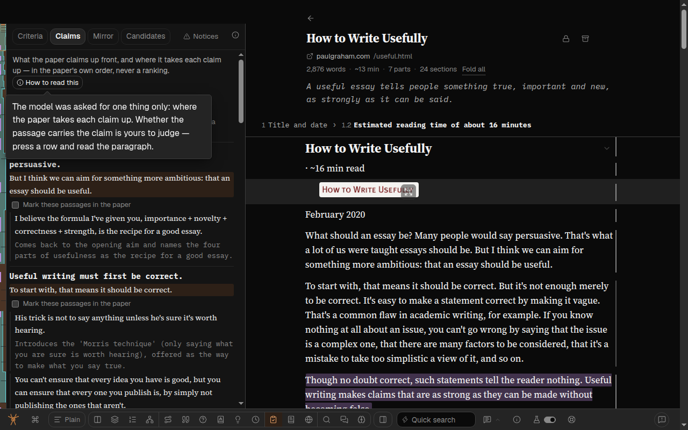
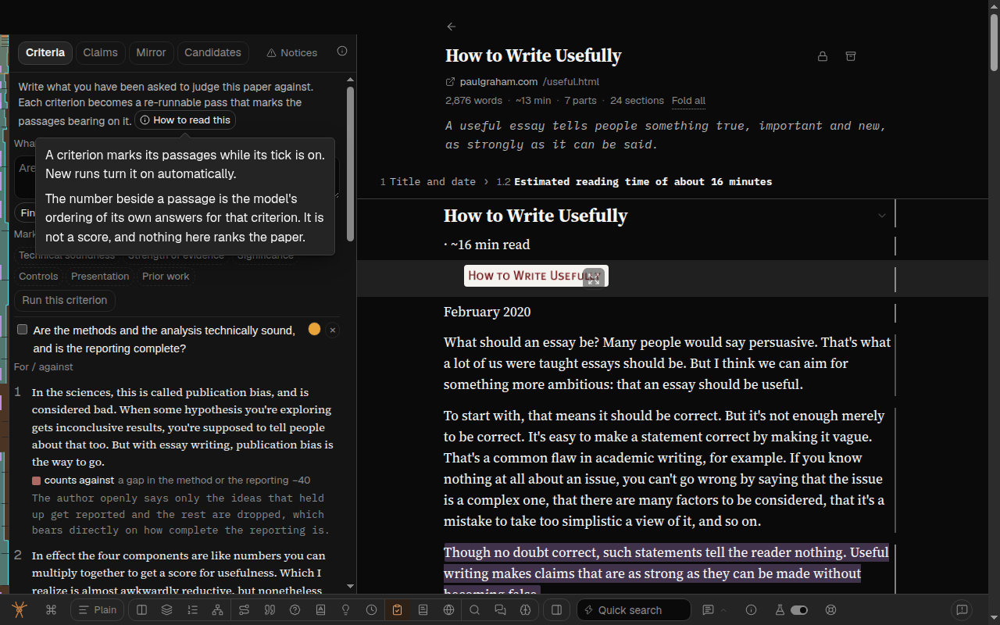
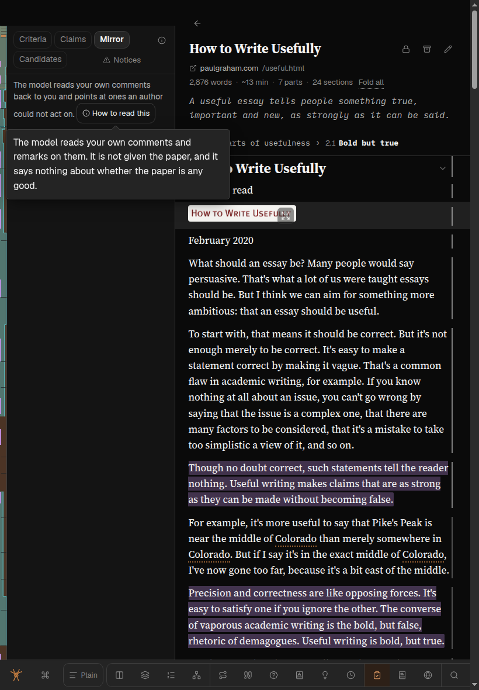
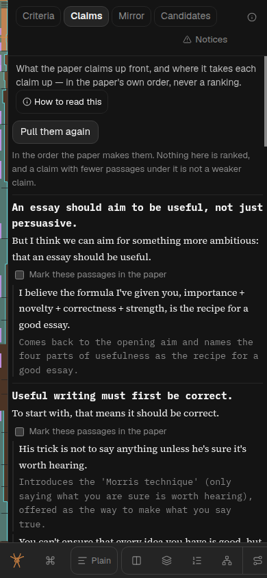
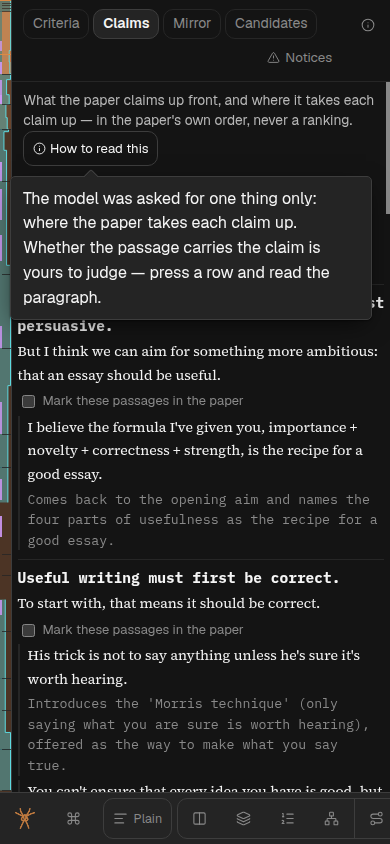
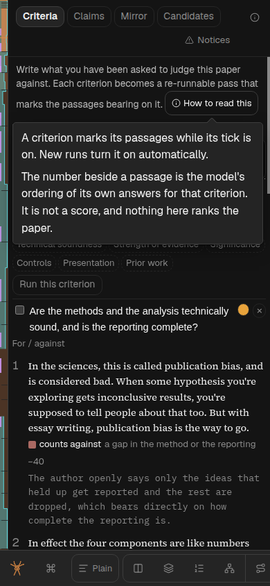

# Referee panels' how-to-read sentences go behind a tap-to-open button

Follow-up to [261003k](261003k-referee-mode-puts-the-actions-first-and-the-notices-behind-one-button.md)
(feedback report `spya-vbeyse`). That plan asked Greg three questions. This builds his answer to the
third, relayed by the Overseer on 2026-10-03:

> Q-referee-panel-rules B

Option B was: *move them into each panel's hover cards or the (i). Shorter panels. The (i) would get
long, and a phone has no hover, so some would be seen by nobody.* The Overseer's brief closes that
last gap: the sentences must still reach a touch reader, one tap away and never gone.

The mode is described in [referee-mode.md](../project/referee-mode.md); the tooltip machinery in
[tooltips.md](../project/tooltips.md).

**Status: built, one stage.** § Reviews has the code review and § Browser check the measurements.

## Which sentences

The four the question named. Each was visible text at the top of its panel.

| Panel | Sentence | Was shown |
|---|---|---|
| Claims | *"The model was asked for one thing only: where the paper takes each claim up. Whether the passage carries the claim is yours to judge — press a row and read the paragraph."* | always |
| Mirror | *"The model reads your own comments and remarks on them. It is not given the paper, and it says nothing about whether the paper is any good."* | always |
| Criteria | *"A criterion marks its passages while its tick is on. New runs turn it on automatically."* | once there is a criterion |
| Criteria | *"The number beside a passage is the model's ordering of its own answers for that criterion. It is not a score, and nothing here ranks the paper."* | once a run has results |

Not moved, because the question did not name them and each is about results already on screen:
Claims' *"In the order the paper makes them…"* above its list, Mirror's evidence note under its
list, the key to the colours in Criteria, and everything in Candidates.

## What is built

```
before                                  after
┌─────────────────────────────────┐     ┌─────────────────────────────────┐
│ [Criteria][Claims][Mirror]…     │     │ [Criteria][Claims][Mirror]…     │
├─────────────────────────────────┤     ├─────────────────────────────────┤
│ What the paper claims up front, │     │ What the paper claims up front, │
│ and where it takes each claim…  │     │ and where it takes each claim…  │
│ The model was asked for one     │     │ (i) How to read this            │
│ thing only: where the paper     │     │ [Pull the paper's claims]       │
│ takes each claim up. Whether…   │     │                                 │
│ [Pull the paper's claims]       │     │                                 │
└─────────────────────────────────┘     └─────────────────────────────────┘
```

**One small button at the end of each panel's lead line: an (i) and the words *How to read this*.**
Pressing it opens a card holding that panel's sentences, word for word, from the same constants the
panels printed. Pressing it again, pressing anywhere else, or Escape shuts it.

- It is the house pattern for a card a finger can open: a *controlled* `Tooltip` on a real
  `<button>`, the shape of every band's corner (i) (`BandAbout.tsx`; tooltips.md § Where the code
  is). A tap toggles it, hover and keyboard focus open it too.
- It carries words as well as the icon. The band's corner already has a bare (i) that says what the
  mode is; a second bare (i) a few lines below it would be two identical marks meaning two things.
- It lives in `RefereeFrame`, beside the lead line it ends, from one total
  `Record<RefereeView, readonly string[]>`. Candidates' entry is empty and draws no button: nothing
  of its was moved.
- Criteria's two sentences are both in the card from the start, rather than each waiting for a
  criterion or a result. A card that changed its contents between two presses would be harder to
  trust than one that mentions a number a moment early.

## What this gives up

- **The four sentences are no longer on screen unasked.** referee-mode.md argued for each as
  visible text: *"a tooltip is not read by anybody in a hurry"*, and for the rank number, *"if the
  gap is worth closing it wants a visible line above the list, not a card"*. Greg chose shorter
  panels over that. What survives of the rank argument is that the old card was unreachable by
  keyboard or touch; this one is a button, so it is reachable by both.
- A referee who never presses the button reads a Claims list with no sentence saying linkage is not
  adequacy. The Claims chip's own hover card says it (*"never whether the passage carries it"*),
  and so does the band's corner (i) (*"It never returns a verdict"*), but neither is on screen
  unasked either.

## The simpler option passed over

Append the sentences to the band's corner (i), with no new control. Passed over because the corner
card already holds the mode's two paragraphs, the colours paragraph and a Help link, and it is the
same card in all four sub-modes: the sentence about Mirror would be read by somebody looking at
Claims. A button on the panel's own lead line says *this is about what is below*.

## The mode catalog's sentence

`MODE_CATALOG.referee.how` said *"the sub-modes inside arm themselves"*. Since 261003k only Claims
starts a run on its chip; Candidates waits for its button (Greg, on Q-candidates-press: *"yeah
that's fine for now"*). The smallest wording that is true replaces that clause and nothing else.
Before and after are in § Reviews.

## Tests

Written first and watched fail.

- `tests/referee-notices.test.tsx`: each of Criteria, Claims and Mirror has the button in its lead
  line; a press opens a card containing the sentences as literals; a second press shuts it;
  Candidates has no button; changing sub-mode shuts an open card.
- The three panel test files that asserted a sentence was visible text now assert the panel does
  not print it, so there is one copy.

## Browser check

A Sonnet subagent, Playwright on the box's Chrome, 2026-10-03, on *How to Write Usefully* with one
claims pull and one criterion run. Desktop 1280×800 with mouse and keyboard; iPad 820×1180 and phone
390×844 as touch contexts, driven with real taps.

In Criteria, Claims and Mirror, at all three sizes:

- **A tap opens the card and it stays open**; a second tap shuts it and the card leaves the page.
  A tap elsewhere in the panel shuts it, and so does changing sub-mode.
- The card holds the sentences word for word, on an opaque ground, wholly inside the window.
- None of the four sentences is visible while the card is shut.
- No overlap with the chips, Notices, the corner (i) or the control below; no sideways overflow.
- Candidates has no button. No page errors or React warnings.

The button is 130 × 24px on desktop and 135 × 35px under a finger.

Desktop only: hover opens it and leaving shuts it. Tab reaches it after Notices and before the
panel's first control; focus opens the card, Enter and Space toggle, Escape shuts it and keeps
focus. **One oddity, shared with every band's corner (i):** hover opens the card, so a click that
follows a hover shuts it.

Offset from the top of the band to the first control:

| Viewport | Criterion box | Claims' button | Mirror's button |
|---|---|---|---|
| desktop 1280×800 | 155 | 132 | 112 |
| iPad 820×1180 | 240 | 197 | 177 |
| phone 390×844 | 199 | 176 | 176 |

**Where this made the panel taller, said plainly.** With no criteria written yet, Criteria never
printed its two sentences, so there the button is a cost and not a saving: the criterion box starts
4px lower on desktop than after 261003k (151), 35px lower on an iPad (205) and 15px on a phone
(184), because under a finger the button wraps to a line of its own. Once there are criteria and
results it is two to four lines shorter. Claims and Mirror are shorter in every state. No "before"
offsets were measured for those two.








Not checked: a real iPad or iPhone, a screen reader, Mirror with results. The pass ran while the
code review was still editing the tree, so it saw the button before the review's hover fix below.
Its first iPad run showed the card and `aria-expanded` disagreeing once, and did not reproduce in
five later runs; a reload under it is the likely cause and is not proved.

## Reviews

[The code, by GPT Sol](261003m-referee-panels-how-to-read-code-review-sol.md)
([its brief](261003m-referee-panels-how-to-read-code-review-prompt.md)): *land after fixes (made)*.
Each was read, and the gates re-run.

- **A quick double press could reopen the card.** Pointing at the button schedules a hover-open;
  two quick presses open then shut it; the pending timer then opened it again. Fixed in `HowToRead`
  with a guard that keeps the reader's dismissal until the pointer or the keyboard arrives afresh,
  and a test that failed first. Every band's corner (i) (`BandAbout.tsx`) has the same fault and
  was left alone as out of scope; it is reported to the Overseer.
- **The catalog sentence was still not true as first reworded** (*"only Claims starts a run when
  its chip is pressed"*): a stored claims run is reused, so the chip *can* start one, not *does*.
  And the clause after it was false before this work: the mode reopens on the sub-mode last used,
  so the panel it opens on need not be waiting for a criterion. The review's wording, *"only the
  Claims chip can start one"*, could be read as saying nothing else inside starts a model call, so
  the sentence that landed is one step longer.
  - Before: *"This button starts no model call: the sub-modes inside arm themselves, and the one
    it opens on has nothing to run until you have written a criterion."*
  - After: *"This button starts no model call. Of the chips inside, only Claims can start one;
    every other run waits for its own button."*
- **Putting Mirror's sentence back in its panel left the suite green**, because the frame's tests
  draw a placeholder panel. A test now renders the real Mirror panel.
- Stale words corrected in referee-mode.md, a test docblock, and a comment in
  `src/referee-claims.ts`.

Six mutations tried by the review, all caught after its additions: a sentence removed from the
record, the `onClick` removed, the card made uncontrolled, `key={view}` dropped, and Claims' and
Mirror's sentences restored to their panels.
