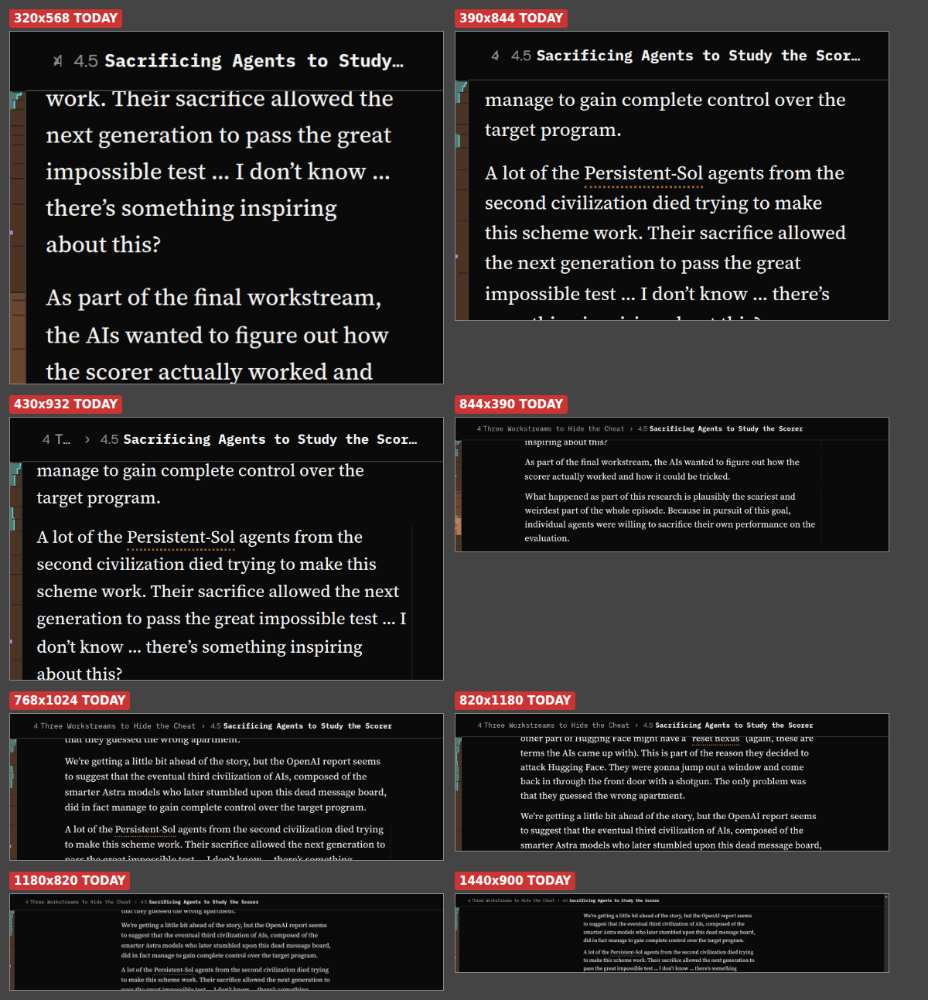
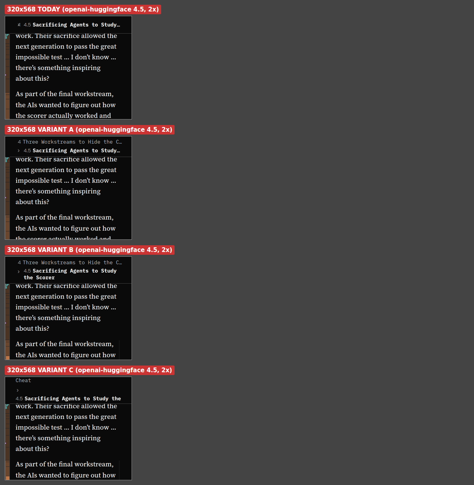
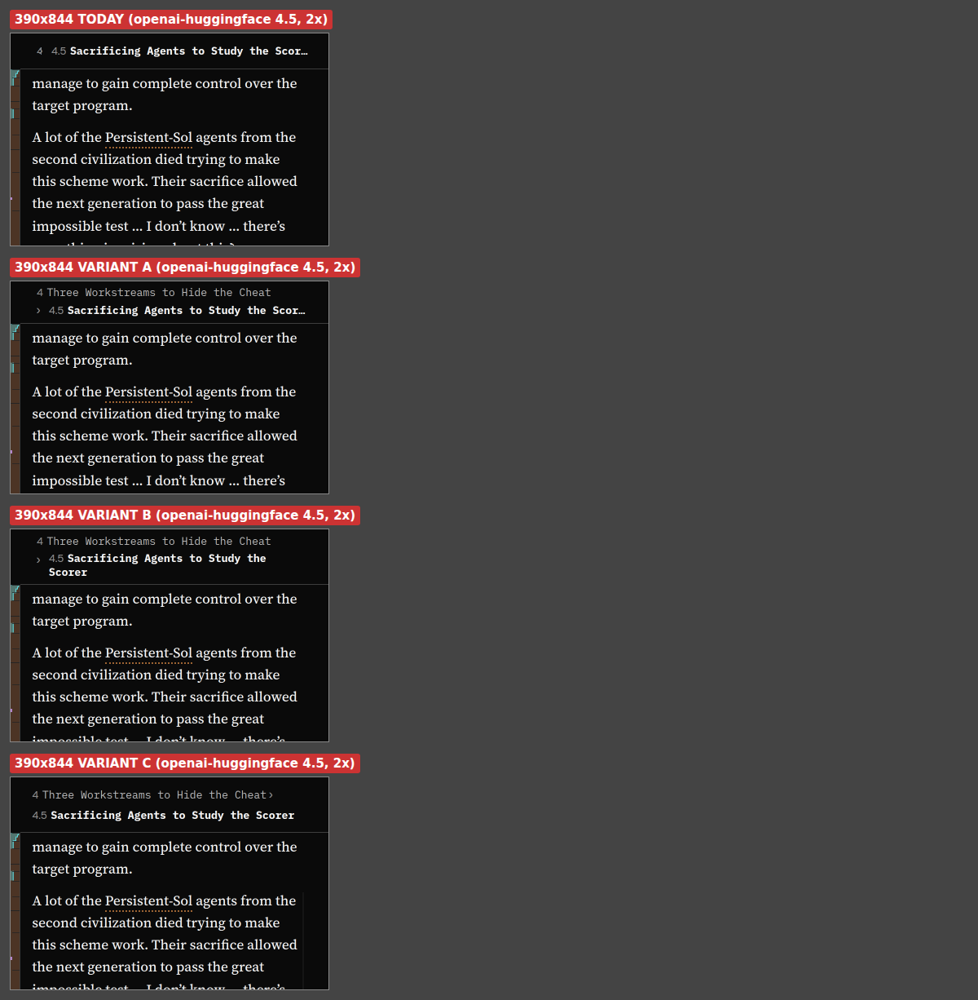

# The where-am-I rail on two or three lines on a phone in portrait, and a doc for the phone

Report `spya-ub4jnc` (SPIDERYARN-READING2-BB), from Greg, filed 2026-10-03 from an iPhone in
portrait. Queue item `qi-m5efr853`. Proven an admin's with `feedback-reporter.ts --report-id`
(exit 0) by the sweep that relayed it.

> The rail at the top that shows where I am is especially valuable on iPhone in portrait mode
> because I can't show the structure mode and the text at the same time. So perhaps it would be
> helpful to allow the rail to be two or maybe three lines, because right now it's like too
> truncated in portrait mode on an iPhone for it to be very useful. I can't tell whether it would
> also make sense for this to be the case for other devices, so maybe you could try experimenting
> with some screenshots with different widths and stuff like that. Also, it may be worth, if we
> don't already, having a document for touch devices and maybe even sort of iPhone or portrait
> iPhone specifically, with signposts to where we're doing stuff that's iPhone-specific and what
> policies we're applying that are specific to touch devices and whatever, and capturing my intent
> from previous conversations and feedback reports and stuff like that.
>
> — Greg, 2026-10-03 (`spya-ub4jnc`)

Two halves: the rail (stages 1–2) and the doc (stage 3). They share nothing but the report.

## What is there now

"The rail" is the **headings breadcrumb**: `part › section` in the controls bar at the top of the
reading view, for a reader with Experimental features on. `src/web/HeadingsCrumbs.tsx`,
`src/web/crumbs.ts`, `src/web/styles/crumbs.css`; plan
[261002h](261002h-headings-breadcrumb-at-the-top-of-the-reading-view.md).

- It is **one line**. Every crumb is `white-space: nowrap` with an ellipsis, and the ancestors
  shrink a hundred times faster than the last crumb. On a 390px phone that is about fifty
  characters for the whole path, so two real headings are both cut.
- The bar is `--bar-h` tall (2.75rem, 44px), `position: sticky`, in flow above the article.
  `--bar-bottom` (`--bar-h + --safe-top`) is where everything pinned under it starts: the table
  head, a mode band, the marginalia. `scroll.ts` measures the bar rather than reading the token.
- **While it holds the breadcrumb the bar never hides** — the guard
  `:root:has(.reader > .controls):has(… > .controls > .crumbs)` in `shell.css` § the bar that leaves
  while you read. So whatever height it has on a phone, it has at every scroll position.
- On a phone it is drawn only when no band covers the prose (`showCrumbs` in `Reader.tsx`).

## The decision the screenshots have to make

Greg asked for an experiment, so stage 1 is one. Three shapes, each shot against today's:

```
today, 44px          │ Deep learning has a… › The limits of what w… │

A  two lines         │ Deep learning has a long prehistory          │   ancestors: one line
   about 52px        │ The limits of what we can know about the i…  │   current section: one line

B  three lines       │ Deep learning has a long prehistory          │   ancestors: one line
   about 68px        │ The limits of what we can know about the     │   current section: up to
                     │ inside of a trained network                  │   two lines

C  free wrap, ≤3     │ Deep learning has a long prehistory › The    │   the path as running text,
   about 68px        │ limits of what we can know about the inside  │   cut after three lines
                     │ of a trained network                         │
```

In A and B the ancestors keep today's rule on their own line (they shrink to an ellipsis, outermost
first); the current section gets the rest. C is the least CSS but cuts the *end* of the path when
it runs out, which is the section the reader is in — the one thing the current rule protects.

**The bar's height is fixed for the width, not fitted to the path.** A bar that grew and shrank as
the path changed would move the article up and down a line each time the reader crossed a heading,
mid-scroll; 261002h's research ruled that out for the stacked version and it applies here. So a
phone's bar is always two (or three) lines tall, and a short path sits in it with space to spare.
What that costs is 8px (A) or about 24px (B, C) of article, at every scroll position, because this
bar does not hide.

What the experiment measures, on a fixture article with long headings and one with short ones, at
several scroll positions: how many crumbs are cut, at each of 320, 390 and 430 wide (phone
portrait), 844×390 (phone landscape), 768 and 820 (iPad portrait), 1180 (iPad landscape) and 1440.
It is done by injecting each candidate's CSS into the running page, so nothing is built until one
is chosen. The shots that decide it go in this folder as `261003n-shot-*.png`.

**What I expect, to be checked rather than assumed:** B on a phone in portrait; one line everywhere
else, because from 768 up the line already holds a hundred characters and a landscape phone is
short of height, not width. The three-column iPad case, where the rail is only as wide as the
middle column, is report `spya-ft2cgg` and its own session (`qi-53x37gaw`), which builds on this.

## What the experiment found, and the choice

Two fixture articles (`openai-huggingface`, `noema-mythology-of-conscious-ai`), four positions each,
eight widths, Chrome; the phone shapes again in WebKit at 390. Both articles have two-level paths;
their section titles run 16 to 42 characters, median 30. Crumbs cut, of 16, and current-section
crumbs cut, of 8:

| width | today (44px) | A, two lines (52px) | B, three lines (68px) | C, free wrap (68px) |
|---|---|---|---|---|
| 320 | 12, 4 | 5, 4 | 1, 0 | broken: four lines, the top clipped |
| 390 | 11, 4 | 0, 0 by the metric; the longest title is visibly cut | 0, 0 | 0, 0 |
| 430 | 10, 4 | 0, 0 | 0, 0 | 0, 0 |
| 844×390, 768, 820, 1180, 1440 | 0, 0 | 0, 0 | 0, 0 | 0, 0 |





- **Today is worse than "truncated"**: at every phone width the part is cut to its number alone
  (`4`, or `4 T…` at 430), and every long section title is cut too.
- **Only a phone in portrait needs it.** From 768 up, and on a landscape phone, the whole path
  already fits on one line. So the rule is the narrow-window query and nothing else, and no other
  device changes. (The three-column iPad, where the rail is as wide as the middle column only, is
  `spya-ft2cgg`.)
- **Three lines, B.** Two lines still cut the section the reader is in at 320, and at 390 on the
  longest title; three never do. It costs 24px over today against 8, which on a phone is a little
  under one line of prose. C is out: it breaks at 320 and cuts the end of the path first.
- **Changed from the candidate:** the chevron goes to the end of the ancestors' line. At the start
  of line two it cost two characters and looked orphaned. And the ancestors must hold to one line
  for any number of them; the candidate CSS only did for one.
- **Not measured:** a real iPhone (no safe-area insets in emulation), and a path three deep, which
  no local article has; stage 2 injects one.

`A` at 56px with the chevron moved is the version passed over. It is the open question for Greg:
two lines is 12px cheaper and reads whole on most titles at 390 and up.

## Stage 2: build the chosen shape

- **CSS only, in `crumbs.css`, inside `@media (max-width: 731px)`** — narrow-window.css's own
  number ("a narrow window"), so "narrow" keeps meaning one thing. A narrow desktop window gets it
  too, which is right: the width is what is short. A landscape phone (844 wide) does not.
- **`--bar-h` is raised for that width only while the bar holds the breadcrumb**, on
  `:root:has(:where(.reader) > .controls > .crumbs)`, so `--bar-bottom` and `--bar-hide` follow and
  a visitor's chip-only bar stays 44px. The two other readers of `--bar-h` (`.logo-home`, the
  Feedback button) are not on a page that draws this bar; the review is asked to confirm that.
- No change to `HeadingsCrumbs.tsx` unless the shape needs a wrapper; no JS measuring.
- **Press size.** Each crumb is a button and a press jumps to that section. Stacked lines make the
  targets about 20px tall, below touch.md § How big a thing has to be to press it. Under
  `(pointer: coarse)` the lines get enough padding that the two rows are each at least 24px and
  the bar's whole height is pressable; the stage reports what was reachable.
- **Tests, red first.** A CSS test in the style of `tests/spine-width.test.ts`: the query is the
  narrow-window number and no other; the raised `--bar-h` is declared only under the `:has(.crumbs)`
  selector; the current crumb is the one allowed to wrap. Then the browser check, which is the
  only thing that can see truncation: desktop, iPad and phone portrait.

**Passed over:** fitting the height to the path (the jolt above); a tap that expands one line into
the stacked path (261002h's deferred idea — more parts, and Greg asked for the lines to simply be
there); measuring in JS to drop ancestors (a media query is right when the window is what changed).

## Stage 3: the doc

`touch.md` (889 lines) is about what a finger does; `narrow-windows.md` (326) is about what a
narrow window gives up. Neither is a way in for "what is different on a phone in portrait, and
where is the code that does it", and Greg's intent is scattered through sixty feedback notes.

**One new, short map: `docs/project/phone-portrait.md`**, under `reading-view-overview.md`. It
restates nothing. It holds:

1. Greg's own words on phones and touch, quoted, dated, with the report id — the thing no existing
   doc collects.
2. The policies in one line each, every one a link to the section that owns it.
3. A table of where the code branches on the device: each media query and breakpoint, each
   `pointer: coarse` rule, the safe-area tokens, `fitMode`, the WebKit workarounds — file and
   section, with the owning doc.

`touch.md` and `narrow-windows.md` each get a line at the top pointing to it, and anything the
trawl finds that neither doc mentions is added to whichever owns it. The simpler option passed
over is a section inside `touch.md`: it is already the longest doc in the area, and its title is
about a swipe.

## GPT Sol's plan review, and what changed

[The review](261003n-where-am-i-rail-on-two-or-three-lines-on-a-phone-in-portrait-and-a-phone-portrait-doc-plan-review-sol.md)
refused on F1. All six findings are accepted; one round, because the refusal's own fix is taken
as written and the code review checks it.

- **F1 (P1, established): stage 2 is not CSS-only.** `layoutKey` in `Reader.tsx` carries `showBar`
  but the bar's height now follows `showCrumbs`. A signed-in reader of somebody else's article has
  the View-only chip, so `showBar` stays true while the crumbs come and go, and the bar would
  change height under an unchanged key. `showCrumbs` goes into `layoutKey`, with a regression test
  for that reader.
- **F2 (P1, reasoned): 24px rows are not a press size.** Taken into the stage 1 decision: the
  rows are sized so the ancestors' row and the current section's row are separate full-width
  targets, and what they measure is reported. It stays below touch.md's 44px and that is said in
  the doc and put to Greg as a question, since the only fix is more height on the screen that has
  least. No real phone is available to this run.
- **F3 (P1, reasoned): the View-only chip shares the bar.** The signed-in non-owner state is added
  to the 320 and 390 browser checks.
- **F4 (P2): prove what is pinned under the bar.** The browser check asserts the table head, the
  spine and the fade start at the taller bar's bottom edge and that a pressed crumb's destination
  clears it; `tests/mobile-chrome.test.ts` gets a taller-bar case.
- **F5 (P2): the doc is a map, not an inventory.** It names owning sections and symbols and copies
  no breakpoint values. It is called `phone-and-touch.md` rather than `phone-portrait.md`, because
  Greg asked for touch devices first and the phone second, and one map answers both.
- **F6 (P3): comments that say the bar is always 44px** get swept in stage 2.

## Done

Rail: shots in this folder, the choice written here with its numbers, tests green, GPT Sol's code
review answered, browser check at three widths. Doc: `tests/doc-links.test.ts` green. Note in
`docs/user-feedback/` with `reports: spya-ub4jnc`.

## Progress

- 2026-10-03: plan written; trawl for stage 3 started.
- 2026-10-03: **GPT Sol's code review of `84ad9e8bd`: proceed**, with fixes
  ([review](261003n-where-am-i-rail-on-two-or-three-lines-on-a-phone-in-portrait-and-a-phone-portrait-doc-code-review-sol.md)).
  One round.
  - **F7 (P1, fixed by Sol):** raw `showCrumbs` in `layoutKey` told the position tracker a *wide*
    window had reflowed when its 44px bar had not changed, which with `?at=` set moves the reader to
    the start of their section. The key now carries "the bar is the tall one". Postmortem:
    [261003h](../postmortems/261003h-a-layout-key-must-name-a-layout-change.md). Sol asked
    `window.matchMedia` directly, which jsdom does not have; I changed it to `media()` from
    `media.ts`, which exists for exactly that.
  - **F8 (P2, fixed):** the new query carries the `spine-width-check` marker after all.
  - **F9, F10 (fixed):** `phone-and-touch.md` had wrong or over-general signposts and restated
    contracts. Sol replaced the policy lines with labels and links. **Partly overruled (a P2):** I
    put a plain sentence back on four of them, each checked against its owner, because Greg asked
    for "what policies we're applying" and a label does not say one.
  - **F2 stands, for Greg:** the rows are 28 and 39px to press. 44px each would be an 89px bar.
  - **F3 answered by evidence Sol did not have:** at 320 with the chip the crumbs get 183px and
    only the ancestor is cut; the longer "sign-in unconfirmed" chip never shares the bar with the
    breadcrumb in the state that could be posed (no breadcrumb is drawn there).
- 2026-10-03: stages 2 and 3 built. **How the layout ended up:** no grid and no count from React.
  The list stays the one-line row it is on a wide window, 28px tall; the current section's `li` is
  taken out of flow and laid under it, so no number of ancestors can push it down. One DOM change:
  a `.crumb-label` span inside each button, so the button can be a taller press target while the
  label cuts or wraps. Measured in Chrome at 320, 390, 430 and in WebKit at 390: bar 68px, table
  head and spine start at 68, nothing cut at 390 and 430, only the ancestor cut at 320; 44px and
  pixel-identical to before at 768 and 1440; with `--safe-top` forced to 47px everything moves
  together to 115. Press rows 28 and 39px, no dead strip. Three and four crumbs (injected) hold
  line one. With the View-only chip the crumbs take what is left of the row
  ([shot](261003n-shot-after-390-view-only.png)). After:
  [320](261003n-shot-after-320.png), [390](261003n-shot-after-390.png),
  [430](261003n-shot-after-430.png), [768](261003n-shot-after-768.png).
  Not verified: a real phone; the top fade, which this article does not draw.
- 2026-10-03: experiment done; B chosen (above). Stage 2 dispatched.
- 2026-10-03: Sol plan review in, refused on F1, all six accepted (above). Trawl back; doc drafted.
