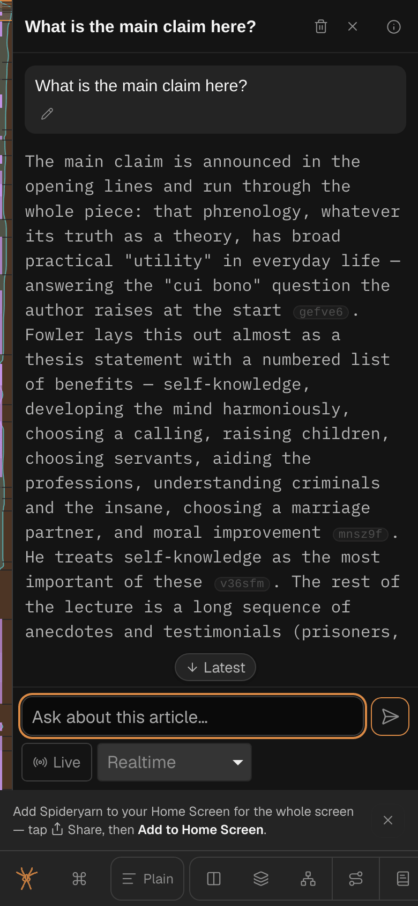
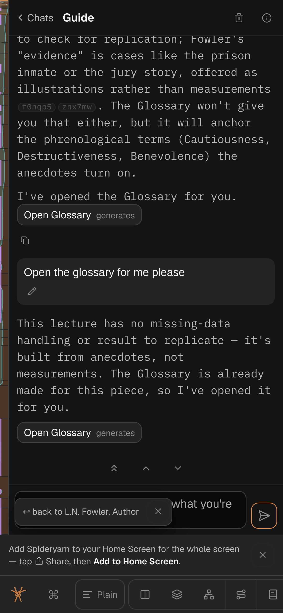
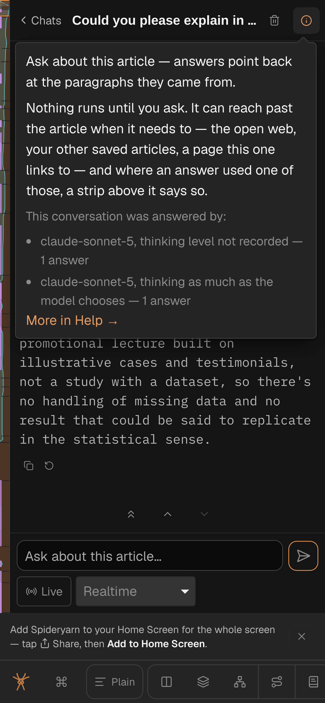
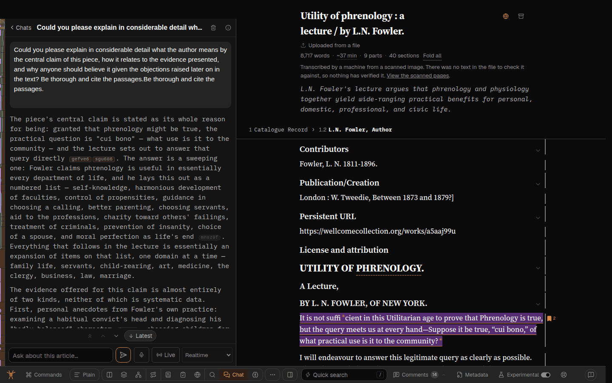

# Chat: back to the list on a phone, the model in the thread's (i), and step between messages

Overseer queue item qi-aft7nhv9, session `fbpd9fnc-chat-phone-nav-and-model-info`. Two of Greg's
reports (an admin's, `feedback-reporter.ts` exit 0), batched:

- **`spya-pd9fnc`** (SPIDERYARN-READING2-ER, 2026-10-08 07:32 UTC), **part 1 of 2** — the chat
  half. Part 2 (dictation double-tap) belongs to session `fbbtjtbb`; the dictation component is not
  touched here.
- **`spya-qd2agx`** (SPIDERYARN-READING2-ES, 2026-10-08 07:33 UTC).

> On mobile, I'd opened a chat, and I was in the middle of a chat, and I couldn't see a way to get
> back to the main chat mode that would let me choose other threads.
>
> Also, in the information icon for the chat thread, I was hoping it would show me which model it
> had been using, and perhaps even thinking level.
>
> — Greg, spya-pd9fnc, 2026-10-08

> In the chat interface, we have a button to scroll to the latest. It would be nice to have up and
> down buttons somehow, and maybe even top to make it easier, especially on mobile, to scroll
> between individual messages within the chat.
>
> — Greg, spya-qd2agx, 2026-10-08

Out of scope, by the brief: awareness of other threads inside Chat (session `fbwhq0j0`), the iOS
layout-after-rotation bug (`fbgxbwug`), and dictation (`fbbtjtbb`).

## Prior work

- [261005h](261005h-narrow-window-chat-thread-list-gets-more-lines-and-no-lone-quick-search-icon-in-the-bottom-bar.md)
  — Chat's list on a phone (row line counts). Not the thread view.
- [261001f](261001f-long-url-wraps-and-chat-latest-pill-clears-the-text.md) — the "Latest" pill
  moved into flow, a row of its own between transcript and composer. The step buttons join that row.
- [261005f] § A streamed answer stays where it starts — the hold logic in `Conversation`
  (`src/web/ChatPanel.tsx`). Any new scroll write has to cooperate with it the way `toBottom` does.
- [261001m](261001m-every-mode-gets-an-i-in-its-top-right-corner.md) — the band's (i), `about` slot.

## 1. A way back to the list on a phone (bug)

**What exists.** An open conversation's header (`ChatPanel` `head`) draws the title, a two-press
trash, and an `X` titled "All conversations" that calls `leave()`. On a wide screen that is the way
back.

**What the phone shows.** Measured by a browser pass on 2026-10-08 (WebKit with an iPhone 14 user
agent and Chromium touch-emulated, both 390×844; WebKit at 820×1180): **the X is there, on screen,
and it works** — `.band-head` is pinned above the transcript, a 200-character title is clipped with
an ellipsis and does not push it off, and a tap goes to the list. So nothing hides it. What fails is
that a reader cannot tell it is the way back:

- a faint 14px `×` in a 22px box, between the trash can and the (i);
- an `×` reads as "close this" (the panel, the mode), and its neighbour deletes;
- its only words are `title="All conversations"`, a tooltip, which never shows on touch;
- nothing in the header names the place it goes to.

And the other door is worse: pressing Chat in the Dock while in a thread *leaves* Chat. On a phone
the Dock scrolls sideways and Chat is usually off screen anyway.



So the class is **a control whose only label is a tooltip, on a device that has no hover** — a
discoverability bug, not a layout bug.

**Fix.** A labelled back control at the **start** of the header, where a phone reader looks for
"back": `‹ Chats` (`ChevronLeft` + the word), `tap-target`, `aria-label="All conversations"`. The
`×` goes: one control for one job, and the `×` is the half that misleads. The title follows it and
still ellipsises. The trash stays where it is. Learn draws no list and keeps none (by design; the
browser pass confirmed Greg's URL was `mode=chat`, not Learn).

Not changed: the Dock's Chat button leaving Chat from inside a thread. Pressing an active mode's
Dock button to leave it is the Dock's rule for every mode; changing it for one is a product call
that this report does not ask for.

## 2. The thread's (i) says which model answered, and how hard it thought

**What is stored.** Every assistant message already has `model` (the id the provider reported,
e.g. `anthropic/claude-sonnet-5`; a spoken turn has the realtime model). Thinking effort is **not**
stored. It is decided per job in `CHAT_REASONING` (`src/ai-call.ts`) and sent by `wireEffort`:
chat's row is `providerDefault` (nothing sent; the model thinks as it likes), and on the high-power
model a `providerDefault` row is sent as `high`.

**Decision: store it per answer, beside `model`.** A nullable `effort text` column on
`chat_messages`, stamped when the answer finishes, holding what was sent: a named effort
(`"high"`), `"default"` for "we sent none, so the provider's default", and null on every row written
before this (shown as nothing rather than guessed). CLAUDE.md § Store when it happened; and the
table is the kind of thing that changes (a row moves from `providerDefault` to `medium` after an
eval), at which point a value computed at render time from today's table would mis-describe every
old answer.

- *Simpler option passed over:* derive it in the browser from the stored model id (high-power ⇒
  `high`, else "default"). No migration, but it needs a client copy of the server's table and it
  rewrites history the first time the table changes. Rejected for that reason, but it is the
  fallback if review thinks the column is not worth it.
- **Where it is computed:** export one function from `src/ai-call.ts` — `wireEffort` already is the
  answer, so export it (or a named wrapper) and have `converse.ts` put `effort` on its `done` event
  from the *requested* model, the same value `outgoing` sends. One source, so the stored value
  cannot disagree with the wire.
- **Spoken turns** (Live) store no effort: the realtime model has none of ours.
- **Carried through**: `types.ts` `ChatMessage.effort?`, `pg-chat.ts` read/insert/patch, the
  migration + `src/db/schema.ts`, the browser's `chat/model.ts`, export (`src/store/export.ts`)
  if it lists message fields, and the public reader stripped like `model` is (check what
  `public-reader.ts` does with `model`).

**What the (i) says.** When a conversation is open (Chat, not Learn — Learn's (i) is Learn's), the
`about` card gains a short paragraph after the mode's words:

> Answered by claude-sonnet-5, thinking at the model's own default.
> Answered by claude-opus-5-5 (High-powered AI), thinking hard (high).

Model ids are shown with the provider prefix stripped, as `AboutMade` and `displayName` do. If a
conversation's answers used more than one model/effort (High-powered AI switched mid-thread), list
each pair with how many answers it gave. Answers with no `model` (still pending, failed before the
provider said) are not counted. With no answers yet: nothing added.

## 3. Step between messages: Top, Previous, Next, Latest

**Where.** The row the "Latest" pill already occupies, in flow between transcript and composer
(261001f). It is shared by every surface `Conversation` draws — the band, the block-chat dialog,
the Marginalia card — so the controls are the same everywhere (controls.md § Controls that do the
same job look the same).

**When it shows.** Only when the transcript overflows its scroller (there is somewhere to go) and
there is at least one turn. Not while the conversation is empty. The pill used to appear only when
the reader was away from the bottom; the row now appears whenever there is somewhere to go, and
"Latest" within it keeps its old rule (shown only while away).

```
 ┌─ transcript ─────────────────────────┐
 │ …                                     │
 └───────────────────────────────────────┘
        [⇈]  [↑]  [↓]   [↓ Latest]          ← one centred row; Latest only when away
 ┌─ composer ───────────────────────────┐
```

**What each does.** A "message" is a turn: a question or an answer (`[data-turn]`).
- **↑ Previous**: put the start of the nearest turn that begins *above* the current top of the
  view at the top. Inside a long answer, that is the answer's own start; at its start, the
  question before it.
- **↓ Next**: put the start of the first turn that begins *below* the current top at the top; if
  none, the bottom.
- **⇈ Top**: the first turn.
- Disabled at the ends (no turn above / already at bottom).
- Instant, as `toBottom` is, not smooth: a smooth scroll is a stream of scroll events the hold logic
  would read as the reader moving mid-flight. Each press updates `stick`, `away` and the hold's
  anchor synchronously, as `toBottom` does, so a streaming answer is not yanked back.

**Size.** Icon buttons with titles/aria-labels; `.tap-target` so a finger gets 40px.

**Keyboard.** None added in this change (keyboard.md would need a line; the article already owns
↑/↓).

## Stages

1. **Back to the list** + **step buttons** (client only). Failing tests first: the head of an open
   conversation has a back control at its start; the step row's arithmetic (a pure function over
   turn offsets — `stepTarget`-style) red then green. Browser check at 390/820/1440.
2. **Model and effort in the (i)**: migration, server stamp, store, client card. Tests: the store
   round-trips `effort`; converse's `done` carries the wire's effort for both models; the card's
   sentence for one pair, two pairs, none.

Each stage: typecheck, `npm test`, lint on touched files, GPT Sol code review, commit.

## Done looks like

- On a 390px phone, mid-conversation, a visible "‹ Chats" at the left of the header goes to the list.
- The (i) on an open conversation names its model(s) and thinking level, and old answers without a
  stored effort say only the model.
- An overflowing transcript has Top / Previous / Next (and Latest when away) under it, working by
  finger and mouse, and a streaming answer still holds still.
- Feedback note in `docs/user-feedback/` naming both report ids; `scripts/feedback-endings.ts` run.

## Plan review (GPT Sol, read-only) — [261008c-plan-review-sol.md](261008c-plan-review-sol.md)

`VERDICT: refuse`, on three P1s, all taken. It approved the way-back diagnosis and fix, and storing
the effort per answer with `wireEffort` as the source and `"default"` vs null as the encoding; and it
found no render loop in `measureSteps`.

- **F1 (P1) — ↓ could not get back to a held question.** Right: the room under a held answer was
  excluded from every target, so ↓ landed at the words' end (590) instead of the question (900). Now
  `chatStep` takes two ends — `end` (the words) and `max` (room included): a turn is stepped to
  wherever the room lets it reach, and running out of turns goes to `end`, never into the room. And
  a button's enabled state is now `chatStep(…) !== null`, the same call a press makes, so ↑ at the
  first turn's start (below the padding) is off rather than dead. Tests: `tests/chat-steps.test.ts`
  (held ends), and Sol's suggested Previous-then-Next case in
  `tests/chat-streamed-answer-stays.test.tsx`.
- **F2 (P1) — overlapping 40px finger targets.** Right: three `.tap-target` halos 31px apart. The
  step buttons are now drawn 40px on a coarse pointer, with no halo; the row costs about 46px on a
  phone, judged in the browser pass below.
- **F3 (P1) — prefix stripping misnames Opus** (`claude-opus-5.5` for `claude-opus-5-5`). Right, and
  the repo forbids it. `DISPLAY_NAME`/`displayName` moved to `src/model-names.ts`, which imports
  nothing (re-exported from `src/models.ts`), and the card groups by that name. The lookup is now
  `Object.hasOwn`, since a stored id is data.
- **F4 (P2) — retry must clear `effort`; constrain the column; export by name.** All done:
  `effort: null` in `retry`, a CHECK on the values and an assistant-only CHECK, `effort` in
  `src/store/export.ts`. The public reader excludes `chat_messages` entirely, so nothing there.
- **F5 (P2) — failed answers store no model at all.** Taken as wording: the card counts finished
  answers (done, including stopped) only, and says so in its docblock.

## What landed

- **§ 1**: `‹ Chats` at the start of an open conversation's header (`.chat-back`, `tap-target`), the
  × gone. Learn unchanged.
- **§ 2**: `chat_messages.effort` (migration `20261008102903_chat_message_effort`, applied locally
  only); `converse`'s `done` carries `wireEffort(jobFor(kind), model) ?? "default"` and the chat
  route stores it; `ChatThreadAbout` in the (i). Spoken (Live) answers store none and say
  "not recorded". Help's Chat page says where the model and thinking are.
- **§ 3**: `src/web/chat-steps.ts` + the `chat-steps` row in `Conversation`.

## Browser pass (Playwright, 2026-10-08)

WebKit iPhone 390×844 and Chromium 1440×900, 820×1180 for layout. All pass, no console errors.
`‹ Chats` at x=19, trash and (i) clear of it, a long title still ellipsised. The (i) on old answers:
*"answered by claude-sonnet-5, thinking level not recorded"*; after one new question, two groups.
Step buttons 40×40 with 4px gaps on touch (25.6px on desktop), a 40px row. ↑ from part-way into
turn 7 of a 10-turn thread went 7, 6, 5 … 0 and disabled; ↓ came back down to the bottom and
disabled. While an answer streamed, ↑ to the previous answer held at exactly that position for 6s
as the answer grew 647 → 1,619 characters; ↓ afterwards reached the new question, its answer, the
bottom.





Seen and not ours: on the Guide thread on a phone, a "↩ back to …" chip (the guide's Back) sits
over the composer's placeholder. Reported, not touched; fixed in [261008e](261008e-the-way-back-chip-covers-chat-s-input-on-a-phone.md).

## Code review (GPT Sol, write-capable) — [261008c-code-review-sol.md](261008c-code-review-sol.md)

On `ee1ae5850`. `VERDICT: approve with changes`; its four fixes read and kept, each with a test:

- **F6 (P1)** — a Live conversation's unsaved spoken lines could overflow the panel and draw a row
  of three disabled buttons over no stored turn. The row now needs at least one turn.
- **F7 (P2)** — the rollback round-trip's seeder (`tests/helpers/seed-reader-state.ts`) dropped
  `effort`; it carries it now, with a Postgres regression (run locally: green).
- **F8 (P2)** — the hold path measured every turn *after* writing the room and `scrollTop`, a
  second forced layout per streamed word. Turn starts are now read in `settle`'s read phase and
  reused.
- **F9 (P3)** — `models.ts` still said the names lived there.

It also confirmed the stored effort is right for `candidates` and `guide` threads (both sides use
`jobFor(kind)`).
