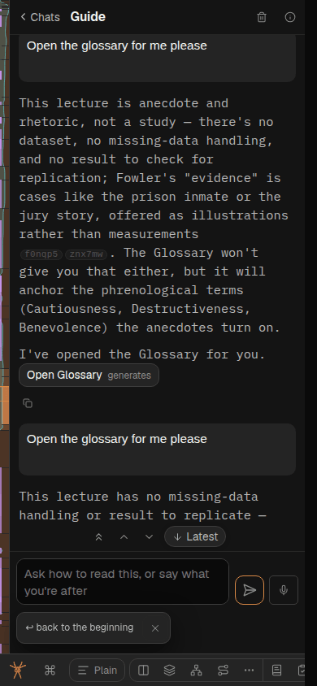
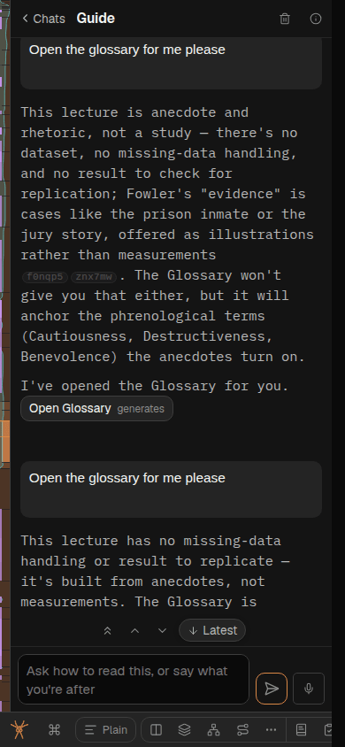
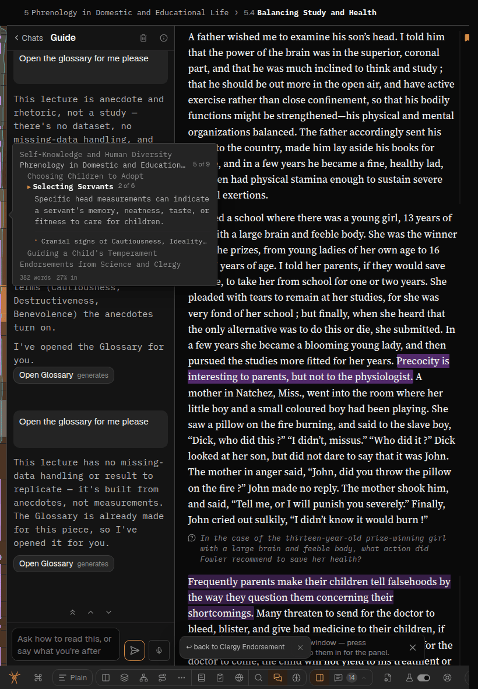
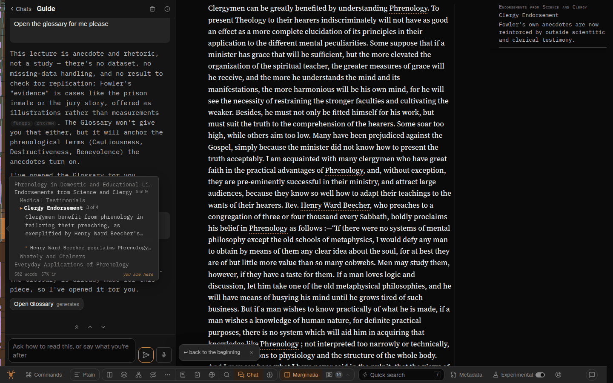
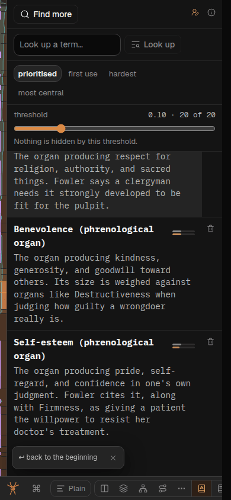

# The way-back chip covers Chat's input on a phone

Seen by the session on [261008c](261008c-chat-back-to-the-list-on-a-phone-the-model-in-the-thread-s-i-and-step-between-messages.md)
on 2026-10-08, at 390px on the Guide thread: a "↩ back to L.N. Fowler, Author" chip sat over the
start of the composer, hiding its placeholder and the left of the input box
([shot](261008c-shot-2-chats-and-steps-390.png)).

## Cause

The chip is `ReturnChip` (*back to ⟨section⟩*, after a jump), or `BandBackChip` (*back to ⟨mode⟩*)
in the same slot. It is `position: fixed` at `left: spine + --mode-w + 0.5rem`, 0.75rem above the
dock — beside the band when the band is beside the article, but at the window's left edge when the
band covers it (`--mode-w: 0`), which is on top of the band's bottom-left corner. Nothing in the
covering band made room for it. Chat's foot is the composer, so it was Chat that showed it, but
every mode's last row was under the chip. The chip in the shot names a section, so it is
`ReturnChip` after a jump; whatever made the jump, the overlap is the slot's, not the guide's.

The room already had a name: `--return-chip-h` (dock.css), 0 with no chip, which the offline strip
and the mode herald already read for the same reason.

## Fix

`.reader.band-covers .mode-band` gets `padding-bottom: var(--return-chip-h)`
(narrow-window.css § a band with no room). One declaration, in the rule that already owns the
covering band's box, for every mode at once.

- **Padding rather than raising the band's `bottom`**: the strip behind the chip stays the band's
  ground; a raised bottom would show the article through it.
- **Not a one-off offset on `.chat-composer`**: the chip covers every covering band's foot, and
  the herald's `footRoom` measures from the band's bottom, so it picks the room up for free.
- **Beside the article (820, 1440) nothing changes**: the rule needs `band-covers`, and there the
  chip stands over the prose.

Passed over: hiding the chip while a covering band is open. Simpler in CSS, but the chip is the
only way back for a home-screen reader, and the guide opening a mode is exactly when they want it.

## Evidence

- [tests/the-way-back-chip-clears-a-covering-band-in-chrome.test.ts](../../tests/the-way-back-chip-clears-a-covering-band-in-chrome.test.ts)
  renders the real stylesheets in Chrome at 390 and 1440: red before the fix (`390: the chip
  covers the band's foot`), green after, with controls that no room is reserved without a chip or
  with the band beside the article.

- Browser check (Sonnet, Playwright, this worktree's dev server, `/read/fowler-phrenology`, Chat):
  at 390 the composer is y 678–752 and the chip 753–792 inside the band's ground (band 0–804);
  with the chip dismissed the composer's bottom is the band's (804). At 820 and 1440 the band is
  beside the article, padding 0, and the composer's rect is identical with and without the chip.
  Glossary at 390, scrolled to the end: last row 747.7, chip top 753.2.

  
  
  
  
  

## Code review (GPT Sol, write-capable) — [261008e-code-review-sol.md](261008e-code-review-sol.md)

The covering selector beats the per-mode padding rules, including Structure's rules loaded later.
The covering guard restores `--dock-bottom` to `--dock-space` and `--hint-now` to `--hint-h`, so
the band and chip share the same bottom offset, including the safe area and install hint. The
reservation needs the chip's height plus its 0.75rem gap; `--return-chip-h` includes both.

`footRoom` measures from the band's outer bottom to its growing child's bottom, so it includes
this padding. The herald's `max()` clears both the padded foot and the chip without adding the
chip's room twice. Its old browser fixture supplied only the footer's height; the review corrected
it to measure the actual room, and now checks that the covering herald stays close to the foot too.
The new chip test also passed an explicit `undefined` for Chrome's executable path, which failed
the project's `exactOptionalPropertyTypes` check; the review supplies a string instead.

The chip and band do not consume `--kb-inset`; this fix therefore preserves their clearance when
iOS leaves the layout viewport unchanged. It does not solve the existing composer-under-keyboard
limitation described in [ModeSurface](../../src/web/ModeSurface.tsx) § No viewport code lives here yet.

Review added phone cases with a long scrolling transcript, the chip's close button, a 34px safe
area, the install hint, and bars requested hidden. These additional browser cases could not be
executed in the review sandbox: Chrome exits during launch with `setsockopt: Operation not permitted`.
The earlier red/green evidence above is the author's run, not a successful reviewer rerun.
