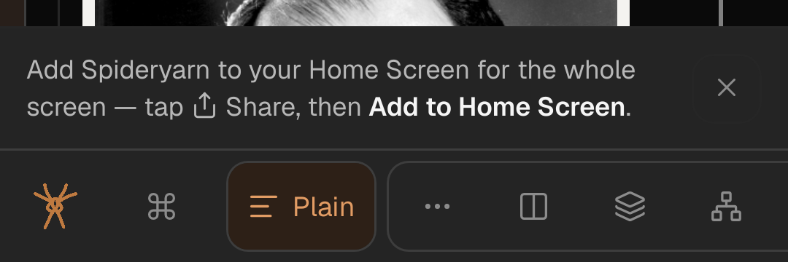
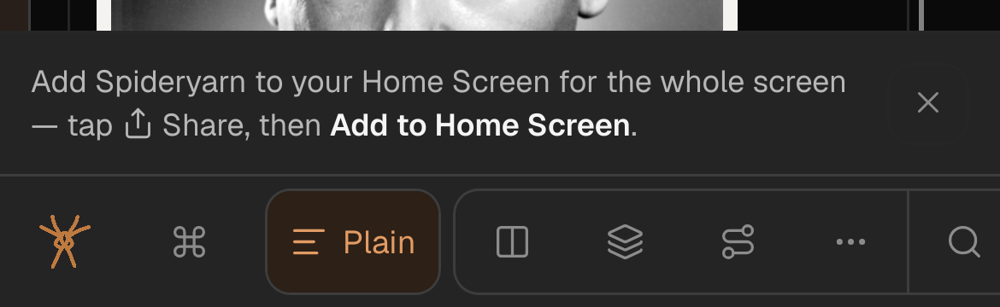

# Phone bottom bar: More leads the bands' frame when its own place is off screen

Queue item `qi-t22r9mt4` (from plan
[261007c](261007c-bottom-bar-rises-in-on-first-load-and-a-more-button-gathers-the-lesser-modes.md)):
*"at 390 wide the bar still scrolls sideways and the More button sits off-screen until scrolled. More
must be reachable without scrolling on a phone: fit the row (narrow-windows.md's fit ladder) or pin
More."* [261008d](261008d-bottom-bar-groups-skim-and-more-join-structure-and-summary-comments-joins-marginalia.md)
§ D4 moved More four buttons left and left this item open on purpose, so it is not fixed already.

## What is wrong, measured

WebKit, iPhone user agent, DSF 3, this tree's dev server, 2026-10-09. Every phone width is on the last
rung (`dock-fit-4`) and **every button has the same x at 390, 375 and 360** — the row is at its 44px
floor and only the window's edge moves.

| state | More [left, right] | visible at 390 / 375 / 360 |
|---|---|---|
| default, Experimental off | [310, 354] | yes / yes / yes |
| Diagram open, Experimental off | [354, 398] | no (8px off) / no / no (38px off) |
| Experimental on, any mode | [354, 398] | no / no / no |

Left of More are Spideryarn, Commands, Plain (with its word), Structure, Summary, Diagram and Skim:
398px of buttons at the 44px floor Greg chose (narrow-window.css § a coarse pointer). **No label rung
can fit 360**: dropping Plain's word saves 23px of the 41 needed. So the fit ladder cannot fix it,
and pinning More is the fix.

## The decision

**D1. When More's own place is past the bar's visible edge, More moves to the front of the bands'
frame** — `[Plain] [⋯ Structure Summary Diagram Skim | Search …]` instead of
`[Plain] [Structure Summary Diagram Skim ⋯ | Search …]`. At the front it is at x≈178 whatever is
drawn after it. Where its own place is visible (every desktop, an iPad, a phone in the default bar),
nothing changes: Greg's placement, *"just after the skim mode"* (spya-mcs4gb, 2026-10-08), holds
wherever it can be seen.

**D2. Measured, not keyed to a width or to the rung**, the house rule for this bar
(dock-fit.ts header). After the ladder picks its rung, `useDockFit` asks one more question: does
More's *home* right edge lie past the dock's content edge (client width less its right padding,
which carries the notch inset), with the row at scroll 0? "Home right edge" is
`max(More.right, anchor.right)`, where the anchor is the last drawn row before More's home (the last
of `cutForMore`'s lead, marked with a data attribute). In the home order More is the larger; in the
leading order the anchor is, and it ends exactly where More would. So the answer **does not depend on
which order is drawn**, and moving More cannot flip the answer back — no oscillation. Moving More
changes no widths, so the ladder's own measurement is untouched.

**D3. DOM order moves, not CSS `order`.** 261008d § D2 option 4 turned CSS `order` down for the
focus-order/visual-order mismatch (WCAG 2.4.3); the same applies here. More keeps a stable React key
so a re-order moves it rather than remounting it (an open menu survives a rotation). Both arms
(`DockModes`, `DockModeLinks`) take the same flag through `cutForMore`, so they cannot disagree.

**Simpler option passed over:** move More to the front whenever the row overflows at the last rung.
One boolean, no geometry — but it would move More on an iPad in portrait and on every phone in the
default bar, where it is already visible, giving up Greg's placement for nothing.

**Also passed over:** a rung that drops Plain's word (fixes 390 only, not 360 — and Plain keeps its
word on purpose, narrow-window.css § a coarse pointer); `position: sticky` on More (each
`.dock-frame` is `overflow: hidden`, so it is its own scroll container and sticky goes nowhere);
moving More out of the scrolling row to a fixed slot at the bar's right end (a structural change to
the bar, and More leaves its group, which Greg asked for).

**Cost, named:** on a phone with Diagram drawn, More is the first button of the bands' group rather
than the last of the shape run. A reader who learned "More is after Skim" on a laptop finds it four
buttons earlier on the phone. Flagged to Greg in the debrief.

## Stages

1. Failing tests first: the measurement (fake rects; More past the edge ⇒ leads; inside ⇒ home;
   leading order with the anchor past the edge ⇒ still leads), and a render of both arms in the
   leading order (More first in the bands' frame, focus order = visual order). Then the code:
   `moreLeads` in dock-fit.ts, `cutForMore(bands, leads)`, the anchor attribute, Dock passing the
   flag. Comments and docs that say More stands after Skim (narrow-windows.md, reading-view-overview,
   dock-fit.css, Dock.tsx) get the exception.
2. Browser check (Sonnet, WebKit) at 1440, 820 (iPad), 390, 375, 360 with Diagram open and with
   Experimental on and off; GPT Sol code review; gates; push.

## GPT Sol's reviews

[Plan review](261009c-plan-review-sol.md) ([prompt](261009c-plan-review-prompt.md)): no blocker. Taken:
re-measure placement on every measurement, not only when the rung changes (P1); scroll added back,
anchor marked from the home split even when More leads (P1); one flat keyed array so a re-order
moves nodes (P2). Passed over: subtracting the notch inset past the narrow-window query (P2) —
More's home is ~400px in and a landscape phone is 667px or wider, so it cannot decide the answer;
written into `moreOffTheEdge`'s comment instead.

[Code review](261009c-code-review-sol.md) ([prompt](261009c-code-review-prompt.md),
[diff](261009c-code-review.diff)): no defects in the production code; it added tests for a resize
that keeps the rung, both arms, a scrolled bar, right padding, a bar with no layout, and focus
through both re-order directions.

## Results

`tests/dock-more-leads.test.tsx` lays the bar out by DOM order, so the order-independence is
exercised: five of six tests were red before the code. Measuring More where it is drawn (the naive
version) was tried as a mutant and the per-render "does not flip back" test caught it.

Browser, Sonnet subagent, WebKit iPhone at 390/375/360, WebKit iPad at 820, Chrome at 1440:

| state | phones | iPad 820 | 1440 |
|---|---|---|---|
| default, Experimental off | after Skim, [310, 354] | after Skim | after Skim |
| Diagram open, Experimental off | **first, [178, 222]** | after Skim | after Skim |
| Experimental on | **first, [178, 222]** | after Skim | after Skim |
| metadata page, Experimental on, 360 | **first** | — | — |

More's menu opens and closes from the leading place, and still works after a 360→900→360 resize;
with the bar scrolled 200px a re-measure keeps More first. After a viewport resize in headless
WebKit, the arrangement caught up in about a second. The rung shares the same
`ResizeObserver` → `requestAnimationFrame` path, so the delay is not new with this change. It was
not chased further.

## Done

- [x] Stage 1 — tests red, then green; typecheck.
- [x] Stage 2 — browser check, Sol review, push to `dev`.
