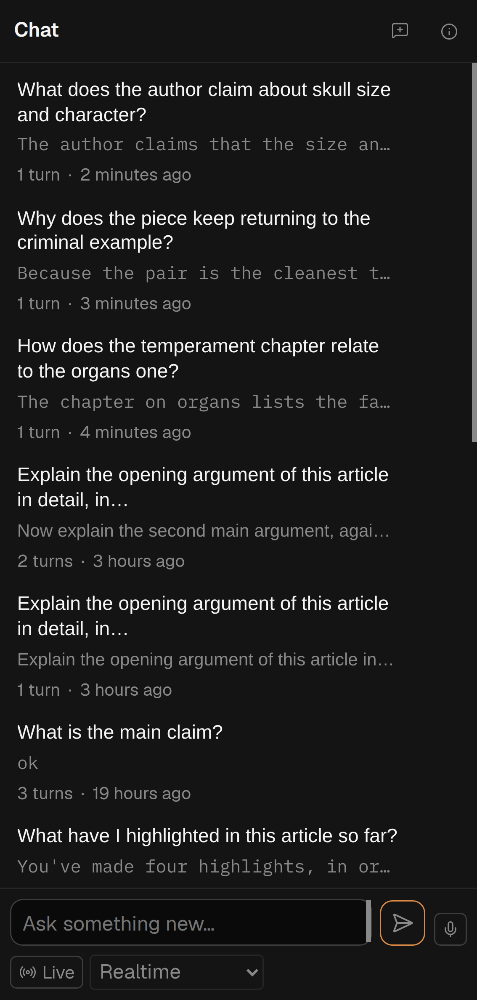
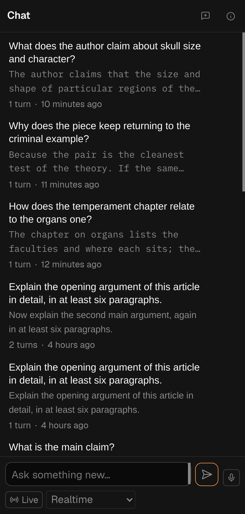

# On an iPhone Chat's list cuts each conversation too short, and the bottom bar draws a quick-search icon with no box

Two reports from Greg (an admin; `feedback-reporter.ts` exited 0 on each production row), batched as
Overseer queue qi-prrxf2rv, session `fbsvsbae-n8pgy2-narrow-chat-and-search`. Both filed as
suggestions.

**Ending, both: Shipped**, on `dev`. Plan
[261005h](../plans/261005h-narrow-window-chat-thread-list-gets-more-lines-and-no-lone-quick-search-icon-in-the-bottom-bar.md).

## `spya-svsbae` — Chat's list

Filed 2026-10-05 07:37 UTC from Chat on
`entropy-26-00481-with-cover-from-taylor-beck-spya-naz564`; Sentry SPIDERYARN-READING2-DD.

> In chat mode, when I'm looking at it in portrait mode on an iPhone, it truncates both the thread
> title and the first response a little bit too aggressively, so it's quite hard to tell what each
> chat's really about.

- **What cut the title was not the screen.** A conversation's stored title is the first sixty
  characters of its first question, so two questions that open alike were stored alike.
- **Built**: a row now shows the whole first question where the title was only its start, on every
  width and for conversations that already exist. A renamed conversation shows its name as written.
- **Built**: under 732px the title may run to three lines (was two) and the preview under it to two
  (was one). Measured at 390px, the preview went from about 35 characters to two full lines.
   
- **Left alone**: a wide window's line counts. And the 46px the hidden rename and delete icons hold
  at the right of each row: on a phone that strip is the only way to reach rename.

## `spya-n8pgy2` — the lone quick-search icon

Filed 2026-10-05 07:45 UTC from Search (`?match=quick`) on `2605-20355v1-spya-ygtwkz`; Sentry
SPIDERYARN-READING2-DF.

> In the bottom bar of the reading view, we show a search mode icon. Good.
>
> We also show a quick search input text bar when there's room. Okay, that's good too.
>
> But if there isn't much room, don't bother showing the quick search icon alone without the input
> text bar, because the quick search icon does just the same thing as clicking the search icon,
> which we are already also showing, so the quick search icon alone doesn't add any value.

- **Built**: where the bar has no room for the box, it draws nothing: on a touch screen, in a window
  under 732px, and on the bar's last fit rung (1100px and below on a bar with every mode). `/` still
  opens quick search there.
- **One difference from the report's premise**, for Greg to know rather than a reason not to build:
  the ⚡ opened Search on *quick*; the Search button opens it on *thorough* unless the URL names a
  kind. So on a phone quick search is now Search and then the *quick* tab. Whether Search should
  open on *quick* on a phone is a product call nobody has made; not built, not queued.
- **Left alone**: the ⚡ that takes the box's place while Search mode is open in a window wide
  enough for the box. That one is not about room; it is there so there is one box to type in.

**Not tried on a real iPhone.** Stylesheet tests, and a touch-emulated Chrome on the box at 390×844.
Nothing deferred, so no further queue entry.
