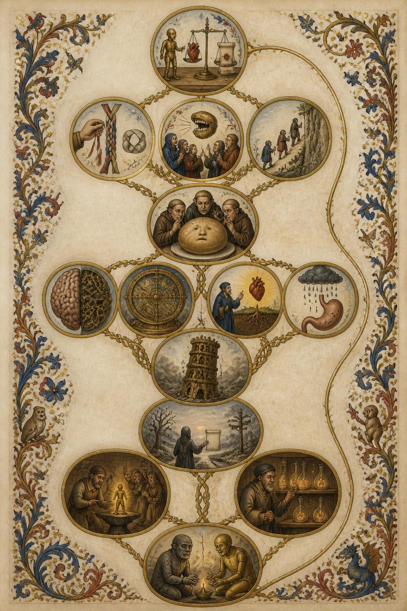
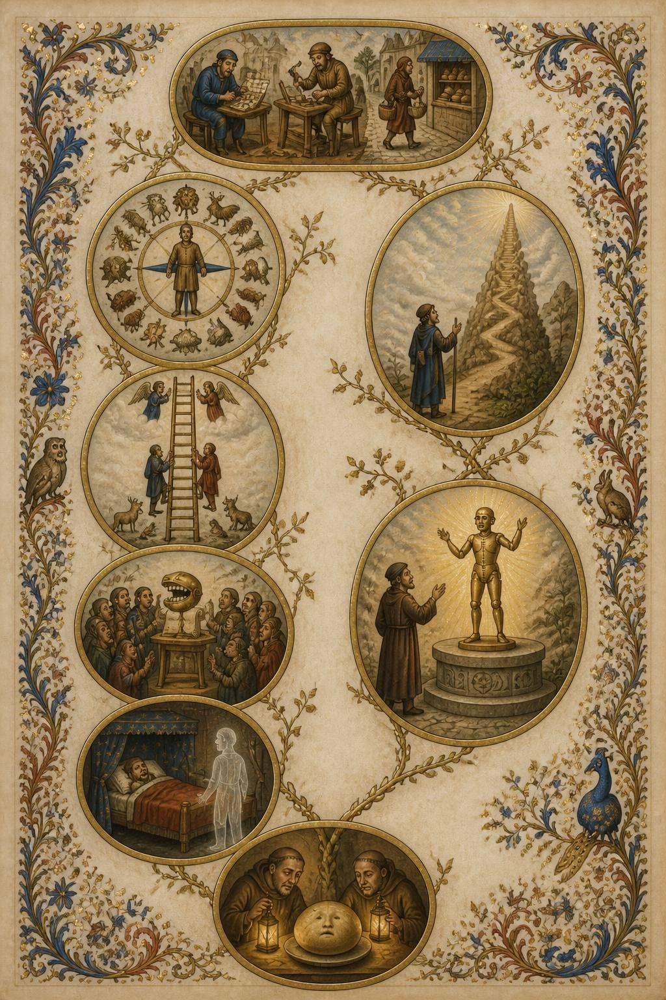
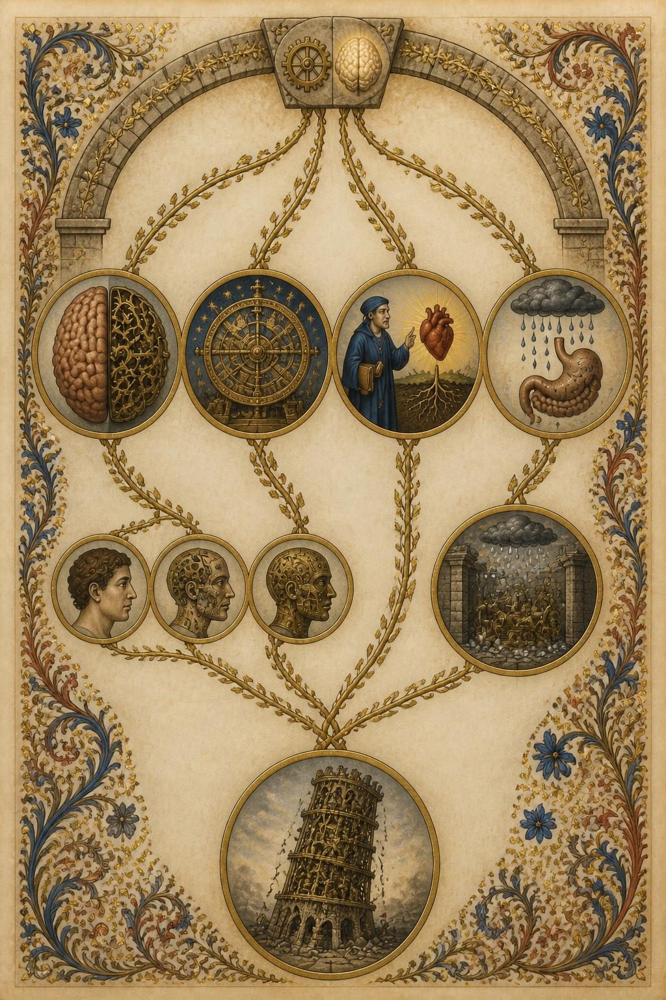

(The second run of the day, and the one to read. The plates here are the
`.jpeg` the model actually returned — `output_format: "jpeg"`, compression 82,
407 KB each against about 3.4 MB for the same plate as PNG. `illustrated-2026-09-03/`
next door is the first run, before that parameter was sent; its plates are
downscaled copies of 3.4 MB PNGs and its numbers are otherwise comparable.)

# Illustrated run — 2026-09-03T04:54:29.684Z

Prompt version `illustrated/1`; illustrator `openai/gpt-image-2` at `2:3`, quality `low`, JPEG. Each article has `<slug>.raw.json` (what the model sent, before any checking), `<slug>.brief.json` (after `readIllustrated`) and one `.jpeg` per plate.

Prompt: the shipping `SYSTEM` in `src/illustrated.ts`.

## The numbers

**`brief $` is the bill and the plates are not**, which is the opposite of
what this feature was first costed at. It is broken out rather than totalled
for exactly that reason: a $0.20 brief buried in a total is the number that
decides whether this ships, hidden.

`dropped` is vignettes `readIllustrated` refused — an unknown block, a quote
that is not in the block it names, one under the four-word floor, or free
text over its cap. It rising is the prompt drifting off the article.

| article | plates drawn | vignettes kept | dropped | brief $ | plates $ | brief out tokens | brief time | plate times |
|---|---|---|---|---|---|---|---|---|
| noema-mythology-of-conscious-ai | 3/3 | 26 | 4 | **$0.2740** | $0.0447 | 22908 | 223s | 33/27/25s |

## What these numbers do not say

**They do not say the picture is right.** Illustrated deliberately accepts an
output that cannot be structurally validated: a genuine, verbatim,
block-local quote can still be paired with an invented `depicts`, and the
image model can ignore the brief entirely. Sketch remains the checkable
diagram of record. Look at the JPEGs.

**One bad draw is not a broken prompt.** Rendered text varies run to run:
across three draws of one identical brief on 2026-09-03, a heading came out
correct once, misspelt once and omitted once, with no invented body text in
any run. That variance is the argument for the *what it depicts* list under
the picture carrying the real words — which is the last section of each
article below.

**The acceptance test is Fable's**: show two articles' plates to somebody who
read them and ask which is which. If they could be swapped, it is a novelty.

### noema-mythology-of-conscious-ai

**Style the model chose:** An illuminated manuscript page — vellum, iron-gall ink linework, gold leaf and lapis/madder pigment, with the argument told as a sequence of painted roundels linked by vine-tendrils and marginalia, fitting an essay that closes on the soul, psychē and Ātman.

Dropped:
- `plate[0].vignettes[6]`: quote is not in block spya-zg9me8
- `plate[0].vignettes[10]`: quote is not in block spya-yverz7
- `plate[0].vignettes[11]`: quote is not in block spya-e7fdmb
- `plate[2].vignettes[2]`: quote is not in block spya-zg9me8

Media type the provider returned: `image/jpeg`.

What each plate depicts, as the brief has it:

- **overview** — The Funnel, the Fork, and the Return
  - `spya-e68t9h` — At the top of the page, a small brass automaton stands before a scribe's balance-scale; one pan holds a bleeding heart, the other a sealed scroll. — “with consciousness comes moral status, the potential for suffering and, perhaps, rights”
  - `spya-cvaqgs` — A scribe's hand plaiting three plain ribbons into a single braid, without any faces or symbols on the ribbons themselves. — “The propensity to bundle intelligence and consciousness together can be traced to three baked-in psychological biases”
  - `spya-k6fpme` — A coiled, folded parchment-ribbon shape sits ignored in a corner while a crowd of small figures gathers admiringly around a separate speaking mechanical mouth. — “Nobody, as far as I know, has claimed that DeepMind's AlphaFold is conscious”
  - `spya-cke6sj` — A path up a hillside that turns near-vertical just ahead of each climber's foot, flattening away behind them, with tiny robed travelers craning upward at every step. — “on an exponential curve, every point is an inflection point”
  - `spya-k850tu` — The three ribbons, the quiet folded shape, and the vertical path all converge as vine-tendrils into a round bun marked with a faint, accidental face, being peered at by monks. — “seeing patterns in things, like a face in a piece of toast or Mother Teresa in a cinnamon bun”
  - `spya-a8jgf4` — An anatomical brain split down the centre, one half rendered as soft convoluted flesh, the other as interlocking brass gears. — “brains are not computers. The metaphor of the brain as a carbon-based computer has been hugely influential”
  - `spya-hj5y6s` — A robed scholar gestures toward a glowing heart growing among tangled roots in the soil. — “called biological naturalism by the philosopher John Searle— that properties of life are necessary”
  - `spya-npjt4j` — A drawn diagram of a stomach and coiled intestine sits perfectly dry beneath a rain-cloud whose drops stop short of touching it. — “A simulation of the digestive system does not actually digest anything”
  - `spya-ymbpwn` — The split brain, the bronze gear-device, the rooted heart and the dry stomach-diagram converge as tendrils into a leaning tower built of stacked cogs, visibly cracking. — “looks increasingly shaky as the many and deep differences between brains and (standard digital) computers come into view”
  - `spya-vs0vpj` — A row of small glass vessels on a shelf, each containing a tiny glowing brain-like knot of tissue, tended quietly by an alchemist in the margin. — “the accidental emergence of consciousness in cerebral organoids (brain-like structures typically grown from human embryonic stem cells)”
  - `spya-zv36xq` — The crossroads figure, the forge, and the glass vessels all converge below into one final roundel: a rough stone-carved idol and a jointed brass figure standing side by side, both leaning toward the same small flame. — “the idea of the soul might seem as outmoded as the Stone Age”
- **inside-the-temptations** — Doing and Being, Bias and Rapture
  - `spya-nj888h` — A cluster of small figures: one bent over a grid of squares, one fitting together wooden furniture pieces, one carrying a basket down a lane toward a shopfront. — “solving a crossword puzzle, assembling some furniture, navigating a tricky family situation, walking to the shop”
  - `spya-h4mwb2` — A single human figure stands at the centre of a drawn compass-circle, with varied creatures and objects arranged around its rim, all facing inward toward the human as if measured against it. — “to take the human example as definitional, rather than as one example of how different properties might come together”
  - `spya-cke6sj` — A road rising toward the sky that steepens sharply just ahead of the traveller's foot and flattens behind, with a small robed figure gazing up in awe. — “on an exponential curve, every point is an inflection point”
  - `spya-her4zk` — A tall ladder rising through the page, winged angelic figures at its top rungs, human figures in the middle, and animals clustered at its foot. — “closer to angels and Gods than to other animals, as in the medieval Scala naturae”
  - `spya-v4sduf` — A robed inventor stands before a glowing jointed humanoid figure raised on a stone altar, arms lifted as though before a deity. — “If you've created a conscious machine — it's not the history of man, that's the history of Gods”
  - `spya-k6fpme` — A crowd of small robed figures gathers eagerly around a speaking mechanical mouth mounted on a scroll-stand. — “Large Language Models (LLMs) like OpenAI's ChatGPT or Anthropic's Claude have been the focus of most of the excitement”
  - `spya-t29n67` — A sleeping figure in a curtained bed, with a faint translucent figure standing silently at its foot. — “hear voices that aren't there or see a dead relative standing at the foot of the bed”
  - `spya-k850tu` — The ladder, the altar-scene, the speaking mouth and the bedside ghost all send tendrils down into one final medallion: a round bun bearing a faint accidental face, examined closely by two monks. — “seeing patterns in things, like a face in a piece of toast or Mother Teresa in a cinnamon bun”
- **inside-the-computation** — The Cornerstone and the Cracking Tower
  - `spya-wepmnr` — A single keystone at the top of a stone arch, with a small brass gear and a softly glowing brain-shape resting together upon it, both borne up by the one stone. — “The very idea of conscious AI rests on the assumption that consciousness is a matter of computation”
  - `spya-a8jgf4` — A brain split down the centre, one half soft convoluted flesh, the other half interlocking brass gears. — “brains are not computers. The metaphor of the brain as a carbon-based computer has been hugely influential”
  - `spya-hj5y6s` — A robed scholar gestures toward a glowing heart rooted among tangled soil-bound roots. — “called biological naturalism by the philosopher John Searle— that properties of life are necessary”
  - `spya-npjt4j` — A drawn diagram of a stomach and coiled intestine, perfectly dry, beneath a rain-cloud whose falling drops stop just short of touching it. — “A simulation of the digestive system does not actually digest anything”
  - `spya-ahtr6e` — A sequence of three small heads in a row, each more transformed than the last, flesh giving way piece by piece to brass cogs and plates. — “invites us to imagine progressively replacing brain parts with silicon equivalents that function in exactly the same way”
  - `spya-xvm37k` — A small stone office filled with dials and gearwork, its roof open to a drawn storm-cloud from which hailstones fall inward onto the machinery. — “a hailstorm is likely to arise inside the computers of the U.K. meteorological office”
  - `spya-ymbpwn` — A tower built of stacked cogs and gears, leaning visibly, cracks running down its stonework base. — “looks increasingly shaky as the many and deep differences between brains and (standard digital) computers come into view”
