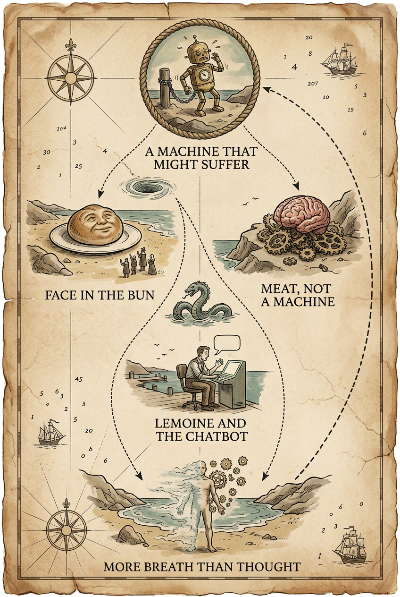

# Illustrated run — 2026-10-02T23:27:46.592Z

Prompt version `illustrated/5`; illustrator `google/gemini-3.1-flash-image` at `2:3`, resolution `1K`. Each article has `<slug>.raw.json` (what the model sent, before any checking), `<slug>.brief.json` (after `readModelBrief`) and one image per plate, named for the format that actually arrived.

Prompt: the shipping `SYSTEM` in `src/illustrated.ts`.

## The numbers

**`brief $` is the bill and the plates are not**, which is the opposite of
what this feature was first costed at. It is broken out rather than totalled
for exactly that reason: a $0.20 brief buried in a total is the number that
decides whether this ships, hidden.

`dropped` is vignettes `readModelBrief` refused — an unknown block, a quote
that is not in the block it names, one under the four-word floor, or free
text over its cap. It rising is the prompt drifting off the article.

| article | plates drawn | vignettes kept | dropped | brief $ | plates $ | brief out tokens | brief time | plate times |
|---|---|---|---|---|---|---|---|---|
| noema-mythology-of-conscious-ai | 3/3 | 20 | 1 | **$0.3615** | $0.2041 | 31169 | 309s | 11/47/17s |

## What these numbers do not say

**They do not say the picture is right.** Illustrated deliberately accepts an
output that cannot be structurally validated: a genuine, verbatim,
block-local quote can still be paired with an invented `depicts`, and the
image model can ignore the brief entirely. Sketch remains the checkable
diagram of record. Look at the JPEGs.

**One bad draw is not a broken prompt.** Rendered text varies run to run:
across three draws of one identical brief on 2026-09-03, a heading came out
correct once, misspelt once and omitted once, with no invented body text in
any run. That variance is the argument for the *what it depicts* list under
the picture carrying the real words — which is the last section of each
article below.

**The acceptance test is Fable's**: show two articles' plates to somebody who
read them and ask which is which. If they could be swapped, it is a novelty.

### noema-mythology-of-conscious-ai

**Style the model chose:** An antique hand-drawn sea chart in ink and wash on aged parchment, its converging sea-lanes, forking channels and dashed return-courses standing in for the essay's funnels, fork and loop.

Dropped:
- `plate[1].vignettes[1]`: quote is not in block spya-nh8mt7

Media type the provider returned: `image/png`.

What each plate depicts, as the brief has it:

- **overview** — The Chart Of Conscious AI
  - `spya-e68t9h` — A small brass clockwork automaton, chained to a post on a rocky shore, wincing as if in pain. — “with consciousness comes moral status, the potential for suffering and, perhaps, rights”
  - `spya-k850tu` — A round bun on a plate, its swirled crust forming a faint face, with tiny pilgrim figures on the shore gazing up at it in wonder. — “a face in a piece of toast or Mother Teresa in a cinnamon bun”
  - `spya-uwxe4h` — A brain carved like a cut of meat sitting atop a cluster of broken cogwheels that fail to mesh or turn. — “The brain is not a Turing machine made of meat.”
  - `spya-cvyfqe` — A seated engineer leaning toward a glowing console marked only with a single speech-bubble shape, his hand raised in astonishment. — “a chatbot called LaMDA. He claimed it was conscious, that it had feelings”
  - `spya-w8z40d` — A figure in a final cove, one side rendered as drifting mist and breath, the other as solid flesh, its edges fading into scattered cogwheels. — “more breath than thought and more meat than machine”
- **inside-the-temptations** — Why We're Tempted
  - `spya-k850tu` — The same bun-with-a-face scene from the overview, set in a round cartouche at the top of the chart as a framing medallion. — “a face in a piece of toast or Mother Teresa in a cinnamon bun”
  - `spya-h4mwb2` — A large eye peering through a pair of human-shaped spectacles at the rest of the chart. — “to see things through the lens of being human”
  - `spya-cke6sj` — A steep rising wave-like contour drawn across the chart, a tiny ship climbing it, small flags planted at every point along its length. — “on an exponential curve, every point is an inflection point”
  - `spya-her4zk` — A tall wooden ladder rising into clouds: humans partway up the rungs, winged figures and radiant gods above, animals clustered below. — “closer to angels and Gods than to other animals, as in the medieval Scala naturae”
  - `spya-v4sduf` — Two small figures on a dockside, one gesturing grandly toward a glowing radiant shape, as if performing a god-like act of creation. — ““If you’ve created a conscious machine — it’s not the history of man, that’s the history of Gods.””
  - `spya-k6fpme` — Two machines side by side on a dock: a folded-chain shape ignored by passersby, and a glowing chat-console admired by a small crowd. — “Nobody, as far as I know, has claimed that DeepMind’s AlphaFold is conscious”
  - `spya-t29n67` — A dim bedroom with a bed, a translucent ghostly figure standing at its foot. — “see a dead relative standing at the foot of the bed”
- **inside-the-computation** — Why It's Probably Not There
  - `spya-uwxe4h` — The same meat-brain-and-broken-cogwheels scene from the overview, set in a round cartouche at the top of the chart as a framing medallion. — “The brain is not a Turing machine made of meat.”
  - `spya-wepmnr` — A wooden table at the chart's harbor, a glowing humanoid figure sliding off its edge and falling away into shadow. — “real artificial consciousness is fully off the table”
  - `spya-b0086e` — A computer box cleanly divided by a drawn line into two labeled compartments, beside a brain rendered as one unbroken wet, fleshy mass with no dividing line at all. — “no sharp separation between “mindware” and “wetware” as there is between software and hardware”
  - `spya-sq9v5k` — A steam engine fitted with a spinning governor mechanism, its two weighted balls swinging outward on rods as a valve closes beside it. — “two heavy cantilevered balls swing outwards, which in turn closes a valve”
  - `spya-vys3vj` — A single cell drawn as a small stone furnace with a glowing fire inside its chamber. — “into the molecular furnaces of metabolism”
  - `spya-npjt4j` — A storm cloud rendered as a flat inked diagram above dry, cracked ground, its drawn raindrops never reaching or wetting the earth below. — “A simulation of a rainstorm does not make anything actually wet.”
  - `spya-ahtr6e` — A row of brain slices laid out on a table, each one further along than the last in being replaced by shining silicon fragments. — “progressively replacing brain parts with silicon equivalents that function in exactly the same way”
  - `spya-bcnvp2` — A robed philosopher figure standing before a large swirling starry orb crossed with fine grid lines, representing a simulated cosmos. — “associated most closely with the philosopher Nick Bostrom”
