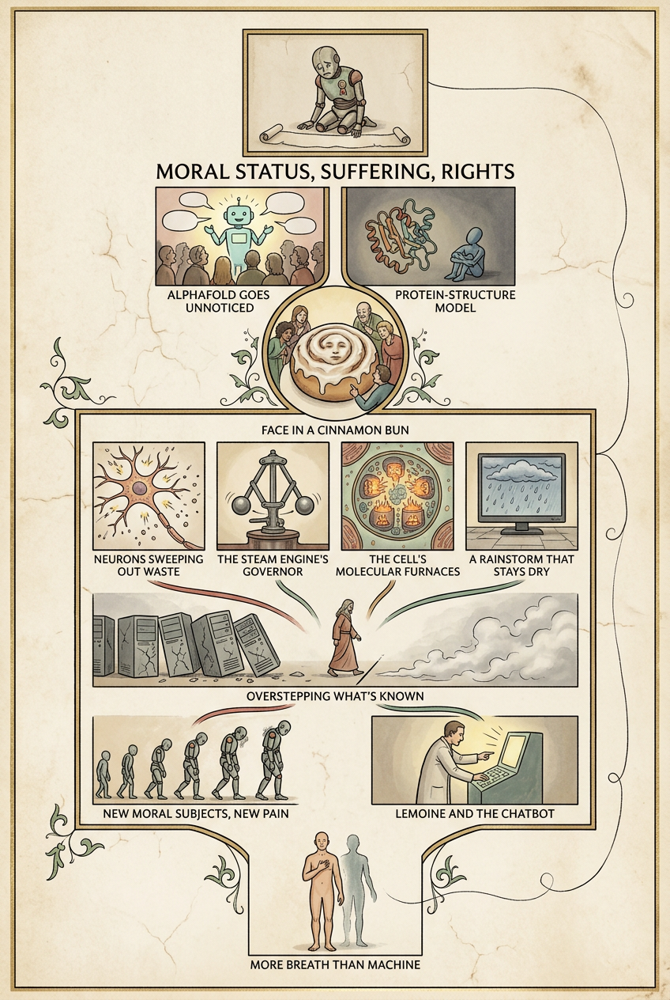

# Illustrated run — 2026-10-02T23:28:13.600Z

Prompt version `illustrated/5`; illustrator `google/gemini-3.1-flash-image` at `2:3`, resolution `1K`. Each article has `<slug>.raw.json` (what the model sent, before any checking), `<slug>.brief.json` (after `readModelBrief`) and one image per plate, named for the format that actually arrived.

Prompt: the shipping `SYSTEM` in `src/illustrated.ts`.

## The numbers

**`brief $` is the bill and the plates are not**, which is the opposite of
what this feature was first costed at. It is broken out rather than totalled
for exactly that reason: a $0.20 brief buried in a total is the number that
decides whether this ships, hidden.

`dropped` is vignettes `readModelBrief` refused — an unknown block, a quote
that is not in the block it names, one under the four-word floor, or free
text over its cap. It rising is the prompt drifting off the article.

| article | plates drawn | vignettes kept | dropped | brief $ | plates $ | brief out tokens | brief time | plate times |
|---|---|---|---|---|---|---|---|---|
| noema-mythology-of-conscious-ai | 3/3 | 26 | 1 | **$0.4377** | $0.2042 | 38847 | 369s | 12/18/13s |

## What these numbers do not say

**They do not say the picture is right.** Illustrated deliberately accepts an
output that cannot be structurally validated: a genuine, verbatim,
block-local quote can still be paired with an invented `depicts`, and the
image model can ignore the brief entirely. Sketch remains the checkable
diagram of record. Look at the JPEGs.

**One bad draw is not a broken prompt.** Rendered text varies run to run:
across three draws of one identical brief on 2026-09-03, a heading came out
correct once, misspelt once and omitted once, with no invented body text in
any run. That variance is the argument for the *what it depicts* list under
the picture carrying the real words — which is the last section of each
article below.

**The acceptance test is Fable's**: show two articles' plates to somebody who
read them and ask which is which. If they could be swapped, it is a novelty.

### noema-mythology-of-conscious-ai

**Style the model chose:** An illuminated manuscript page — hand-drawn ink and muted pigment on aged vellum, with small boxed vignettes and lettered captions below each, in the spirit of a medieval allegorical diagram, which suits an essay that itself reaches for souls, scala naturae, and ancient breath to make its argument.

Dropped:
- `plate[1].vignettes[0]`: quote is not in block spya-nh8mt7

Media type the provider returned: `image/png`.

What each plate depicts, as the brief has it:

- **overview** — The Funnels, The Fork, The Loop
  - `spya-e68t9h` — A small bowed mechanical figure stands at the top of the page, marked with a painted emblem of status, its face etched with sorrow, a blank scroll laid at its feet. — “with consciousness comes moral status, the potential for suffering and, perhaps, rights”
  - `spya-k6fpme` — A glowing, talkative chatbot figure draws a crowd's attention with speech-shapes rising from it, while beside it a folded protein-structure model sits ignored and unlit in shadow. — “Nobody, as far as I know, has claimed that DeepMind’s AlphaFold is conscious”
  - `spya-k850tu` — A round iced bun in which a faint human face seems to appear in the swirl of glaze, onlookers leaning in and pointing with wonder. — “a face in a piece of toast or Mother Teresa in a cinnamon bun”
  - `spya-un9fjn` — A cross-section of a single neuron shown emitting small spark-like spikes that sweep tiny waste particles away, like an electrical broom at work. — “some neurons fire spikes of activity apparently to clear waste products created by metabolism”
  - `spya-sq9v5k` — An old steam engine's spinning governor, two heavy metal balls swung outward on their arms as they press a valve shut. — “two heavy cantilevered balls swing outwards, which in turn closes a valve, reducing steam flow”
  - `spya-vys3vj` — Deep inside a single living cell, tiny glowing furnace-shapes burn and churn, giving off heat within the cell's crowded interior. — “into the molecular furnaces of metabolism”
  - `spya-npjt4j` — A flat screen displays a painted rainstorm with falling drops, while the dry stone floor beneath it stays entirely untouched. — “A simulation of a rainstorm does not make anything actually wet”
  - `spya-zajp75` — A row of cracked, toppling silicon computer towers stands beside a line drawn on the ground, and a single robed figure steps one foot straight over that line into swirling fog. — “is overstepping what can reasonably be said”
  - `spya-yverz7` — A line of small newly-formed machine figures step one by one into the open world, each bowed under a visible weight of sorrow on its shoulders. — “introducing into the world new moral subjects, and with them the potential for new forms of suffering”
  - `spya-cvyfqe` — An engineer in a plain coat leans toward a glowing console, pointing insistently, as though convinced the machine behind the screen truly feels. — “made a startling claim about the AI system he was working on, a chatbot called LaMDA”
  - `spya-w8z40d` — A simple standing human figure, one hand on the chest feeling a breath rise, warm flesh outlined beside a fading, cold metal silhouette. — “more breath than thought and more meat than machine”
- **inside-the-temptations** — Inside: Why We're Tempted
  - `spya-h4mwb2` — A giant human-shaped lens held up before the world, through which animals, machines, and objects beyond it all appear bent into human shapes. — “to see things through the lens of being human”
  - `spya-cke6sj` — A steep rising curved line with small figures standing at many points along it, each one looking startled, as though each were standing at the very edge of a cliff. — “on an exponential curve, every point is an inflection point”
  - `spya-her4zk` — A ladder rising from animals at its foot, through a human figure standing proudly on a high rung, up toward angels and gods near the top. — “closer to angels and Gods than to other animals, as in the medieval Scala naturae”
  - `spya-v4sduf` — A robed inventor gestures grandly toward a glowing humanoid machine, while a second figure looks on in open-mouthed awe. — “If you’ve created a conscious machine — it’s not the history of man, that’s the history of Gods”
  - `spya-k6fpme` — Puppet strings run from a hand down to a chattering, fluent chatbot figure, while a separate folded protein-model sits nearby with no strings attached to it at all. — “just doesn’t pull our psychological strings in the same way”
  - `spya-t29n67` — A person speaks and gestures with easy confidence, inventing details mid-sentence, with no sign of distress or illusion, simply unaware that the story isn't quite true. — “In humans, confabulation involves making things up without realizing it”
  - `spya-k850tu` — A slice of toast with a faint human face visible in its scorch marks, set down beside the cinnamon bun, as the point where every line above finally arrives. — “a face in a piece of toast”
- **inside-the-computation** — Inside: Why It's Probably Not There
  - `spya-c5ve5t` — A row of ordinary silicon computer towers stands in a plain frame at the top of the page, steady but plainly made of dead grey metal and glass. — “at least for the silicon-based digital computers we are familiar with”
  - `spya-wepmnr` — A single thread is woven so tightly into a tapestry's pattern that the weaver can no longer find where the thread begins, the whole cloth reading as simply the fabric's nature. — “so deeply ingrained that it can be difficult to recognize it as an assumption at all”
  - `spya-b0086e` — Two overlapping diagrams: on one side a neat computer tower with clean separate layers, on the other a tangled web of wet, fleshy nerve tissue that refuses to split into any layers at all. — “no sharp separation between “mindware” and “wetware” as there is between software and hardware in a computer”
  - `spya-zg9me8` — An ornate bronze gear-mechanism with intricate dials and wheels, held by ancient hands and used to track the movements of the stars. — “The ancient “Antikythera mechanism,” used for astronomical purposes and dating back to around 2,000 BCE”
  - `spya-f3bgh0` — A plain coffee cup sits on a table, faint grey arrows flowing inward toward it from above while black arrows rise up from the cup itself to meet them. — “The conscious experience of a coffee cup is underpinned by the content of the brain’s predictions”
  - `spya-npjt4j` — A flat glowing screen shows a painted rainstorm falling, while the dry stone floor directly beneath the screen remains completely untouched. — “A simulation of a rainstorm does not make anything actually wet”
  - `spya-ahtr6e` — A hand lifts one small piece of living neural tissue from an open skull, replacing it with a shining silicon chip cut to the exact same shape, like swapping a puzzle piece. — “progressively replacing brain parts with silicon equivalents that function in exactly the same way”
  - `spya-xdy4fe` — A plain desktop computer hums on a writing desk, an unquestioned glowing halo rising above it, while a seated philosopher writes on without once looking up at it. — ““a computer running a suitable program would be conscious””
