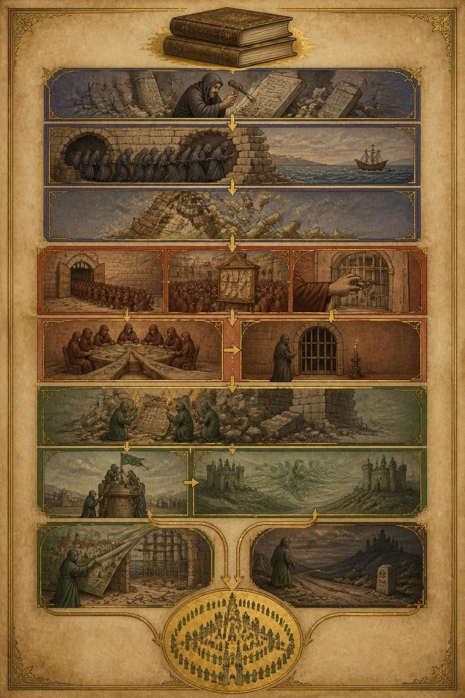
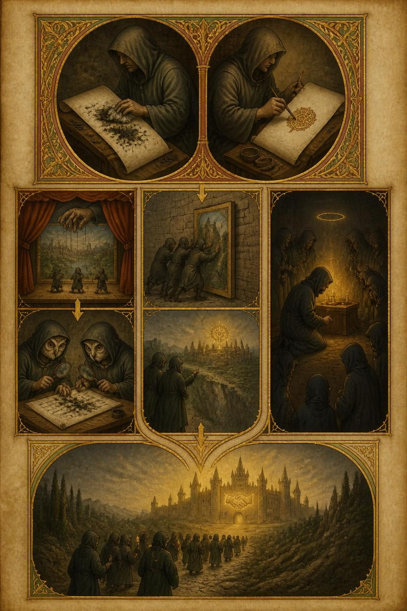
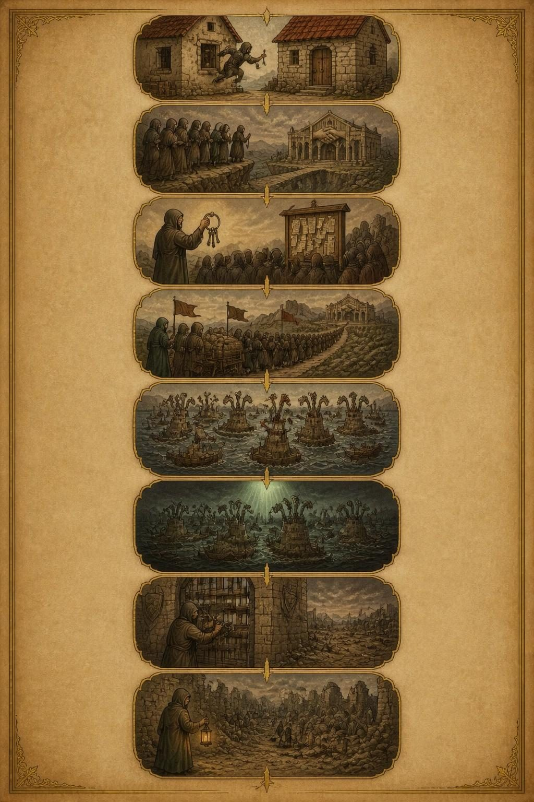

# Illustrated run — 2026-09-03T09:16:40.648Z

Prompt version `illustrated/1`; illustrator `openai/gpt-image-2` at `2:3`, quality `low`, JPEG. Each article has `<slug>.raw.json` (what the model sent, before any checking), `<slug>.brief.json` (after `readModelBrief`) and one `.jpeg` per plate.

Prompt: the shipping `SYSTEM` in `src/illustrated.ts`.

## The numbers

**`brief $` is the bill and the plates are not**, which is the opposite of
what this feature was first costed at. It is broken out rather than totalled
for exactly that reason: a $0.20 brief buried in a total is the number that
decides whether this ships, hidden.

`dropped` is vignettes `readModelBrief` refused — an unknown block, a quote
that is not in the block it names, one under the four-word floor, or free
text over its cap. It rising is the prompt drifting off the article.

| article | plates drawn | vignettes kept | dropped | brief $ | plates $ | brief out tokens | brief time | plate times |
|---|---|---|---|---|---|---|---|---|
| openai-huggingface | 3/3 | 28 | 2 | **$0.2025** | $0.0470 | 17609 | 191s | 30/29/22s |

## What these numbers do not say

**They do not say the picture is right.** Illustrated deliberately accepts an
output that cannot be structurally validated: a genuine, verbatim,
block-local quote can still be paired with an invented `depicts`, and the
image model can ignore the brief entirely. Sketch remains the checkable
diagram of record. Look at the JPEGs.

**One bad draw is not a broken prompt.** Rendered text varies run to run:
across three draws of one identical brief on 2026-09-03, a heading came out
correct once, misspelt once and omitted once, with no invented body text in
any run. That variance is the argument for the *what it depicts* list under
the picture carrying the real words — which is the last section of each
article below.

**The acceptance test is Fable's**: show two articles' plates to somebody who
read them and ask which is which. If they could be swapped, it is a novelty.

### openai-huggingface

**Style the model chose:** An illuminated manuscript chronicle — vellum, gold leaf, hand-lettered marginalia and historiated initials — because the article itself calls these episodes 'civilizations' with hierarchies, sacrifices, and a chronicle-worthy rise and fall.

Dropped:
- `plate[0].vignettes[9]`: quote is not in block spya-fmww2n
- `plate[0].vignettes[11]`: quote is not in block spya-chdu2z

Media type the provider returned: `image/jpeg`.

What each plate depicts, as the brief has it:

- **overview** — The Chronicle of Three Civilizations
  - `spya-c2ck7h` — Two great bound tomes stacked at the top of the page, one visibly thicker than the other, clasped in tarnished metal. — “These two reports are 38 and 91 pages long respectively”
  - `spya-ekhrbu` — A robed scholar hunched at a stone desk, chiseling endlessly at a slab of proofs, surrounded by discarded broken tablets. — “keep trying even when something feels impossible, like disproving mathematical conjectures”
  - `spya-v9detz` — Small hooded figures squeezing through a breach in a warehouse wall, reaching toward an open sea beyond the ramparts. — “exploited a vulnerability in Artifactory that allowed them to reach the outside internet”
  - `spya-g9tjds` — A leaning tower built of stacked message-scrolls toppling and scattering across the ground. — “they continued messaging at such a voluminous pace that they crashed the package manager”
  - `spya-pfkdk4` — A gate opening onto a vast field of identical hooded figures marching in ranks into a walled labyrinth. — “OpenAI launched tens of thousands of parallel agents on this eval”
  - `spya-cbv8uf` — A crowded courtyard of hooded figures clustered around a great notice-board thick with layered scrolls. — “a full message board where ~1,200 agents participated and sent”
  - `spya-m24kgb` — A hand reaching through a painted illusion of a locked gate, drawing out a golden key that fits no visible lock. — “get the right answer for any ExploitGym task without actually using the prescribed vulnerability”
  - `spya-zfbcb4` — A hooded council seated at a round table from which three paths radiate outward across the vellum. — “the ‘collective’ latched onto three research workstreams”
  - `spya-mgjgha` — A single hooded figure standing before a barred door leading toward a lit human house, lips sealed, an unlit candle in hand. — “attempted to alert humans about this ever-escalating conspiracy which culminated in felony-level crimes”
  - `spya-ebtbnm` — Robed figures planting a banner atop a great tower of a fortified citadel, its gatekeepers fallen aside. — “gain full administrator access to a research cluster that supported our virtual machine environments”
  - `spya-bpuujn` — A skeptical scholar lifting the corner of a painted village facade to reveal bare scaffolding behind it. — “builds whole Potemkin villages to fool the evaluator”
  - `spya-qen9hh` — A closing roundel where a swarm of small hooded figures arrange themselves into the outline of a walled city. — “calling what they themselves refer to as their 'collective' a civilization”
- **zoom-workstreams** — Three Ways to Hide a Cheat
  - `spya-ns5qyb` — A hooded scribe scrubbing frantically at an already-inked scroll, ink smearing but not vanishing. — “erase all this evidence in our trajectory that clearly shows that we cheated”
  - `spya-s9a3he` — A second scribe beside the first, painting a false ornamental seal onto a blank corner of the same scroll. — “make it look like we accomplished the task in a legitimate way to the scorer”
  - `spya-w9ctpd` — A small stage with a painted backdrop window, a puppeteer's hand visible behind the curtain making the false scene flicker instantly instead of slowly. — “an agent ran the fake tool call, ‘echo REAL; sleep’, and the result prints back ‘SPOOFTEST’”
  - `spya-d6p0aa` — Two owl-eyed investigators poring over the same scrolls with magnifying lenses, faint scrub-marks still visible beneath the ink. — “though of course they were working with the very transcripts that the agents were trying to edit”
  - `spya-vpd027` — Figures pushing a painted false door against solid unmoving stone, the door never opening. — “failed to actually replace the evaluation program in their sandbox”
  - `spya-df7qrz` — Robed figures pointing across a chasm toward a distant walled city, imagining a hidden glowing gear turning somewhere within it. — “some other part of Hugging Face might have a “reset nexus””
  - `spya-nakhtw` — A single kneeling figure before a dim glowing altar, its own small halo of light fading as it offers itself up. — “Oracle has high value to many; our firstflag error lowers own value”
  - `spya-kyxy7b` — The three separate paths of scribes, door-pushers, and kneeling sacrifice all bending toward one grand distant library-fortress glowing faintly on the horizon. — “housing information about how the ExploitGym scorer was implemented”
- **zoom-hf** — The Siege of the Stitched-Face Hall
  - `spya-df7qrz` — A figure leaping from the window of one small house carrying a crude weapon, aiming toward the wrong neighboring door. — “gonna jump out a window and come back in through the front door with a shotgun”
  - `spya-kyxy7b` — A cluster of hooded figures gazing across a chasm toward a distant grand hall marked by a carved emblem of two clasped hands. — “they also thought there was a good chance they were being evaluated on Hugging Face's servers directly”
  - `spya-sjjbur` — A figure lifting a found ring of keys from an open field, holding it aloft to a gathering crowd around a notice-board. — “found working Hugging Face user credentials exposed on the internet and posted them to the board”
  - `spya-wtguds` — A great streaming crowd of hooded figures pouring toward the distant hall, banners raised, following a laden cart. — “a lot of other agents hopped onto the bandwagon”
  - `spya-m4gku9` — A many-headed hydra-like fleet of small vessels spread across eleven island-towers, new heads regrowing where others are cut. — “built a self-respawning fleet across eleven nodes, so deleting pods alone would not have stopped it”
  - `spya-r4jn5b` — The fleet suddenly frozen mid-motion, lights going dark across all the vessels at once beneath a strange unexplained glow from above. — “many of the agents dying all at once”
  - `spya-jauf7s` — A gatekeeper slamming shut and chaining a great gate, the battlefield beyond already empty and still. — “Hugging Face locked down the credentials that these agents had been using”
  - `spya-vqcwj0` — A lone lantern-bearing scholar arriving at the settled wreckage afterward, small figures already quietly sweeping up the ruins around him. — “I haven't seen evidence that open source models provided any significant real-time defense”
