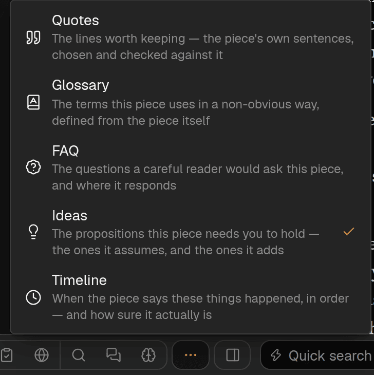

The buttons in the bottom bar are the modes. Each shows the same article a different way, in a panel
beside the text; the text itself never changes. You do not need most of them for most pieces — pick
by the question you have.

Five of them are not in the bar itself but under its **More** button: Quotes, Glossary, FAQ, Ideas
and Timeline. Press **More** and pick one from the list. While one of those is open it has a button
of its own in the bar, so you can see where you are, and pressing that button closes it.

{{modes-table}}

The ones marked experimental appear only once you turn on [experimental
features](/help/experimental-features).

 says what it does and how this panel was made, and ends with a link to its page in Help.")
