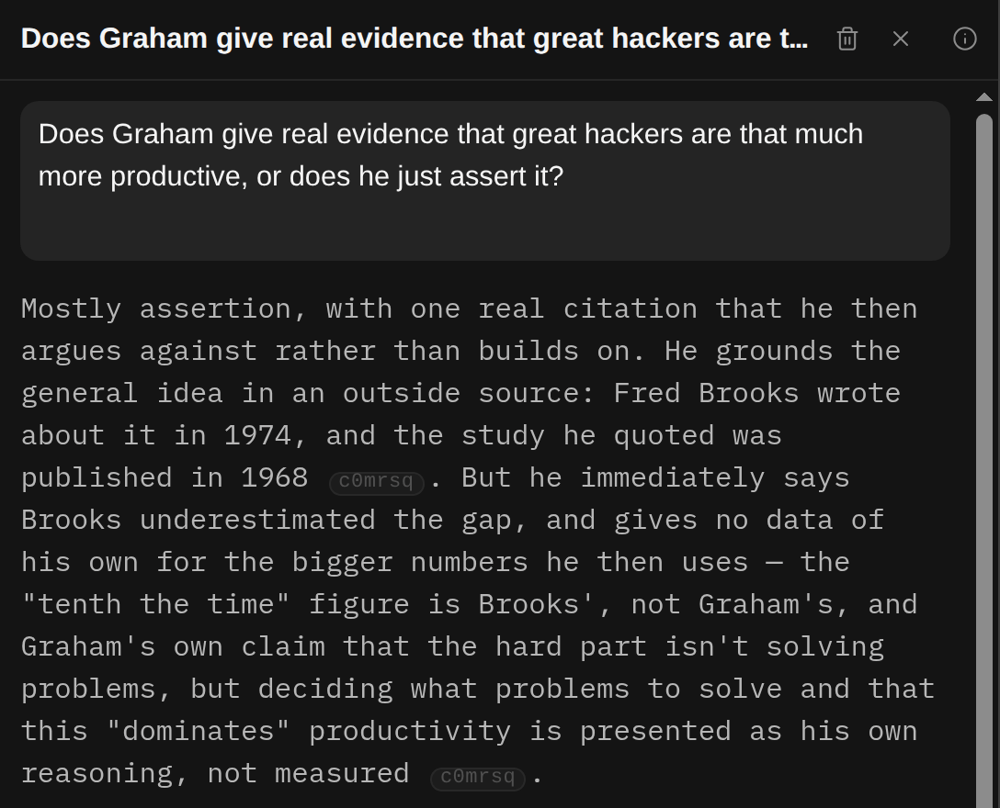

## In short

Chat is for the questions the article raises in your own head: what a sentence means, whether a
claim really follows, how two parts fit together. You ask in your own words, and every answer points
back to the paragraphs it came from, so you can check it against the text rather than take it on
trust.

## When to use it

When you have a question of your own: what a sentence means, whether a claim follows, how two
passages fit together. It is the wrong tool for “summarise this” — Summary and Structure already do
that, and Chat has no summarising tool on purpose.

Quicker ways in than the Chat button:

- **The speech-bubble in a paragraph’s margin** opens a chat about just that paragraph. Nothing is
  asked until you send.
- **The ? in a paragraph’s margin** asks “Help me understand” straight away.
- **Select some words**: they are highlighted, and the box that opens has an **Ask the AI about
  this…** field.

Chat is only for whoever added the article; on someone else’s shared article its button is dimmed.

## Reading it

The short codes in an answer are links to the paragraphs it relied on. Click one to jump there, or
point at it to read the start first. A dimmed code is a paragraph the article no longer has. Check
the passage before you trust the claim — that is what the codes are for.

The lines above an answer say where else Chat looked:

- **searched the web**: the pages it used are listed under the answer as **From the web**.
- **searched your library for …**: it searched your other saved articles. This matches words, not
  meaning, so if it finds nothing, try other words before you conclude you never read about it.
- **read** and a site name: it fetched that page.

An answer with none of these came from the article alone. Chat decides when it needs them.

Each article keeps its own list of conversations; **‹ Chats**, at the top left of a conversation,
takes you back to it. That list holds every
conversation you have had about the article, not only the ones started in Chat. A row from somewhere
else has a small icon in front of it: point at it, or tap it, to see where it came from, for example
a claim in Sources, a passage, or Learn. Pressing a Learn row takes you to Learn, where that
conversation lives; it cannot be renamed or deleted from Chat. When the list has conversations from
more than one place, the buttons above it (**All**, **Chats** and one for each other place) narrow
it.

<kbd>Enter</kbd> sends and <kbd>Shift Enter</kbd> starts a new line; <kbd>Esc</kbd> stops an answer
still arriving. **Answer again** gets a fresh answer, and the pencil lets you rewrite your question.
The bin beside the pencil deletes that question, its answer and everything after it: press it, then
press it again to confirm. The first question has no bin; to delete it, delete the conversation.
When a conversation is longer than the panel, the arrows under it step to the previous or next
message, or back to the first, and **Latest** jumps to the end. The (i) in the corner of a
conversation says which AI model answered it, and how hard it was asked to think.

**Buttons in an answer.** Chat can offer a button when you ask it to bookmark a passage, add or
remove a tag, look a term up in the glossary, or show where the article first says something.
Nothing happens until you press the button; Chat cannot do any of these itself.

**The guide.** The **Guide** row pinned at the top of the list is a conversation about how to read
this article with Spideryarn, rather than about what it says. A new article opens on it when there
is room beside the text, with a greeting that is ours and costs nothing; nothing is asked of the AI
until you send something. The guide can do one thing per answer by itself, if it only moves you:
take you to a passage, or open a mode that has nothing to write, such as Structure or Learn, or the
Glossary or Summary's Brief or Fuller once they have already been written for this article. It
says so when it does, and **Back** undoes it. Anything that costs money or changes your things, such
as a search, a mode that has to be written first, a tag or a bookmark, is still a button you press. Its
greeting asks why you are reading the piece: answer in the box below as you would any message. When
you say why, or something about yourself, the guide offers to save it, as close to your own words
as it can, under its answer: **Save as why you're reading** or **Save to About you**. Nothing is
saved until you press, and **Undo** puts it back. You can talk to the
guide out loud with **Live**, as in any chat, and type **Guide** in the command bar to get back to it.

**Talking instead of typing.** The microphone turns your speech into text in the box, to edit before
you send. It is worth trying even if you type quickly: most people say more out loud than they would
type, and the more you say about what you want, the better the answer can fit it. A recording stops
after fifteen minutes, and says so a minute before. Press Stop twice quickly and the box finishes its
action once the words arrive: it sends here, in Feedback, in a comment follow-up and in a quiz answer;
it saves when you annotate a passage; and in the command bar it presses Enter. **Live**, beside it,
is a spoken conversation you can interrupt. Your audio goes
directly to OpenAI. What is said joins the same conversation, so you can hang up, type for a while,
and press **Live** again. A call ends after five minutes of quiet, or twenty minutes in all.
