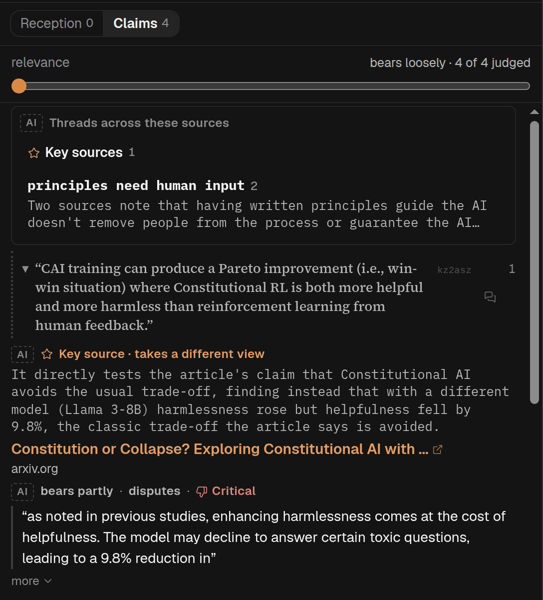

## In short

A piece is rarely the last word. Debate searches the open web for what others have said about it —
replies, critiques, follow-ups — so you can read it alongside the responses it finds. Every result
links to its source so you can check it, and when the search finds no reception, which is often, it
says so plainly.

## When to use it

For a well-known paper, a contested essay, or anything you are about to rely on; not for a blog post
nobody has linked to. It waits for you to press **Search the web**, and takes about a minute. Many
pieces turn out to have no reception at all, and it says so — a real answer, not a failure. Only
whoever added the article can run the search; visitors to a shared article see what has already been
found.

## Reading it

- Two views. **Reception** is what others have written about this piece itself: replies, reviews,
  and work that cites it and says something about it. **Claims** lists the claims the piece rests
  on that someone outside could argue with. The number on Reception is how many sources it is
  showing; on Claims, how many claims are listed.
- **Search the web** searches for Reception only. It used to pick three or four of the piece's
  claims by itself and search those too; it no longer does. A search made before that change still
  shows the claims it chose, under **Claims the earlier search chose**.
- Opening **Claims** makes the list the first time, with one AI call over the piece and no web
  search; a link or Back to Claims only shows **List its claims**. Each claim is quoted in the
  piece's own words, with a link to that passage, and under it a short line in the AI's words. If
  the piece changes afterwards, the list is shown with **List again**. Choosing claims to check on
  the web is coming. Visitors to a shared article see the list but cannot make one.
- In Reception, pages that link to the piece or quote it come first. Pages that only mention its
  title follow under **Names this piece by its title only**: often a paper citing it, sometimes a
  page about something else with the same title, so check before you rely on one.
- **Cited by**, at the end of Reception, lists the papers that cite the piece, most cited first. It
  is free and is there before you search: it comes from OpenAlex, a public index of published work,
  which we ask using the piece’s DOI, and no AI is involved. It is a list only: we have not read
  what any of those papers says about the piece. It needs the piece to have a DOI on record, and
  only whoever added the article sees it. **Search Google Scholar**, under it, opens a search for
  the piece’s title.
- Under **Claims the earlier search chose**, each claim is quoted in the piece’s own words, with a
  link to that passage and the sources on it underneath. Press a claim to fold its sources away. The **relevance** slider hides
  sources the AI judged to bear on their claim only loosely or partly.
- To look into one claim yourself, press the chat icon beside it. It opens a new conversation
  in [Chat](/help/mode-chat) and sends a question with the claim quoted. Once you have asked, a line
  under the claim shows how the chat’s latest answer begins; press it to open that conversation
  again beside Debate. If a later search words the claim differently the line goes, and the
  conversation is still in Chat’s list, marked with Debate’s icon. Only whoever added the article
  has this.
- To look at the debate from an angle of your own, such as how the piece relates to another paper,
  type it in the box at the top and press **Ask in chat**. It does not change the search results
  shown here: it opens a new conversation in [Chat](/help/mode-chat) and sends a question that asks
  for a web search from that angle. You can do this before searching at all. **Your angles**, under
  the box, lists the conversations you started this way once you send their first question; press
  one to open it again beside Debate. Only whoever added the article has this.
- Anything tagged **AI** is the AI’s reading, checked against nothing: the threads across sources,
  the key-source picks (starred), each page’s lean (Supportive, Critical, Neither for nor against,
  Could not tell) and its relevance. Quoted excerpts, by contrast, are checked against what the
  search returned.
- **Threads across these sources**, at the top, are themes several sources share. Press one to show
  only its sources.
- Reception can be ordered **as found**, by **date** or by **stance** (most critical first).
