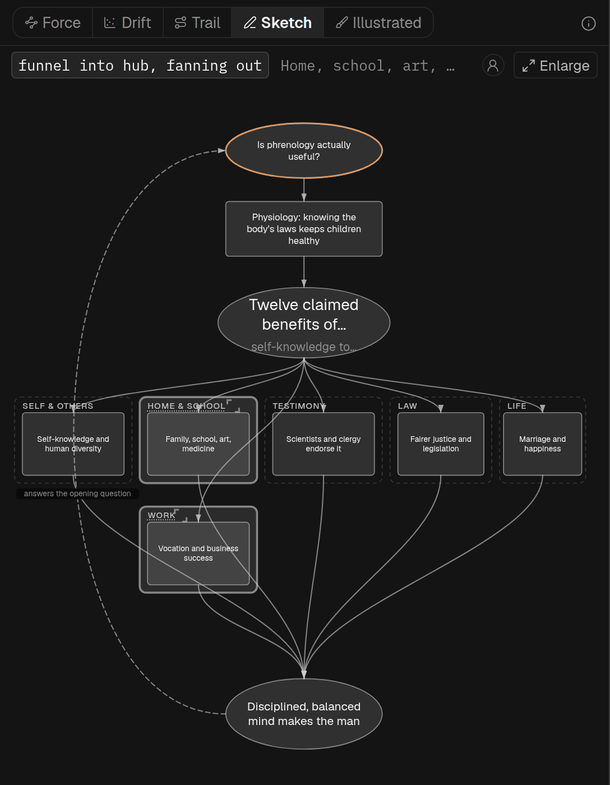
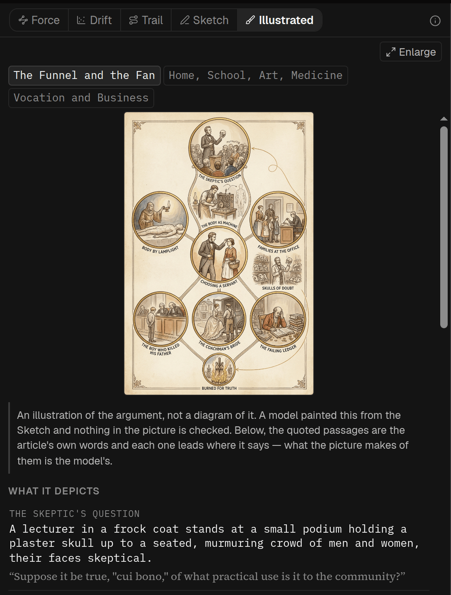

## In short

Some arguments are easier to follow once you can see their shape: three reasons meeting at one
conclusion, a ladder of steps, a main line with side trips. The Sketch is a model reading the
argument and drawing it as a picture, running mostly down the page in the article’s order; a box can
take you to the passage it came from. Use it to see where a long piece is heading before you start,
or to find your place in it.

## When to use it

The **Sketch** is worth the wait for a long or tangled argument, where seeing its shape at once —
three reasons meeting at a conclusion, a ladder of steps, a main line with side trips — tells you
how to read the rest. For a short piece with one line of argument, skip it. On someone else’s shared
article you see a Sketch only if one has already been drawn.

## Reading it

The Sketch mostly runs down the page in the article’s order, and nothing in it is to scale. Point at
a box to read more; click one to jump to its passage, though not every box has one. Click a region’s
name to zoom into that part, and use **Back** or <kbd>Esc</kbd> to come out. **Enlarge** opens it
full screen.

The chips above the picture give other views:

- **Force**, **Drift** and **Trail** are diagrams assembled by code rather than pictures painted by
  a generative model. They do use an embedding model to judge semantic likeness: its dotted links
  are one of Force’s five relationships, and it supplies the positions for Drift and Trail. Force
  shows sections as bubbles that pull together when they talk about the same things. Drift puts one
  dot per paragraph down the page, placed sideways by subject. Trail joins Drift’s dots in reading
  order, which shows whether the piece moves forward or circles back — the one picture where lower
  down does not mean later.
- **Illustrated** is the Sketch painted as a picture. It takes four to seven minutes and needs a
  Sketch first. It is an interpretation: nothing in the painting can be clicked or checked, though
  **What it depicts**, under it, quotes the article and links to the passages. Treat the Sketch as
  the one to trust.

