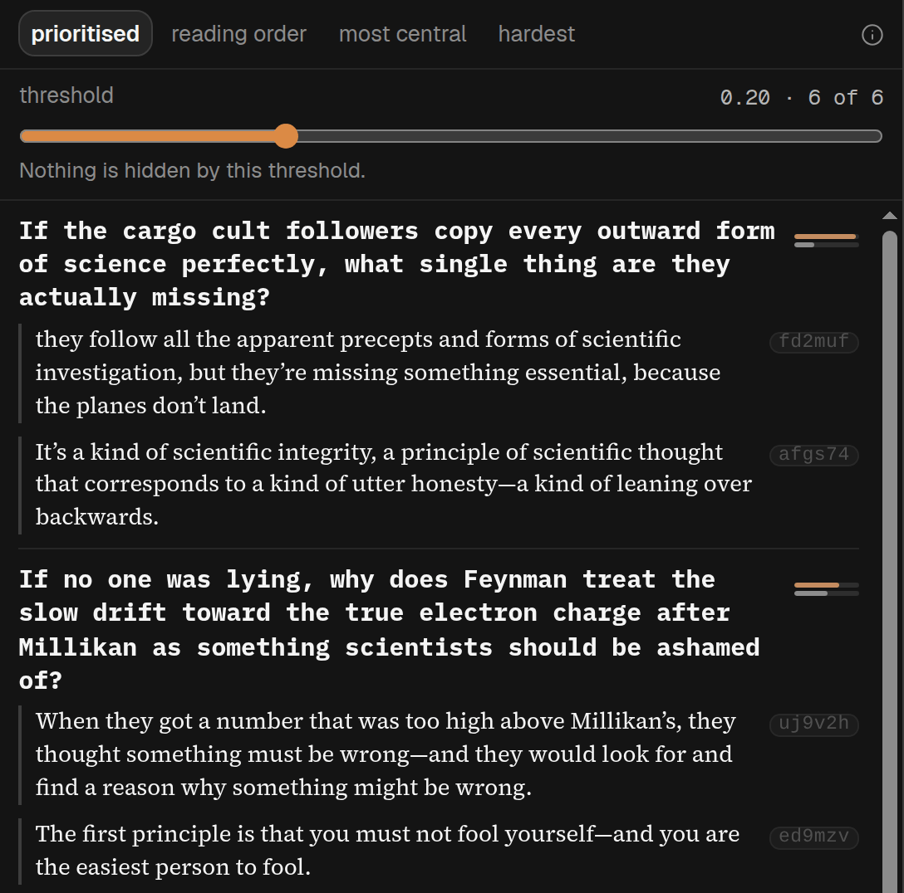

## In short

A careful reader asks questions as they go: why this, what about that objection, how does this part
bear on that one? FAQ lists the questions a careful reader would ask this piece, broadest first, and
points each one to the passages the AI thinks are the piece’s response. It writes no answers of its
own: what you read under a question is cut from the piece.

## When to use it

On a dense piece, to find the objections it anticipates and how one part bears on another, or after
a first read, to check you saw what it was answering. Expect to read rather than to be told. Only
whoever added the article can make the list; visitors to a shared article see one already made.

## Reading it

- The quoted passages are the article’s own words, checked against it. Which passage answers which
  question is the AI’s reading.
- In **prioritised**, the default, the slider decides how many questions show.
- Press a passage to jump to it in the text.
- There are at most twelve questions, and “The model found no questions worth asking this piece” is
  a real answer.
