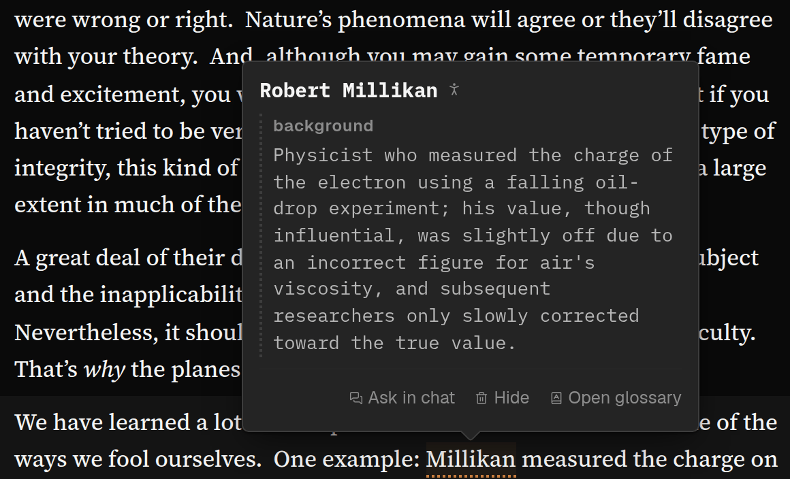
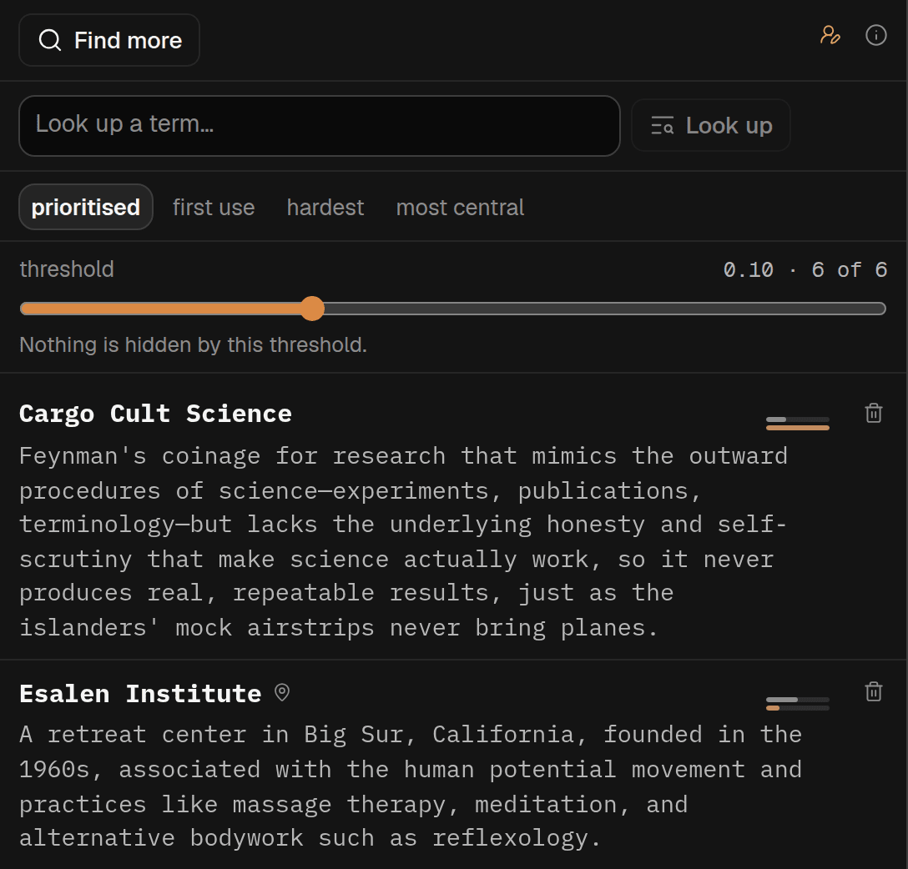

## In short

Every field has words it uses in its own way, and a piece that leans on one you do not know can stop
making sense without telling you why. Glossary lists the terms this piece uses in a non-obvious way
and keeps what the piece tells you about them separate from background supplied by the AI. Once
made, the terms are underlined in the text in every mode, so an explanation is a moment away while
you read.

## When to use it

Early in a piece from an unfamiliar field, or one where the author gives everyday words a narrower
meaning. After that you rarely need the panel, because the terms are **underlined with orange dots
in every mode**. If the piece is in your own field, skip it.

If a word you need is missing, type it into **Look up a term…**: that explains the passage it is in,
and adds it to your list, marked as added by you. **Find more**, at the top of the panel, looks for
quieter terms and adds them to your list. If a new run cannot safely add to this list — because the
article or your profile has changed, or because this version of Spideryarn cannot add to the saved
list — it says **Write a new list** instead. That run replaces the list rather than adding to it.
**Ask in chat** on an entry, or on a term’s card in the text, starts a conversation about it. On
someone else’s shared article you see the glossary already made, but cannot add to it.

## Reading it

Clicking an underlined word does nothing: point at it for the card, and use the card’s **Open
glossary** button for the full entry. On a touchscreen, tap once for the card and again for the
entry. Press <kbd>G</kbd> in a paragraph to jump to its terms.

In an entry:

- **in this piece** comes from the article. **background** is what the AI knows about the term,
  checked against nothing, so give it less weight.
- **used in N places** links to each place the term appears.
- The icon says what kind of thing the term is: a person, place, organisation, event, or a work such
  as a book or paper. Ideas and ordinary terms have none.
- **Ask in chat** opens a new conversation in [Chat](/help/mode-chat) and asks a question about the
  term straight away, with the term quoted. Chat can search the web to answer, and you can go back
  and forth. An answer from the web kept on an entry from before (once made by a button called
  **Dig deeper**, which has gone) is still shown there. Once you have asked, a line under the button shows how the chat’s latest answer begins; press it
  to open that conversation again beside the Glossary. The conversation is also in Chat’s list,
  marked with the Glossary’s icon. Only whoever added the article has this.

The list opens on **prioritised**: only the terms that are hard and carry the argument, in the order
the article introduces them. The **threshold** slider sets how many: left for more, right for fewer.
The two small bars on a row are how hard the term is and how much of the argument rests on it, both
the AI’s judgement. Choose **first use** to see every term.
