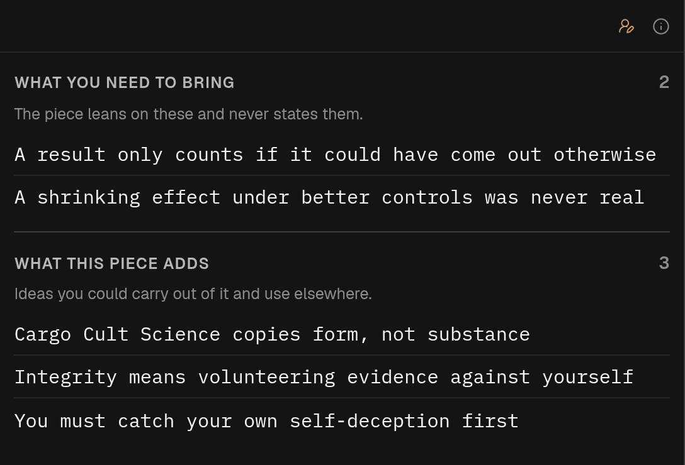

## In short

Hard pieces are often hard because they take things for granted. Ideas lists the propositions this
piece needs you to hold, in the AI’s reading: **what you need to bring**, the ones it thinks the
piece assumes without stating, and **what this piece adds**, the ones it thinks are worth taking
away. Each idea links to the passages that led to it.

## When to use it

Before a hard piece, to see what it expects you to know: **What you need to bring** lists the ideas
it leans on and never states, and one that is new to you explains why a passage felt opaque. After
reading, **What this piece adds** is a short list of the ideas worth taking away. Less useful for
news or narrative, which rarely assume much.

## Reading it

Click an idea to open it and mark all its passages in the text; the arrows step through them. Click
it again to clear the marks.

The heading over the passages matters. For an idea you need to bring it says **The model thinks
these passages rely on it** — the AI’s reading, which the article never states. For an idea the
piece adds it says **Where the piece states it**. **One way to picture it** is the AI’s own
comparison, not the author’s.

**Ask in chat** on an open idea starts a conversation in [Chat](/help/mode-chat) about whether it
holds up and what the piece rests on it for. The idea then shows how many questions you have asked
and how the latest answer begins; click that to reopen the conversation beside Ideas. In the
conversation, **Back to** at the top returns you to the idea.

Your [reader profile](/help/reader-profile) shapes what counts as something you need to bring.
