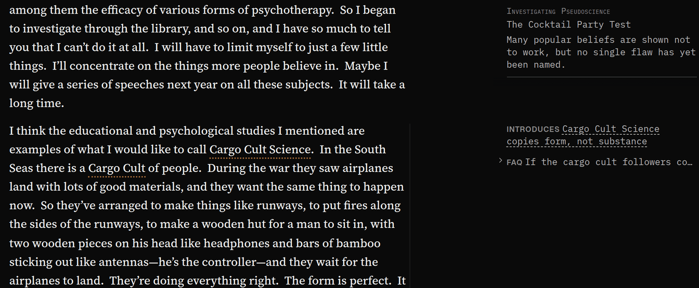

## When to use it

While you read, as a quiet companion. Unlike the other modes it is a switch rather than a choice:
the **Marginalia** button sits at the right-hand end of the modes in the bottom bar, and its column
can stay open beside any other mode’s panel. It is sparse on purpose — one question per part, and a
mark where an idea occurs. In a narrow window it tells you so, and if another mode’s panel is open,
pressing **Marginalia** again swaps the notes in for it.

## Reading it

- **A question with a thin line beside it** is the question that part of the article answers; read
  on to find the answer. There is one for each part, beside its first paragraph.
- **“assumes …”** marks an idea the piece takes for granted; **“introduces …”** one it puts forward
  and argues for. Each sits beside the first passage where the idea occurs; point at it or tap it to
  read the idea in full. These appear only once [Ideas](/help/mode-ideas) has been made.
- **Other modes’ lines**, shut by default: saved FAQ questions, dated Timeline events, Debate
  claims and cited works can appear beside their passages, as can your comments. A line shows one
  item or a count; press it to open it.
- The top of the column shows where you are, and where the argument has got to.
