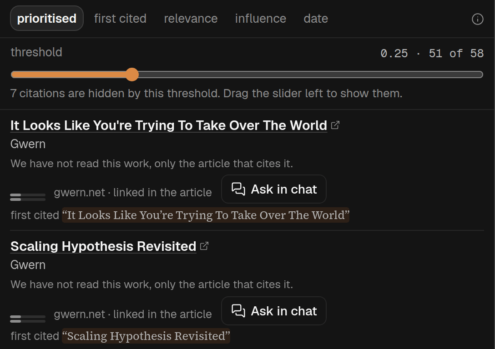

## In short

A piece sits among other people’s work: the works it builds on, and what others have said about it
since. Peer review shows both. **Bibliography** lists what this piece cites, with a link for each;
**Reception** is what others say about the piece itself; and **Claims** lists the claims it rests on,
so you can check what others say about each one. Every source links out, so you can check it rather
than take our word for it.

## When to use it

For an academic paper or a report, where the questions are “what is this built on, and where do I
find it?” and “what have others made of it?”. Three buttons at the top choose the view; the number
on each is how much it has to show. Each view is made the first time you choose it, and kept.
Reception’s is a search of the open web: it takes about a minute, and often finds nothing, which it
says plainly, because many pieces have no reception at all. A link or Back to a view never starts
anything; it shows a button instead, such as **Search the web**. Only whoever added the article can
make these; visitors to a shared article see what has already been made.

Peer review used to be two modes, Citations and Debate. Old links to either still open the right
view. If you have been asked to review a paper yourself, [Referee](/help/mode-referee) is the mode
for that.

## Reading it

**Bibliography**

- Each row says what we have read of the work, which is usually nothing: the sentence on what the
  piece uses it for is written from the article, not from the cited work.
- Two small bars: **relevance** to this piece, and **influence** in its field. Influence is the
  model’s memory of the work, not a citation count. New lists give a number only when the model is
  confident it knows the work; a low number then means a work it knows and thinks minor. If
  relevance was scored but influence has no usable score, the row says *influence unknown*. Older
  lists keep their numbers, including low scores that could mean the model did not know the work,
  until regenerated from Metadata.
- A row’s influence bar marked *from the web* was read from a web page about the work by an
  earlier web search on that row; point at those words, or tap them, to see the site, the day and
  the page’s own words. It is an AI estimate from web evidence, not a citation count, and the page’s
  words may be about something else on that page.
- Some rows also say something like *cited 357 times · Crossref*. That one is a real count, not the
  model’s view: Crossref is the registry that issues most DOIs, and where the article gives a DOI
  that Crossref holds, this is its own number for the work. Point at the words, or tap them, for the
  day we read it; it is not refreshed after that. Crossref only counts citations from works whose
  publishers have sent it their reference lists, so the number is usually lower than Google
  Scholar’s, and it should not be compared across fields or between an old work and a new one. *no
  citations recorded* means Crossref has none on file, not that nobody has cited the work. Most rows
  have no count, because most works are cited without a DOI. It sits beside influence and does not
  change the order or what the slider hides.
- **Ask in chat** opens a new conversation in [Chat](/help/mode-chat) and asks a question about
  the work straight away, with the work named. Chat can search the web and your library to answer,
  and you can go back and forth. It is on the row, and on the card you get by pointing at a
  citation in the text. A longer reading kept on a row from before (once made by a button called
  **Dig deeper**, which has gone) is still shown there. Once you have asked, a line under the row
  shows how the chat’s latest answer begins; press it to open that conversation again beside
  Bibliography. The conversation is also in Chat’s list, marked with Peer review’s icon. Only
  whoever added the article has this.
- **first cited** jumps to where the article first cites it. *only in the references* means the
  article lists it but never cites it in the text.
- **In your library** or **On the public shelf** means the work is already an article here, and
  links straight to it.
- Once the list exists, the places a work is cited are underlined with a dashed line in the text, in
  every mode. Point at one, or tap it, to see the work.
- Orders: **prioritised** (the default, with a slider), **first cited**, **relevance** and
  **influence**. The slider hides the works that score lowest on relevance and influence together,
  relevance counting double; a work whose influence is unknown is judged on its relevance alone
  when available. Ordered by influence, the unknown ones come last, the most relevant first.

**Reception**

- What others have written about this piece itself: replies, reviews, and work that cites it and
  says something about it. Pages that link to the piece or quote it come first. Pages that only
  mention its title follow under **Names this piece by its title only**: often a paper citing it,
  sometimes a page about something else with the same title, so check before you rely on one.
- **Cited by**, at the end, lists the papers that cite the piece, most cited first. It is free and
  is there before you search: it comes from OpenAlex, a public index of published work, which we
  ask using the piece’s DOI, and no AI is involved. It is a list only: we have not read what any of
  those papers says about the piece. It needs the piece to have a DOI on record, and only whoever
  added the article sees it. **Search Google Scholar**, under it, opens a search for the piece’s
  title.
- To look at the piece from an angle of your own, such as how it relates to another paper, type it
  in the box at the top and press **Ask in chat**. It does not change the results shown here: it
  opens a new conversation in [Chat](/help/mode-chat) and sends a question that asks for a web
  search from that angle. You can do this before searching at all. **Your angles**, under the box,
  lists the conversations you started this way once you send their first question; press one to
  open it again. Only whoever added the article has this.
- **Threads across these sources**, at the top, are themes several sources share. Press one to show
  only its sources. Reception can be ordered **as found**, by **date** or by **stance** (most
  critical first).

**Claims**

- Opening **Claims** makes the list the first time, with one AI call over the piece and no web
  search; a link or Back to Claims only shows **List its claims**. Each claim is quoted in the
  piece’s own words, with a link to that passage, and under it a short line in the AI’s words. If
  the piece changes afterwards, the list is shown with **List again**. The number on Claims is how
  many claims are listed, or, once you have checked some, how many sources the checks found.
- To check claims on the web, tick up to four in the list, or type one of your own in **Check a
  claim of your own**, and press **Check**. That is one web search over all of them together, takes
  about a minute and a half, and costs real money; nothing is searched until you press. The sources
  it finds appear under each claim, with your own claim after the list. **This search found nothing
  it could quote on this claim** is a real answer. If the search did not answer for a claim at all,
  it says so in different words, and you can check it again. **Dig further**, beside a claim that
  has been checked, runs one more search for that claim alone and looks for sources it has not
  found yet. One check runs at a time per article, and there is a limit on how many web searches you
  can ask for in an hour and in a day. Visitors see the list, not the checks or anything you typed.
- To look into one claim yourself, press the chat icon beside it. It opens a new conversation in
  [Chat](/help/mode-chat) and sends a question with the claim quoted. Once you have asked, a line
  under the claim shows how the chat’s latest answer begins; press it to open that conversation
  again. Only whoever added the article has this.
- A search made before 2026-10-08 also picked three or four claims by itself and searched those;
  it still shows them, under **Claims the earlier search chose**, each with the sources on it.
  Press a claim to fold its sources away. The **relevance** slider hides sources the AI judged to
  bear on their claim only loosely or partly.

Anything tagged **AI** is the AI’s reading, checked against nothing: the threads across sources, the
key-source picks (starred), each page’s lean (Supportive, Critical, Neither for nor against, Could
not tell) and its relevance. Quoted excerpts, by contrast, are checked against what the search
returned.
