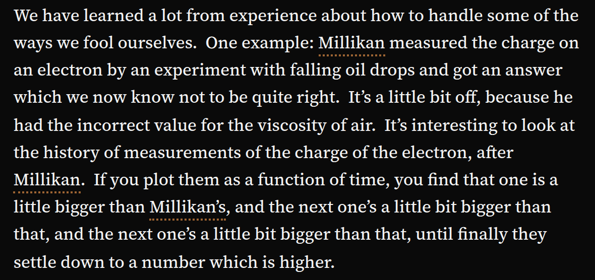

## In short

Plain is the article with no panel or column beside it. Every other mode is help you open when you
want it and close when you do not; Plain is where you come back to, and the way to read straight
through with nothing in the way.

## When to use it

For reading straight through. Open a mode when you hit something you want help with, then press
**Plain** to come back; it closes the Marginalia column too. Pressing the mode you are in a second
time also closes it. Plain is the first button in the bottom bar, in a box of its own, and on a
phone the only one that keeps its name, so you can always find your way out.

## Reading it

One thing carries over: once an article has a glossary, its terms stay underlined with orange dots
in Plain. Point at one to read its definition without opening anything.
