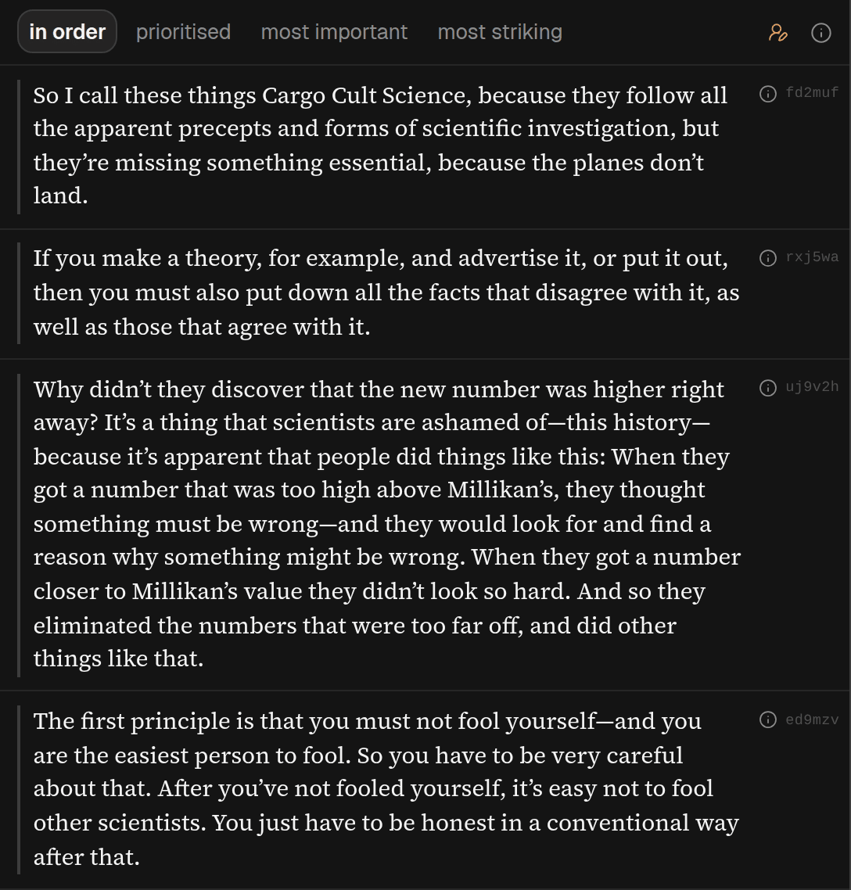

## In short

Quotes picks out the lines in the article most likely to be worth your attention — the sentences the
argument rests on, and the ones that are best put — and highlights them in the text in every mode,
like a highlighter pen. Every quote is cut straight out of the article, so the words are always the
article’s, never the AI’s. Use it to see at a glance where the key passages are, or to carry lines
away for notes.

## When to use it

When you want to carry lines out of the piece in its own words — for notes, a review, or to see
which passages are best put. Quotes is also what [Skim](/help/mode-skim) walks you through. **Find
more** adds lines to the list rather than replacing it.

## Reading it

- **Once made, quotes are highlighted in the text in every mode**, in purple, like a highlighter
  pen. A stronger highlight means the AI judged the line more important or more striking. Search
  results are outlined and quotes are filled in, so the two never look alike, and your own
  highlights are yellow, green, blue or pink. A purple strip down the left edge of the spine shows
  where the quotes are in the whole piece.
- Rest the pointer on a highlighted quote for a moment and a card says what a quote is, shows the
  scores the AI gave it (or says it was not scored) and, where there is one, the AI’s reason for
  choosing it. It also has <kbd>‹</kbd> <kbd>›</kbd> to the quote before or after it in the text
  and, outside Quotes, a button to open it there.
- The AI gives a quote up to two scores: how much of the argument rests on it, and how memorable and
  well put it is. Both are the AI’s judgement. A row shows every available score under
  **prioritised**, the relevant score under **most important** or **most striking** when it has one,
  and none under **in order**; the card on the quote in the text always shows what it has.
- The **(i)** beside a row says why it was chosen when the AI gave one, and always says who chose it
  and when. Press a row to jump to it in the text. <kbd>‹</kbd> <kbd>›</kbd> under the list, or
  <kbd>←</kbd> <kbd>→</kbd> while reading, step from quote to quote in the list’s order.
- **in order** (the default) lists them as the article says them; **prioritised** keeps only those
  above the slider and says how many it is hiding; **most important** and **most striking** sort by
  either score.

A line the AI suggested that cannot be found in the article is thrown away, and the panel tells you
how many were.
