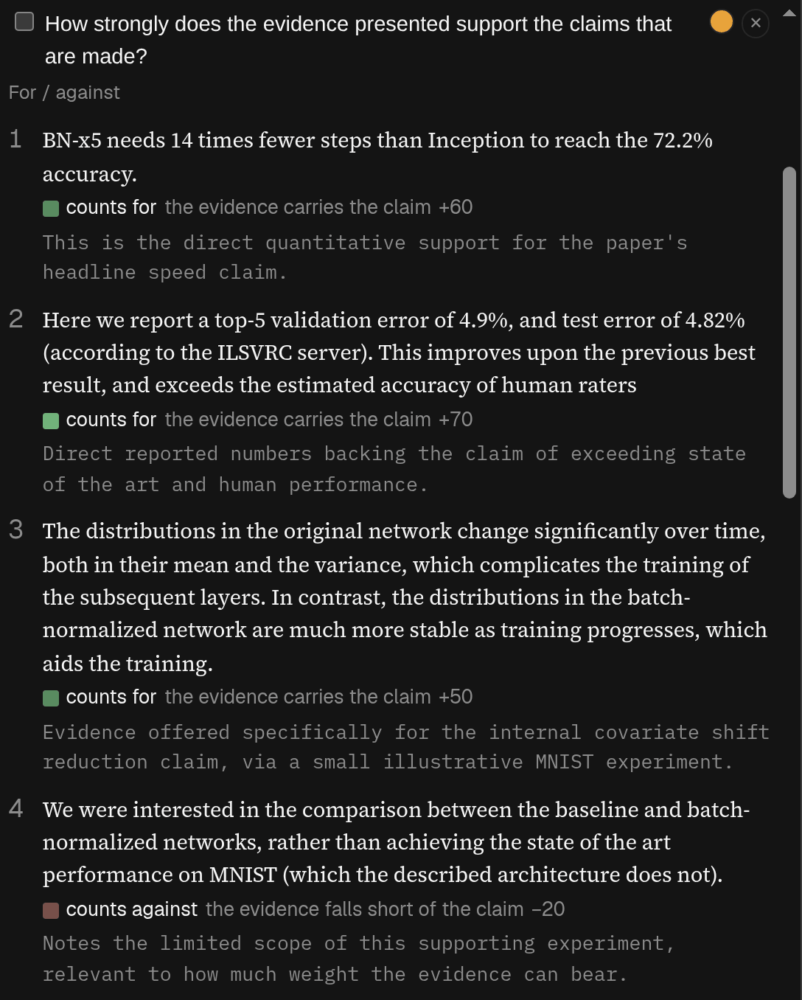

## When to use it

When you are reviewing a paper and want help being thorough without handing over the judgement. It
is built for public preprints, open-review submissions, and drafts the author has agreed to share.
**Do not put a manuscript you received in confidence through it**: many funders, publishers and
conferences count sending one to an AI service as a breach of confidentiality, and where a venue
does allow AI help it usually asks you to say so.

Five parts, chosen by the chips at the top:

- **Criteria**: write what you are judging against, or start from a preset such as **Controls** or
  **Strength of evidence**, then press **Run this criterion**.
- **Claims**: what the paper promises, each beside the passages meant to deliver it.
- **Mirror**: reads your own comments back and flags any an author would find hard to act on, or
  that you should check against the passage. It sees only your comments and the passages you marked.
  It is not saved, so leaving Mirror loses it.
- **Candidates**: the expertise a reviewer would need, then names if you ask. No
  conflict-of-interest check is run, and it may send words from the paper to a search engine.
- **Hidden text**: the check of the original web page for words a reader would not see but an AI
  would read. Its chip carries a mark when it found something. You can ask Opus what it makes of
  each thing found.

Referee is only for whoever added the article.

## Reading it

**Hidden text** checks the original web page for text a person would not see but an AI would read —
text the colour of its background, too small to read, invisible characters, instructions written to
a model. It reports and blocks nothing. “Nothing found” is not a clean bill: PDFs and some parts of
a page are not checked, and it says which. Each finding says in plain words what the trick is;
identical ones are listed once, with a count. A filled dot on the chip means something without an
everyday explanation was found, a ring that everything found has one — such as a page’s own menus.

When something was found, **Ask Opus about these** sends only the flagged bits — never the rest of
the article — to Opus, which says of each one whether it is probably harmless or worth a look, and
why. It is an opinion, not a filter: every row stays listed in the same order, and the chip’s mark
does not change. The hidden text may have been written to fool a model, so read the rows yourself
too. The answer is not saved: reloading the page forgets it, and asking again runs it again.

Colour means two different things:

- A **For / against** criterion colours each passage by which way it cuts: red towards “against”,
  green towards “for”, with a sign too — − against, + for, · neither, ± both.
- Every other mark’s colour says only which criterion or claim made it. It carries no judgement.

The number beside a criterion’s passage is the AI’s ordering of its own answers, not a score, and
nothing adds them up. “The model did not find a passage” tells you about the search, not the paper.
Fewer passages under a claim does not make it a weaker claim.

When you comment on a passage in Referee you can place it on a For / against criterion yourself, and
the panel shows your placement beside the AI’s and says when you disagree.
