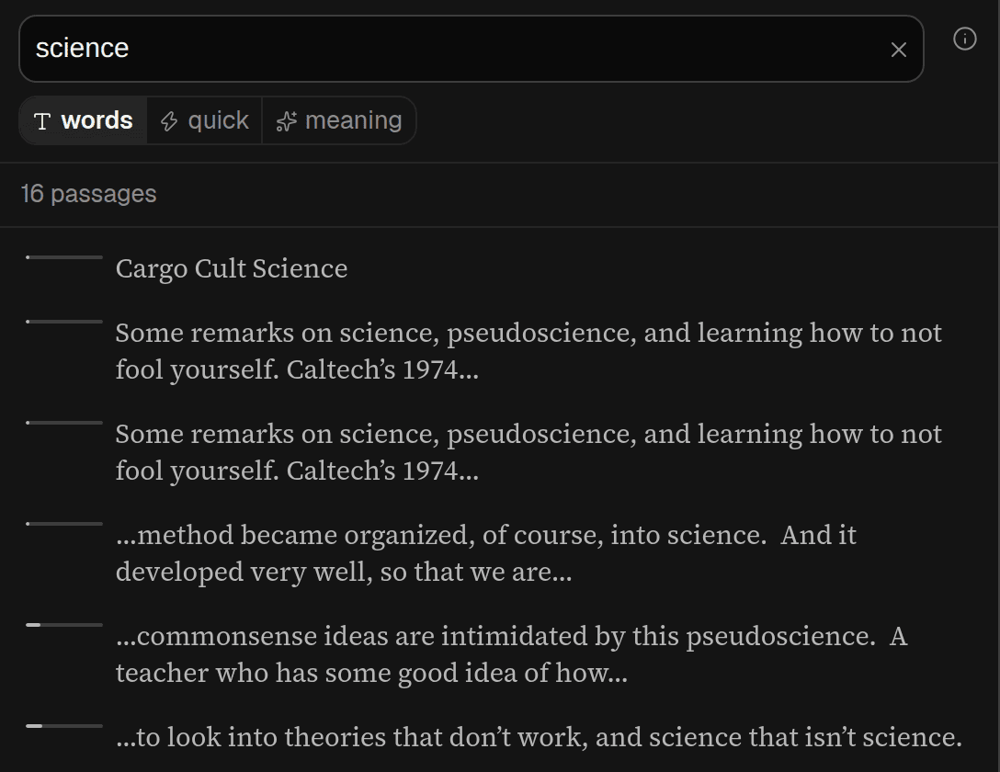

## In short

Search finds a passage when you remember roughly what it said but not where. Search by **words** for
an exact phrase, or by **meaning** to ask a question of the whole piece — “where does she concede a
weakness?” — and find passages the AI thinks answer it even when they use none of your words. The
matches are marked in the text, so you can see where a theme runs through the piece.

## When to use it

Use **words** when you remember a phrase. Use **meaning** to ask a question of the whole piece —
“where does he concede a weakness?”, “anywhere she gives numbers” — or to follow a theme through a
long article. Search opens on meaning, so switch to words for an exact look-up. Your browser’s own
Find works as usual.

**quick** asks the same kind of question and answers in about a second: a fast model scores every
paragraph, and the ones that match are marked whole, with no reasons. It searches whenever you pause
typing, and what you type keeps one saved search, updated as you go rather than a new one each time.
Press Enter when you are done; typing again after that, or after a break, starts a new one. Its
paragraphs are marked with a bar down the side and a mark in the spine, not a highlight over the
words. Use it for a first look; **thorough** on a quick search runs the full meaning search on the
same words, usually in about ten seconds, and replaces the quick one. You do not have to press it:
once you stop typing and the quick answer has settled for two seconds, the thorough search starts by
itself (at once if you pressed Enter). The quick search shows a spinner in place of its **thorough**
button while it runs. On success its results take the quick ones' place; if it fails, the quick
results stay.

To start a quick search from anywhere in the article, type in the **Quick search** box in the bottom
bar, press the **⚡** button that takes its place while Search is open, or press **/**. A phone or a
narrow window has no room for the box: open **Search** and choose **quick**. Typing *search for …*
in the command bar does it too, at any width: the first row it offers is the quick search, and the
second finds the exact words. The box keeps your words after a search, so you can add to them; the
**×** at its right-hand end empties it, and the box in the Search panel has one as well.

## Reading it

Each meaning search gets its own colour, and its matches are marked in the text in that colour and
**down the spine** as thin bars, so you can see at a glance whether a theme sits in one place or
runs through the whole piece — see [Reading the spine](/help/spine).

Tick several searches to show them together; click a search’s words to show only that one. **↺**
puts the question back in the box to ask again.

Each match has a score out of 100. It is the AI’s judgement of its own answer, not a measurement, so
read a high score as “worth a look” rather than “certain”. **prioritised**, the default, hides weak
matches from the list *and* the text; if you expected more marks, move the **confidence** slider
left.

Which searches are showing is part of the address, so a link you send opens with the same marks.
