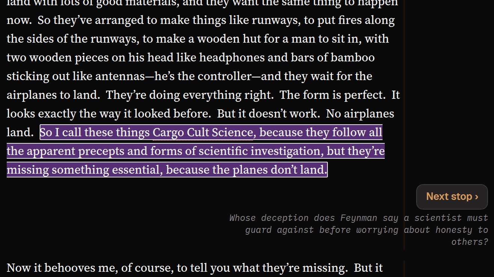
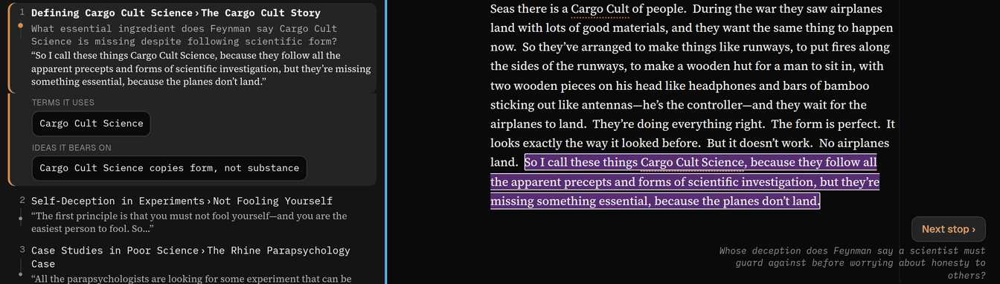

## In short

Skim picks out a handful of passages which, read on their own, give you a good sense of what the
piece is about. Think of it as an alternative to a summary that keeps you in the article: every stop
is a passage from the article, in place, sometimes with a short question to read it with. Along the way it
shows what Glossary and Ideas have already found at each stop, such as an unfamiliar term explained.
Go round quickly with a few stops, then again in more detail, then again in more.

## When to use it

When you need the shape of a paper fast but do not want a summary in place of the text: every stop
is a passage from the article, in place, in context. **Gist** is a handful of stops, **More** about a
dozen, **Most** a larger share of the piece. The order is planned for you — the results first, say,
then a quick look at the methods — not the article’s. Only whoever added the article can plan a
route; visitors to a shared article can walk one already planned.

## Reading it

- <kbd>‹</kbd> <kbd>›</kbd> at the top, or <kbd>←</kbd> <kbd>→</kbd> while reading, step from stop
  to stop. **Next stop ›**, in the text under the current stop, does the same, and at the end of a
  pass becomes **More detail ›**.
- Some stops have a short question above the quote, written by AI, to read it with: what the quote
  refers to, what it settles, or why it matters — never what it found. A stop whose quote stands on
  its own has none.
- A deeper pass has its own new stops and may keep earlier ones where the new ones lean on them.
  When a route has any, small dots under each stop’s number show which passes it is in, shallowest
  first: more than one filled, and you may have read it already.
- Under the current stop, a card gathers what other modes have already found there: **Terms it
  uses** and **Ideas it bears on**.
- The dot beside each row shows how far through the article that stop is, so you can see the route
  jump about.
- **Reading for:** at the top is what you said you want from this article; the route is planned
  around it. **Edit** changes it.
