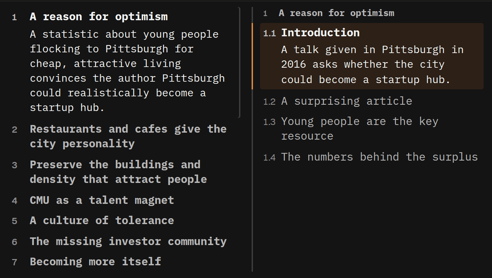

## When to use it

To get your bearings before you start, or to see where you are and what is left. Nothing is
generated when you open it, so it is instant, and visitors to a shared article see it too.

**Structure and the [spine](/help/spine) are the same parts, drawn two ways.** The spine shows
*where* you are and how big each part is, with names only on hover; Structure gives the names and
summaries, but not the sizes.

## Reading it

In **Fisheye**, where a column has no room for every row it says how many come earlier or later. As
one list, Fisheye always shows the sections directly under the part you are in and the available
summary of the current one; when that will not all fit, the list scrolls. Use **Expanded** to see
deeper subsections too. Both scrolling lists follow you only when you move into another section, so
if you scroll one by hand it keeps your place until then. Press any row to jump there.

<kbd>←</kbd> in the middle of a section goes back to that section’s start first. Titles here leave
off the article’s own numbering (“3.2 Methods” shows as “Methods”); the text and the spine keep it.
