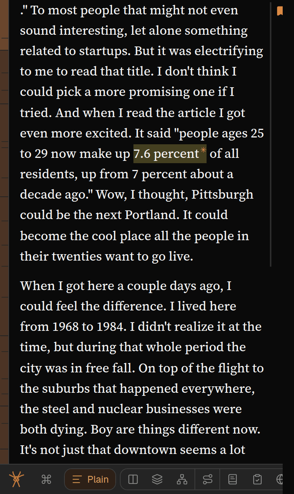

Spideryarn works best on a large screen. On a phone or tablet, these work differently:

- **A mode’s panel covers the article** when the window is too narrow for both. Press **Plain** to
  get back to the text. Turning a phone to landscape often gives room for both.
- **Tap twice on the spine.** The first tap shows that section’s card; the second, on the same
  section, takes you there.
- **Tap a link in the article twice.** The first tap shows where it goes, so a stray tap never takes
  you off the page; the second opens it.
- **Tap an underlined term** to see its glossary definition.
- **Tap a paragraph to show its margin controls.** They stay hidden until then, so the page is not
  covered in icons.
- **Press and hold to select words.** On your own article a **Highlight or comment** button appears
  under them. Tap it and the words are highlighted, with a box to add a comment, change the colour
  or remove it. Tap anywhere else to keep the highlight.
- **On your home screen** there is no Back button: use the **↩ back to …** button above the bottom
  bar — see [Jumping around](/help/jumping-around).

Anything explained only on hover, like the mode buttons’ descriptions, cannot be reached by touch.
To make up for it, each mode shows its name and a sentence about it for a few seconds when you open
it, and its page in Help has the rest.
